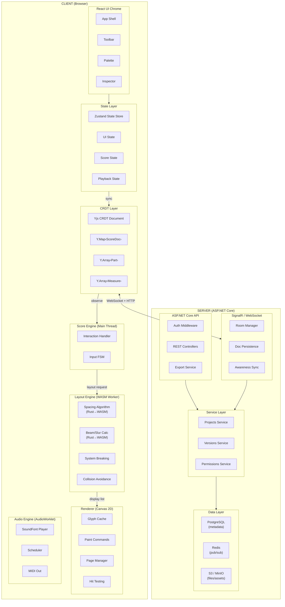
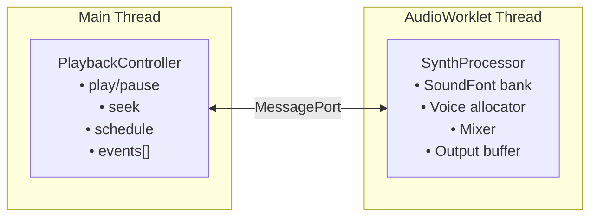
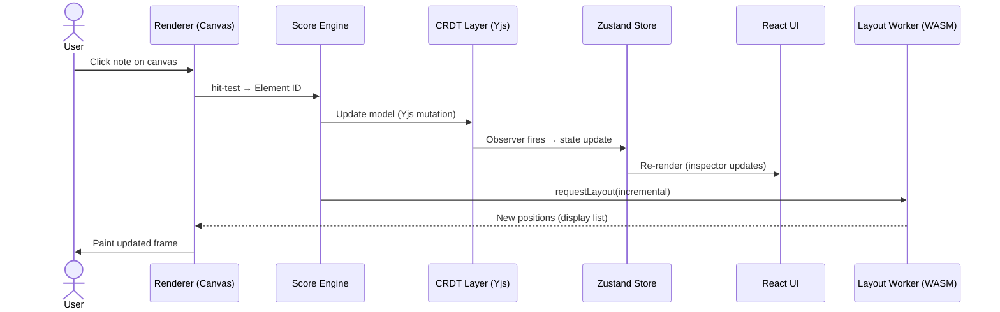
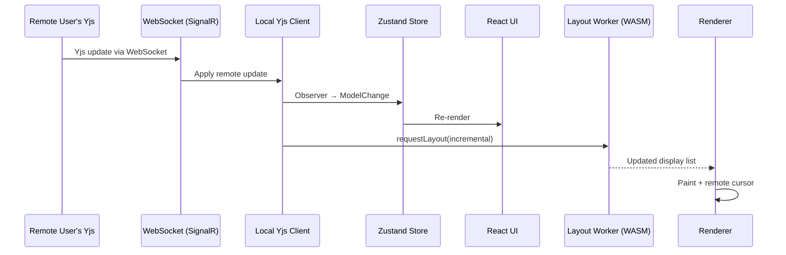
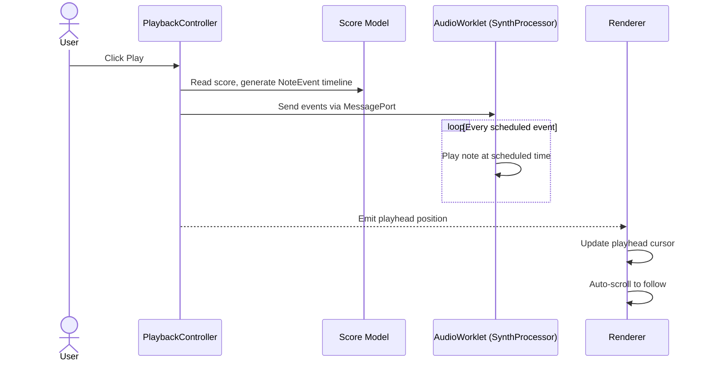
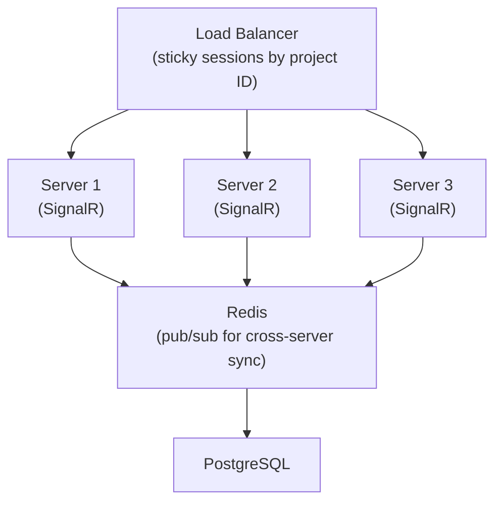

# System Architecture

> **Status (current).** Most of this document still reflects the shipped system: WASM core engine, binary display-list protocol, Canvas rendering, Yjs CRDT collaboration, MNX as the score format. Three caveats:
>
> 1. The layout engine runs in a **Dedicated Worker** by default, hosted through Comlink with a retained Rust→WASM `LayoutEngine`. A main-thread backend remains as an initialization-failure fallback. Incremental edits use PatchFrame v3 and transferable `Float32Array` buffers; see [`../plans/performance-architecture.md`](../plans/performance-architecture.md).
> 2. Any mention of a separate `.viritura` sidecar file is **obsolete** — the score is a single `.mnx` file with `_x.viritura` vendor extensions. See [`../spec/file-format.md`](../spec/file-format.md).
> 3. **The `SERVER (ASP.NET Core)` subgraph below mixes shipped and future work.** Shipped: auth (ASP.NET Core Identity, Google/GitHub OAuth, TOTP 2FA), the external MCP relay (OAuth-secured, per-tab opt-in), WebRTC signalling endpoint and room snapshot store, and the GitHub App integration (OAuth, installation, git proxy). Today's collaboration runs as **y-webrtc P2P** with IndexedDB persistence; the SignalR collaboration hub, Redis pub/sub, PostgreSQL/SQLite persistence, S3/MinIO blob storage, and server-side export are not built (see [`../plans/crdt-collaboration.md`](../plans/crdt-collaboration.md)). The "Scalability Architecture" section near the bottom of this doc is likewise aspirational.
> 4. The diagram below shows conceptual ownership and data flow. The local-edit hot path is incremental: a 2-D dirty region updates retained layout/system/staff layers and applies PatchFrame v3/spatial deltas rather than rerunning the illustrated pipeline over the whole score.

## High-Level Architecture Diagram



---

## Module Architecture

### Client-Side Modules

#### 1. Score Engine (`@viritura/core`)

The central orchestrator on the client. Owns the in-memory score model and coordinates between subsystems.

**Responsibilities:**

- Maintain the canonical in-memory score model (derived from Yjs state)
- Handle user interactions (note input, selection, editing)
- Manage note input state machine (step input, real-time input, repitch mode)
- Dispatch layout requests to the Layout Worker
- Dispatch render commands to the Renderer
- Manage undo/redo (via Yjs undo manager)

**Key interfaces:**

```typescript
interface ScoreEngine {
  // Document management
  loadDocument(ydoc: Y.Doc): void;
  getModel(): ScoreDocument;

  // Interaction
  handlePointerDown(pos: Point, modifiers: Modifiers): void;
  handlePointerMove(pos: Point, modifiers: Modifiers): void;
  handleKeyDown(key: KeyEvent): void;

  // Note input
  enterNoteInputMode(voice: Voice): void;
  exitNoteInputMode(): void;
  setInputDuration(duration: Duration): void;
  addNote(pitch: Pitch): void;
  addRest(): void;

  // Selection
  getSelection(): Selection;
  selectElement(id: ElementId): void;
  selectRange(start: Position, end: Position): void;

  // Editing
  deleteSelection(): void;
  transpose(interval: Interval): void;
  toggleArticulation(type: ArticulationType): void;

  // Layout
  requestLayout(scope: LayoutScope): void;
  getLayoutData(): LayoutResult;

  // Events
  onModelChanged: Signal<ModelChange>;
  onLayoutComplete: Signal<LayoutResult>;
  onSelectionChanged: Signal<Selection>;
}
```

#### 2. Layout Engine (`@viritura/engine-wasm`)

Runs in a **Web Worker** as a **Rust→WASM** module for near-native performance. This follows Figma's architecture where the core computational engine is compiled to WebAssembly. Receives score model data, computes spatial layout, and returns a display list of render commands.

**Multi-rate layout contract (see [`../plans/performance-architecture.md`](../plans/performance-architecture.md) for measurements):**

- **Local, width-neutral edits:** retained incremental layout; the production-Chrome Rhapsody gate requires authoritative p50 ≤16.6 ms.
- **Width-changing edits:** optimistic local feedback within one frame, followed by bounded authoritative reconciliation with a p50 <50 ms gate.
- **Structural/global edits:** asynchronous full fallback; correctness and UI responsiveness take priority over a one-frame completion promise.

**WASM and transport model:**

- The worker retains the promoted score, layout caches, system/staff render layers, Horizon-global staff summaries, and patch-frame state across edits.
- PatchFrame v3 transfers a tagged `Float32Array` with fresh systems plus reuse/transform records. Comlink transfers ownership of the buffer; `SharedArrayBuffer` is not required by the current hot path.
- The main thread paints retained Horizon layers first, then finalizes flattened compatibility arrays for spatial indexing/export consumers.

**Responsibilities:**

- Horizontal spacing (note spacing within measures)
- System break calculation (which measures fit on each system/line)
- Page break calculation
- Beam angle and subdivision calculation
- Slur/tie control point calculation
- Lyrics and text placement
- Collision avoidance (autoplace)
- Staff distance optimization

**Design inspired by standard practice pipeline:**

1. **Measure layout** — space each measure internally (note spacing algorithm)
2. **System layout** — fit measures into systems (line-breaking algorithm, similar to TeX)
3. **Page layout** — fit systems into pages
4. **Element layout** — position every element (beams, slurs, dynamics, lyrics)
5. **Autoplace** — collision detection and avoidance
6. **Finalize** — compute final coordinates for every element

**Worker communication:**

```typescript
// Main thread → Worker
interface LayoutRequest {
  type: "full" | "patch";
  scoreData?: SerializedScore; // Full/reseed only
  patchJson?: string; // Incremental part/global-measure patch
  pageSize: PageDimensions;
  style: EngravingStyle;
}

// Worker → Main thread
interface LayoutResult {
  frame: Float32Array; // Tagged full display list or PatchFrame v3
  metrics: LayoutMetrics;
}
```

#### 3. Renderer (`@viritura/renderer`)

Paints the score to a Canvas 2D context. Manages the visual viewport and canvas lifecycle.

**Responsibilities:**

- Paint music glyphs (SMuFL font rendering)
- Paint lines, arcs, bezier curves (beams, slurs, ties, hairpins)
- Paint text (lyrics, dynamics, tempo markings, chord symbols)
- Manage viewport / virtual scrolling (only render visible pages)
- Hit testing (which element did the user click?)
- Cursor rendering (note input cursor, selection highlights)
- Collaboration cursors (other users' cursors and selections)
- Export rendering (generate SVG or PDF via canvas-to-PDF library)

**Renderer pipeline per frame:**

1. Determine visible pages/systems from viewport
2. For each visible page, draw in order:
   a. Staff lines
   b. Barlines
   c. Clefs, key signatures, time signatures
   d. Notes, rests, chords (including stems, flags, beams)
   e. Articulations, ornaments, dynamics
   f. Slurs, ties, hairpins, other spanners
   g. Lyrics, text, chord symbols
   h. Selection highlights
   i. Collaboration cursors
3. Blit off-screen pages from cache

#### 4. Audio Engine (`@viritura/audio`)

Runs in an **AudioWorklet** for low-latency, glitch-free audio. Controlled from the main thread.

**Responsibilities:**

- Load and parse SoundFont2/SF3 files
- Map instruments to sound presets
- Schedule note events against a musical timeline
- Handle real-time note preview (click a note → hear it)
- MIDI input processing (Web MIDI API)
- MIDI output to external devices
- Metronome click generation

**Architecture:**



#### 5. CRDT Layer (`@viritura/crdt`)

Bridges the score model to Yjs shared types.

**Responsibilities:**

- Map score model types → Yjs types (Y.Map, Y.Array)
- Observe Yjs changes → emit model change events
- Apply local edits → Yjs mutations
- Manage Yjs UndoManager for undo/redo
- Handle sub-documents (one per part or per page range for large scores)
- Sync awareness state (cursor position, selection, user info)

See `05-collaboration-system.md` for full CRDT mapping.

---

### Server-Side Modules

#### 1. API Server (ASP.NET Core)

```
Controllers:
  POST   /api/auth/login
  POST   /api/auth/register
  GET    /api/projects
  POST   /api/projects
  GET    /api/projects/{id}
  PUT    /api/projects/{id}
  DELETE /api/projects/{id}
  GET    /api/projects/{id}/versions
  POST   /api/projects/{id}/versions        (snapshot)
  GET    /api/projects/{id}/versions/{vid}
  POST   /api/projects/{id}/export/{format}  (pdf, musicxml, mnx, midi, png)
  GET    /api/projects/{id}/collaborators
  POST   /api/projects/{id}/collaborators
  WS     /ws/collab/{projectId}              (Yjs WebSocket sync via SignalR)
```

#### 2. Collaboration Server (SignalR + Yjs) — **planned**

> 📋 **Not built.** Today's collaboration is y-webrtc P2P with IndexedDB persistence — no central hub, no Redis backplane, no server-side persistence of Yjs state. The section below describes a possible managed server architecture.

- Manages WebSocket connections per score document via SignalR hubs
- Persists Yjs document state to PostgreSQL
- Broadcasts updates between connected clients
- Handles reconnection and state catch-up (SignalR handles this natively)
- Redis backplane for multi-instance scaling (SignalR scale-out)

#### 3. Version Service

- Creates named snapshots (like Git tags) of score state
- Stores diffs between versions for efficient storage
- Supports branching: fork a score version for experimentation
- Enables "compare versions" feature in the UI

#### 4. Export Service

- Server-side rendering of scores to PDF, PNG, SVG using SkiaSharp
- The same Rust WASM engine can optionally be compiled as a native Rust library for server-side layout
- Queued processing for large scores via background services (`IHostedService`)
- MusicXML, MNX, and MIDI export run as pure computation

---

## Data Flow Patterns

### 1. Local Edit Flow



### 2. Remote Edit Flow (Collaboration)



### 3. Playback Flow



---

## Security Architecture

### Authentication

- ASP.NET Identity with OIDC providers (Google, GitHub, email/password)
- JWT access tokens (short-lived, 15 min)
- Refresh tokens (HttpOnly cookies, 7 days)
- CSRF protection via anti-forgery tokens

### Authorization

- Per-project role-based access: Owner, Editor, Commenter, Viewer
- WebSocket connections authenticated via JWT
- Rate limiting per user and per IP

### Data Security

- All traffic over TLS
- Yjs document state encrypted at rest (AES-256)
- S3 objects served via signed URLs (time-limited)
- GDPR-compliant data export and deletion

---

## Scalability Architecture — **planned**

> 📋 **None of this is deployed.** No load balancer, no SignalR servers, no Redis, no PostgreSQL fleet. The section below documents a possible scale-out topology, not infrastructure that exists today. Today's collaboration is direct browser-to-browser via y-webrtc — the server is not in the data path.

### Horizontal Scaling



- Sticky sessions route all WebSocket connections for a given project to the same server
- Redis backplane bridges SignalR + Yjs updates across server instances
- Stateless HTTP requests can go to any server
- Auto-scaling based on WebSocket connection count

### Performance Targets

All targets are validated against the "Beethoven's 9th" benchmark (1,200 measures, 24 parts, ~400 pages). See [`../plans/performance-architecture.md`](../plans/performance-architecture.md) for the full performance design.

| Metric                             | Target                           |
| ---------------------------------- | -------------------------------- |
| Note input → visual feedback       | < 16ms (1 frame)                 |
| Collaboration sync latency         | < 200ms (p95)                    |
| Full score layout (100 measures)   | < 500ms                          |
| Full score layout (1,200 measures) | < 3s (background, progressive)   |
| Incremental layout (1 measure)     | < 30ms                           |
| Page render time                   | < 8ms (within 16ms frame budget) |
| Time to interactive (initial load) | < 3s (first page editable)       |
| Offline → online sync              | < 2s                             |
| Memory (Beethoven 9th full score)  | < 512 MB                         |
| WASM module size (gzipped)         | < 2 MB                           |

---

## Implementation Snapshot (pre-editor)

> **Heads-up:** the tables below are a historical snapshot from before the interactive editor, audio playback, and selection engine landed. They are kept only to document the staged build-out of the layout pipeline and rendering optimizations; inspect the current implementation and specifications for present behavior.

The architecture above describes the target system. This section documents what was implemented at the snapshot point:

### What's Built

| Component         | Target                                                                      | Snapshot State                                                                                                                                                    |
| ----------------- | --------------------------------------------------------------------------- | ----------------------------------------------------------------------------------------------------------------------------------------------------------------- |
| **Score Engine**  | `ScoreEngine` interface with interaction handler, input FSM, selection      | **Read-only viewer** — no interaction, no input, no selection (selection, input, and interaction have since shipped — see roadmap)                                |
| **Layout Engine** | 6-stage pipeline (measure → system → page → element → autoplace → finalize) | **5 stages done** — measure layout, system breaking, page breaking, element layout, skyline-based autoplace. Multi-system vertical stacking with brackets/braces. |
| **Layout Tiers**  | Tier 1 (<16ms), Tier 2 (<200ms incremental), Tier 3 (background full)       | **Full recompute only** — no incremental layout, no background workers                                                                                            |
| **Renderer**      | Off-screen canvas cache, glyph atlas, dirty rectangles, hit testing         | **Glyph atlas + page cache done** — OffscreenCanvas 5-page sliding window, SMuFL glyph atlas. Hit testing has since shipped.                                      |
| **WASM Bridge**   | SharedArrayBuffer zero-copy display list, arena allocator                   | **Binary transfer done** — Float32Array typed array protocol. JSON fallback preserved. No SharedArrayBuffer yet.                                                  |
| **Viewport**      | Scroll + zoom                                                               | **Done** — wheel/shift+wheel scroll, ctrl+wheel/pinch zoom (0.25x–4.0x), zoom indicator UI                                                                        |
| **State Layer**   | Zustand + Yjs bidirectional bridge                                          | **None at snapshot** — collaboration is queued                                                                                                                    |
| **Audio**         | Web Audio API + samplers                                                    | **Snapshot: empty stub.** Basic audio playback has since shipped — see roadmap.                                                                                   |
| **Server**        | ASP.NET Core + SignalR + PostgreSQL + Redis                                 | **None** — queued                                                                                                                                                 |
| **Collaboration** | Yjs CRDT with awareness, per-user undo                                      | **None** — queued                                                                                                                                                 |

### Layout Pipeline Build-out

The 6-stage layout pipeline. All stages below are ✅ shipped today; the column annotates the historical order they came online.

| Stage             | Description                                                                                          | Built in   |
| ----------------- | ---------------------------------------------------------------------------------------------------- | ---------- |
| 1. Measure layout | Note spacing (logarithmic), stem direction, prefixes                                                 | Round 1 ✅ |
| 2. System layout  | Greedy line-breaking with justification                                                              | Round 2 ✅ |
| 3. Page layout    | Page breaking with margin management                                                                 | Round 2 ✅ |
| 4. Element layout | Beams (quanted), slurs, ties, dynamics, lyrics, tuplets, grace notes, voltas, articulations (3-pass) | Round 2 ✅ |
| 5. Autoplace      | Skyline-based collision avoidance, multi-voice rest conflict resolution                              | Round 2 ✅ |
| 6. Finalize       | Final coordinate computation                                                                         | Round 2 ✅ |

### Rendering Optimizations

| Optimization     | Description                                                 | Status                                       |
| ---------------- | ----------------------------------------------------------- | -------------------------------------------- |
| Full repaint     | Clear canvas + redraw all commands                          | ✅ Shipped                                   |
| Glyph atlas      | Pre-rasterize common SMuFL glyphs                           | ✅ Shipped                                   |
| Off-screen cache | Pre-render pages to OffscreenCanvas (5-page sliding window) | ✅ Shipped                                   |
| Dirty rectangles | Only repaint changed regions                                | Queued (alongside editor interaction polish) |
| WebGL            | GPU rendering for very large scores                         | Speculative                                  |

### WASM Transfer

| Strategy          | Description                            | Status                                     |
| ----------------- | -------------------------------------- | ------------------------------------------ |
| JSON string       | `serde_json::to_string` → `JSON.parse` | ✅ Shipped (kept as fallback)              |
| Binary protocol   | Float32Array via `Transferable`        | ✅ Shipped                                 |
| SharedArrayBuffer | Zero-copy shared memory                | Queued (when <16ms frame budget is needed) |
| Arena allocator   | Bump allocation for layout temporaries | Queued                                     |
