# Score and Parts: Competitive Analysis & Architecture

> **Document status.** This doc is a mix of (a) competitive analysis and
> long-term architectural vision and (b) features that haven't shipped yet.
>
> | Section                                                                                 | Status                                                                                                                                                                                                             |
> | --------------------------------------------------------------------------------------- | ------------------------------------------------------------------------------------------------------------------------------------------------------------------------------------------------------------------ |
> | §1 Competitive analysis                                                                 | ✅ still valid reference (no changes since written)                                                                                                                                                                |
> | §2 Gap analysis                                                                         | ✅ still valid                                                                                                                                                                                                     |
> | §3.1–3.2 Architecture (single source, decomposition principle)                          | ✅ north star                                                                                                                                                                                                      |
> | §3.3 Condensing algorithm                                                               | ✅ shipped — see [`condensing-and-doubling.md`](../spec/condensing-and-doubling.md) for the canonical spec                                                                                                         |
> | §4 Automatic part preparation (page turns, multirests, cue notes, part-specific layout) | 📋 **not implemented**. The content below is preserved as design spec for future work.                                                                                                                             |
> | §5 Data model                                                                           | ✅ condensing data is native MNX; the `.viritura` sidecar shown in older drafts of this section has been replaced by `_x.viritura` extensions inside the MNX file. See [`file-format.md`](../spec/file-format.md). |
> | §6 Performance considerations                                                           | 📋 future work (depends on §4 landing)                                                                                                                                                                             |
> | §7 User workflow                                                                        | 🟡 partial — score-first and parts-first workflows work today for condensing; auto page-turn / cue-note steps are aspirational                                                                                     |
> | §8 Edge cases                                                                           | 🟡 partial — transposing instruments and divisi handled in the condensing engine; cross-staff in piano works; percussion-kit condensing tracked separately                                                         |
> | §9 Design decisions                                                                     | ✅ still valid                                                                                                                                                                                                     |
>
> **What ships today (TL;DR):** the condensing & doubling system (single
> source of truth, multi-source staves, a2 / amalgamate / divisi merge
> analysis, condensing popover, parts panel, per-part `L-{partId}` layout
> ids). For the implementation-level spec see
> [`condensing-and-doubling.md`](../spec/condensing-and-doubling.md). Automatic
> page turns, multirests, cue-notes, and part-specific layout overrides remain
> future work tracked in GitHub.

## The Problem

In orchestral/ensemble music, two views of the same music coexist:

1. **The Score** — a conductor's view showing all instruments stacked vertically, often with multiple players condensed onto shared staves (e.g., "Flute 1" and "Flute 2" on one staff with stems up/down)
2. **The Parts** — individual player views showing only one instrument's music, with cue notes from other instruments, page turns at rests, and part-specific layout

Converting between these is one of the hardest problems in music notation software. No existing tool does it truly well. This is a major differentiator opportunity for Viritura.

---

## 1. Competitive Analysis

### 1.1 Dorico (Steinberg) — Parts-First with Auto-Condensing

**Model:** Write into individual parts. The condensed score is automatically generated.

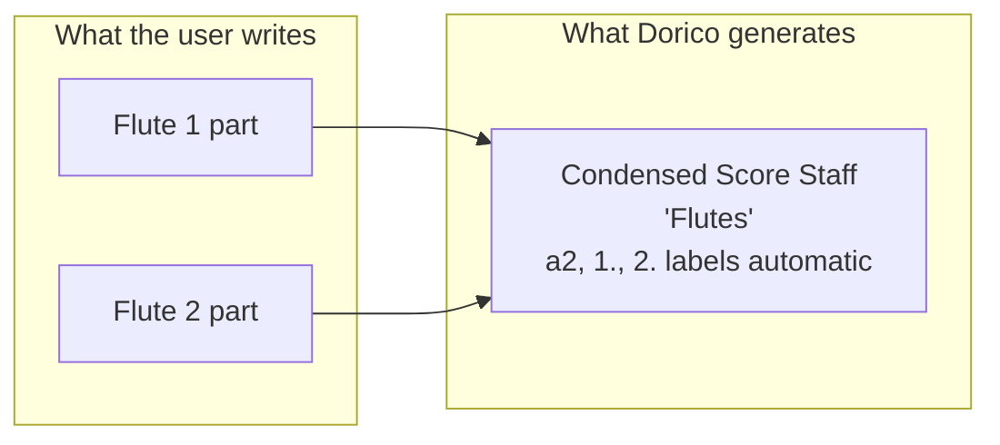

**Strengths:**

- Condensing is fully automatic — when both flutes play the same thing, shows "a2"; when they diverge, stems up/down
- Editing in the part automatically updates the score
- Part layout is independent (different page breaks, spacing adjustments)
- Condensing change labels ("1.", "2.", "a2", "solo", "tutti") are generated, not manually typed
- Each flow (movement) can have independent condensing groups

**Weaknesses:**

- Condensing rules are complex and sometimes produce unexpected results
- Condensed score is read-only in practice — you can't directly edit the condensed score view and have it flow back to parts
- Users frequently fight the condensing algorithm for edge cases (e.g., when to split vs merge, rhythmically independent voices)
- Changing condensing behavior requires diving into condensing settings per phrase/section
- Very CPU-intensive — condensing recalculation is slow on large scores
- If you're composing "score-first" (sketching on the full score), Dorico's model feels backwards

**Condensing quality:** ~70-80% correct out of the box. The remaining 20-30% requires manual condensing overrides (condensing changes, manual condensing groups, etc.)

### 1.2 Sibelius (Avid) — Dynamic Parts (Linked Views)

**Model:** One underlying data set. Score and parts are different "views" with linked content.

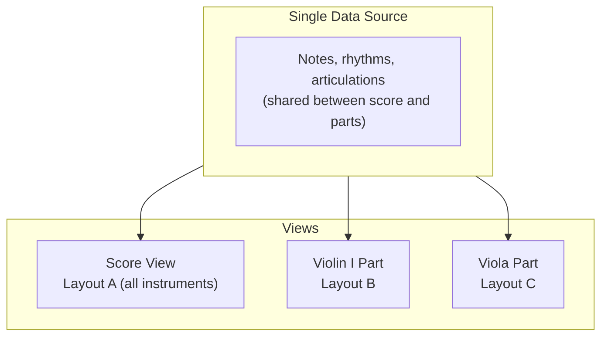

**Strengths:**

- Edit in either score or part — changes propagate bidirectionally
- "Dynamic Parts" introduced in Sibelius 5 (~2007) was revolutionary at the time
- Part-specific layout overrides (system breaks, page breaks) don't affect the score
- Part-specific visibility of elements (hide rehearsal marks in score, show in parts)

**Weaknesses:**

- **No automatic condensing** — if you want Flute 1 and 2 on one staff in the score, you must manually write them into one staff with voices or use workarounds
- Part preparation still requires significant manual work (adding cue notes, adjusting multirests, fixing page turns)
- Multirests (consolidated rests) sometimes break in confusing ways
- Part-specific vs score-specific override system is poorly understood by users
- "Which elements are part-specific?" is a constant source of confusion

**Part preparation quality:** Good bidirectional editing, but condensing and page turn optimization are entirely manual.

### 1.3 Finale (MakeMusic) — Linked Parts (Bolted On)

**Model:** Similar to Sibelius's linked approach, added in Finale 2007+.

**Strengths:**

- Score-to-part linking works for basic editing
- Staff styles allow some condensing workarounds

**Weaknesses:**

- Linked parts feel like a retrofit on top of Finale's older architecture
- Condensing is entirely manual
- Part- vs score-specific elements are confusing
- Frequent data corruption bugs when editing in parts view
- Finale was retired in 2024, so not an ongoing competitor

---

## 2. Gap Analysis: What No One Does Well

| Capability                        | **Needed**             |
| --------------------------------- | ---------------------- |
| **Edit in score → parts update**  | ✅ Must work           |
| **Edit in part → score updates**  | ✅ Must work           |
| **Automatic condensing**          | ✅ Must work           |
| **Edit condensed score directly** | ✅ Core differentiator |
| **Automatic page turns**          | ✅ Must work           |
| **Automatic cue notes**           | ✅ Should auto-suggest |
| **Multirest optimization**        | ✅ Must work           |
| **Part-specific overrides**       | ✅ Must work           |
| **Collision avoidance in parts**  | ✅ Must work           |
| **Performance on large scores**   | ✅ Must work           |

### The Fundamental Tension

There are two compositional workflows that are **both legitimate**:

1. **Score-first** (traditional orchestral): Sketch on the full score, then extract parts later. Common for composers who think orchestrally.

2. **Parts-first** (Dorico's assumption): Write each instrument individually, let the software build the score. Common for arrangers and film composers.

**No existing software handles both workflows gracefully.** Dorico is optimized for (2) and penalizes (1). Sibelius handles (1) well but can't do condensing. This is our opportunity.

---

## 3. Our Architecture: Single Source + Dual Layout Engine

### 3.1 Core Principle: One Data Model, Multiple Views

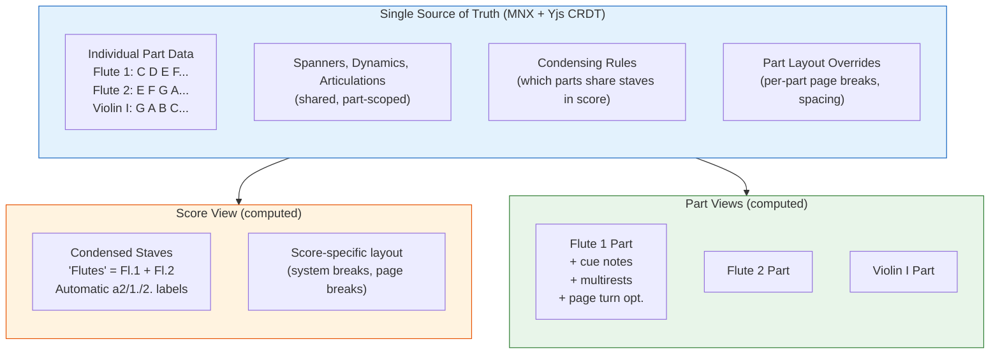

**Key architectural decisions:**

1. **Music data is always stored per individual instrument** — never as a condensed score. This is the canonical representation.
2. **The condensed score is a computed view**, derived from the individual parts + condensing rules. Like a database view — it looks like it exists, but it's generated.
3. **Parts are also computed views** — the layout, multirests, cue notes, and page turns are derived from the individual part data.
4. **Both views are fully editable** — edits in either view flow back to the underlying per-instrument data.
5. **Layout is independent per context** — the score has its own page/system breaks, and each part has its own.

### 3.2 Why Not Store the Condensed Score?

If the condensed score is a computed view, how can the user edit it? The answer: **we interpret edits on the condensed view and decompose them back to individual parts.**

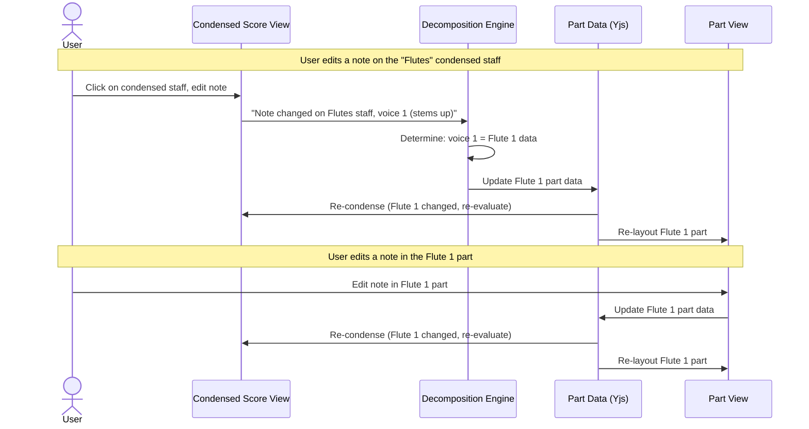

**Decomposition rules for condensed score edits:**

- If the condensed staff shows "a2" (unison), editing the notes affects both parts
- If stem-up = Part 1 and stem-down = Part 2, the stem direction identifies which part
- If the user adds a note on a condensed staff, they're prompted (or it's inferred from context) which part it belongs to
- Dynamic markings, articulations: apply to both parts when "a2", or to the specific part based on placement

### 3.3 Condensing Algorithm

> **Canonical spec moved.** Implementation details — merge analysis, the
> `sources[]` array on `LayoutStaff`, the `a2` / `amalgamate` / `divisi`
> modes, the condensing popover, `condensingRouter.ts`, the staff-grouping
> dialog, and the Parts Panel — live in [`condensing-and-doubling.md`](../spec/condensing-and-doubling.md).
> The summary below is kept for high-level context.

Our condensing engine runs in the WASM layout pipeline and evaluates per-measure:

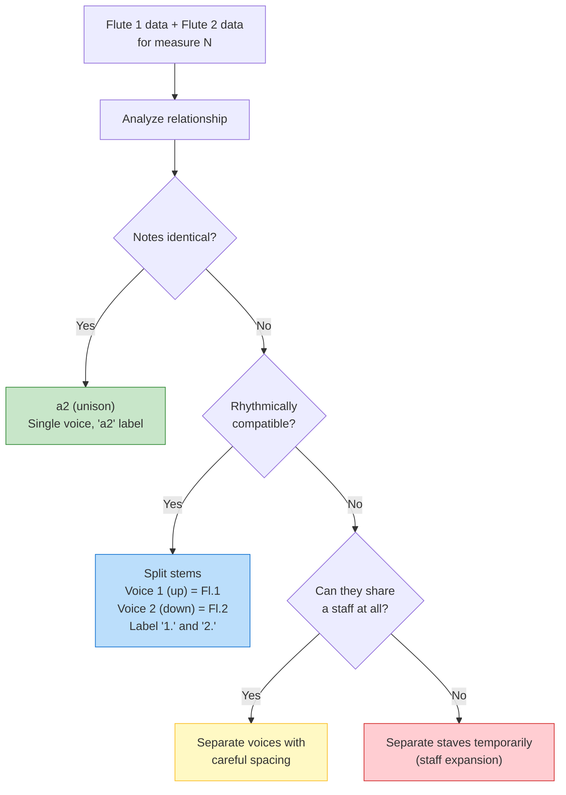

**Condensing states (per measure, per condensed staff):**

| State                    | When                                                           | Visual result                                      |
| ------------------------ | -------------------------------------------------------------- | -------------------------------------------------- |
| **a2** (unison)          | Both parts have identical notes and rhythms                    | Single voice, "a2" text                            |
| **a2** (rhythmic unison) | Same pitches, slight rhythmic differences (e.g., one has dots) | Single voice with adjustments                      |
| **Amalgamate**           | Same rhythm, different pitches; markings agree                 | One chord, both pitches stacked                    |
| **Divisi**               | Different rhythms or incompatible markings                     | Split-stem voices on the same staff                |
| **Solo**                 | Only one part plays, other rests                               | Single voice, "1." or "2." label                   |
| **Separate staves**      | Too complex to condense                                        | Expand the source staves under the condensed staff |

The MNX representation is the **native** `layout.staves[].sources` array —
no vendor extension required:

```jsonc
{
  "id": "S-flutes",
  "sources": [{ "part": "fl1" }, { "part": "fl2" }],
  "label": "Flutes",
}
```

Per-measure overrides (force `divisi` even when the engine would `amalgamate`,
etc.) are stored as `parts[].measures[]._x.viritura.condensingOverride` —
see [`viritura-extensions.md`](../spec/viritura-extensions.md).

---

## 4. Automatic Part Preparation

> 📋 **Status: not implemented.** The text in §4.1–4.4 below
> describes a future feature set (automatic page-turn optimization,
> multirest consolidation, cue notes, part-specific layout overrides). It
> is preserved here as design spec so the eventual implementation has a
> starting point. Today, users can manually force breaks in
> [Engrave mode](../spec/engrave-mode.md) and the Parts Panel can extract a part
> view, but none of the automatic preparation logic exists yet. Scheduling is
> tracked in GitHub.

### 4.1 Automatic Page Turn Optimization

This is one of the biggest pain points for working musicians and a feature no notation software does automatically.

**The constraint:** A musician can only turn a page during a rest that's long enough to free a hand. Rather than using beat-count heuristics, we compute the **actual wall-clock duration in seconds** of every rest, because we know the exact tempo at every point in the score.

**Real-time duration calculation:**

```typescript
/** Compute actual time (in seconds) of a rest at a specific tempo */
function restDurationSeconds(restBeats: number, bpm: number): number {
  return restBeats / (bpm / 60);
}

// Examples:
// 2 beats rest at 60 BPM  = 2.00 seconds ✅ comfortable turn
// 2 beats rest at 120 BPM = 1.00 seconds ⚠️ tight
// 2 beats rest at 180 BPM = 0.67 seconds ❌ too fast
// 4 beats rest at 180 BPM = 1.33 seconds ✅ just enough
```

**Page turn minimum: ~1.5 seconds of real time.** This is the universal threshold — a page turn takes approximately 1.0-1.5 seconds regardless of tempo. No need for per-tempo beat tables.

#### Recto/Verso and Booklet Conventions

Printed parts follow booklet conventions. Pages are either **recto** (right-hand, odd-numbered) or **verso** (left-hand, even-numbered):

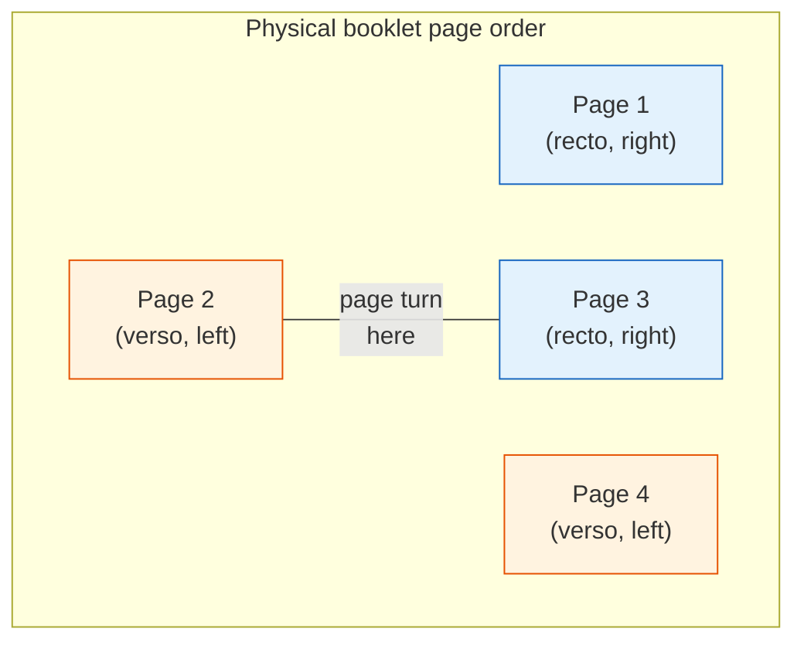

**Critical insight:** A page turn only happens between a **verso** (left/even) and the next **recto** (right/odd) page. The musician can always see verso+recto as a spread. This means:

- Page 2 → Page 3 requires a physical turn
- Page 3 → Page 4 does NOT (they're visible simultaneously as a spread)
- Only turns at even→odd boundaries need rest time

**First page options:**

| Option                  | Page 1                    | Description                                                                    | When to use                            |
| ----------------------- | ------------------------- | ------------------------------------------------------------------------------ | -------------------------------------- |
| **Music on page 1**     | Recto with music          | Part name as header, music starts immediately                                  | Short parts (≤ 4 pages), saves paper   |
| **Cover page**          | Recto with title only     | Title, part name, composer. Music starts on page 2 (verso)                     | Professional / published parts         |
| **Cover + blank verso** | Recto title, page 2 blank | Music starts on page 3 (recto). "This page intentionally left blank" on page 2 | When page 3→4 is a better first spread |

The algorithm chooses automatically based on total page count and page turn feasibility.

#### The Full Page Turn Algorithm

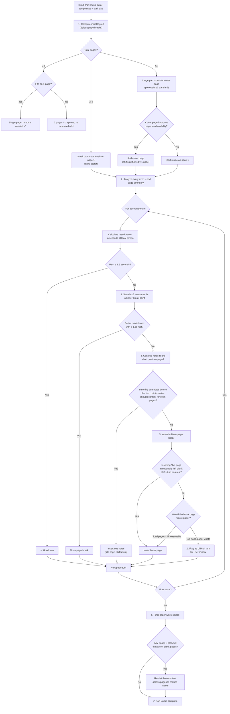

**Implementation:**

```typescript
interface PageTurnAnalysis {
  pageNumber: number;
  side: "recto" | "verso"; // Physical side
  requiresPhysicalTurn: boolean; // Only verso→recto needs a turn
  breakAfterMeasure: string;

  restBeforeNextPage: {
    beats: number;
    durationSeconds: number; // Actual wall-clock time
    tempoAtRest: number; // BPM at this point
    sufficientForTurn: boolean; // durationSeconds ≥ 1.5
  };

  resolution:
    | { type: "good-turn" } // Rest is long enough
    | { type: "moved-break"; toMeasure: string } // Shifted break point
    | { type: "cue-fill"; cue: CueNote } // Cue notes fill the page
    | { type: "blank-page" } // Intentionally blank
    | { type: "difficult"; userReviewNeeded: boolean }; // Flagged for user

  alternativeBreaks: {
    measureId: string;
    restDurationSeconds: number;
    spacingCost: number; // Layout distortion cost
    paperWasteCost: number; // How much empty space this creates
  }[];
}

interface BlankPage {
  afterPage: number;
  text: string; // "This page intentionally left blank"
}

interface FirstPageConfig {
  mode: "music-first" | "cover-page" | "cover-plus-blank";
  /** Algorithm auto-selects, but user can override */
  autoSelected: boolean;
}
```

### 4.2 Automatic Multirest Optimization

Consecutive empty measures are consolidated into multirests:

```
Before: | - | - | - | - | - | - | - | - |
After:  |            8            |
```

**But multirests must be broken at specific points:**

- Rehearsal marks
- Key signature changes
- Time signature changes
- Tempo changes
- Double barlines
- Coda / segno markers

Our engine handles this automatically — no manual intervention needed.

### 4.3 Cue Notes: Suggestions, Manual Insertion, and Page-Filling

Cue notes serve three distinct purposes in professional part preparation:

1. **Navigation** — help a player find their re-entry after a long rest
2. **Confidence** — confirm the player is in the right place by hearing familiar context
3. **Page filling** — a traditional engraver technique to fill a page that would otherwise be too empty, shifting content so that page turns land on rests

No existing software addresses purpose (3). We handle all three.

#### Cue Sources: Three Modes

```mermaid
flowchart TB
    subgraph Auto ["Mode 1: Auto-Suggest"]
        LongRest["Detect rest ≥ 8 bars"] --> Analyze["Rank cue sources"]
        Analyze --> Suggest["Show ghost cue notes<br/>in UI with accept/reject"]
    end

    subgraph Manual ["Mode 2: Manual Insert"]
        UserSelect["User selects rest region"] --> PickSource["User picks source<br/>instrument + measure range"]
        PickSource --> InsertManual["Insert cue notes"]
    end

    subgraph PageFill ["Mode 3: Page-Fill (Engraver Strategy)"]
        ShortPage["Page turn algorithm detects:<br/>previous page is < 60% full"] --> NeedContent["Need more content to<br/>push turn to a rest"]
        NeedContent --> AutoCue["Auto-insert cue notes<br/>in the multirest region before<br/>the problem page turn"]
        AutoCue --> BreakMultirest["Multirest is broken into:<br/>4 bars rest + 4 bars cue + re-entry"]
        BreakMultirest --> RefillPage["Page now has enough content<br/>→ page turn shifts to rest"]
    end

    style Auto fill:#E8F5E9,stroke:#2E7D32
    style Manual fill:#E3F2FD,stroke:#1565C0
    style PageFill fill:#FFF3E0,stroke:#E65100
```

#### How Page-Filling Cues Work

Consider a Violin I part where the page turn algorithm finds a difficult turn:

```
Page 3 (verso):  [m41-m52] mostly rests, page only 40% full
Page 4 (recto):  [m53-m64] starts with a forte re-entry — impossible to turn here!
```

**Without cue fill:** The page turn happens during the forte passage — the player can't turn.

**With cue fill:** The engine inserts 4 bars of Oboe 1 cue notes into the rest on page 3:

```
Page 3 (verso):  [m41-m48] 8 bar multirest → broken into:
                 [m41-m44] 4 bar multirest
                 [m45-m48] cue: Oboe 1 (small notes)
                 [m49-m52] 4 bars rest  ← now the page is ~75% full
Page 4 (recto):  [m53-m64] re-entry
```

The page is now full enough, the turn happens during the 4-bar rest on page 3, and the cue notes serve double duty — they fill the page AND help the player hear the oboe before their re-entry.

#### Cue Source Selection Criteria (Ranked)

1. **Instrument entering just before the player's re-entry** (most useful for navigation)
2. **Prominent melodic line** during the rest period
3. **Same instrument family** (e.g., Flute 1 cue in Flute 2 part — familiar range)
4. **Rhythmically simple and clear** (not complex divisi or fast passages)
5. **Already at a suitable volume** — prefer f/mf passages over ppp (audibility)

#### Page-Fill Cue Algorithm Integration

The page turn optimizer and cue insertion work together:

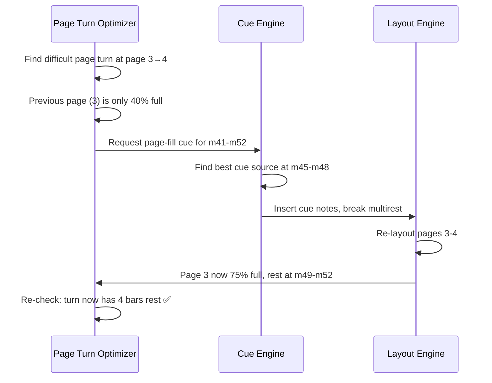

Cue notes are stored as references to the source part's data, not duplicated. If the source changes, the cue updates automatically.

```typescript
interface CueNote {
  id: string;
  sourcePartId: string; // Where the cue music comes from
  startMeasure: string; // First measure of cue
  endMeasure: string; // Last measure of cue
  insertAtMeasure: string; // Where in the target part to show the cue
  label: string; // "Oboe 1", "Vln. II", etc.
  purpose: "navigation" | "page-fill" | "manual";
  autoGenerated: boolean; // true if engine generated, false if user inserted
}
```

### 4.4 Part-Specific Layout

Each part has its own layout overrides, independent from the score:

```typescript
interface PartLayoutContext {
  partId: string;

  /** Part-specific system breaks (independent from score) */
  systemBreaks: { afterMeasure: string; forced: boolean }[];

  /** Part-specific page breaks (optimized for page turns) */
  pageBreaks: { afterMeasure: string; forced: boolean }[];

  /** Intentionally blank pages inserted by algorithm or user */
  blankPages: {
    afterPage: number;
    text: string; // "This page intentionally left blank"
  }[];

  /** First page configuration (recto/verso booklet conventions) */
  firstPage: {
    mode: "music-first" | "cover-page" | "cover-plus-blank";
    autoSelected: boolean; // true = algorithm chose, false = user override
    coverContent?: {
      title: string; // Defaults to score title
      partName: string; // "Violin I"
      composer: string; // From score metadata
    };
  };

  /** Multirest configuration */
  multirest: {
    enabled: boolean;
    maxBarsPerRest: number; // e.g., 32
    breakAtRehearsalMarks: boolean;
    breakAtKeyChanges: boolean;
    breakAtTimeChanges: boolean;
  };

  /** Page turn optimization */
  pageTurns: {
    autoOptimize: boolean;
    minRestSeconds: number; // Default: 1.5 seconds real-time
    allowCueFill: boolean; // Allow engine to insert cues to fill pages
    allowBlankPages: boolean; // Allow "intentionally blank" pages
    maxPaperWastePercent: number; // e.g., 15 — don't waste more than 15% of pages
  };

  /** Cue notes (auto-generated + manual) */
  cueNotes: CueNote[];

  /** Staff size (parts often use larger staff size than score) */
  staffSize: number; // mm, typically 7.0 for parts vs 5.5 for score
}
```

---

## 5. Data Model Extension

> **Status update.** The original draft of this section described a
> separate `.viritura` sidecar holding condensing config, part layouts,
> cue notes, etc. **That sidecar is not what shipped.** Instead:
>
> - Condensing is **native MNX** (`layout.staves[].sources[]`) — no
>   extension needed.
> - Per-measure overrides ride on the existing `_x.viritura` vendor
>   extension namespace inside the MNX file (e.g.
>   `parts[].measures[]._x.viritura.condensingOverride`).
> - The aspirational part-layout fields below (`partLayouts.*`, cue notes,
>   page-turn settings, multirest config) **do not exist** in either the
>   schema or the parser today. They are preserved as design sketch for
>   the eventual part-preparation work.
>
> See [`file-format.md`](../spec/file-format.md) for the actual on-disk format
> and [`viritura-extensions.md`](../spec/viritura-extensions.md) for the
> shipped extension catalogue.

### 5.1 What's stored today (shipped)

```jsonc
// Inside score.mnx — condensing is native MNX
{
  "layouts": [
    {
      "id": "L-full",
      "content": [
        {
          "type": "staff",
          "id": "S-flutes",
          "sources": [{ "part": "fl1" }, { "part": "fl2" }],
          "label": "Flutes",
        },
      ],
    },
  ],

  "parts": [
    {
      "id": "fl1",
      "measures": [
        {
          "sequences": [
            /* … */
          ],
          "_x": {
            "viritura": {
              "condensingOverride": "divisi",
            },
          },
        },
      ],
    },
  ],
}
```

Forced page / system breaks live on the score itself, again natively:
`scores[].pages[].systems[].measure`. See [`engrave-mode.md`](../spec/engrave-mode.md).

### 5.2 Original (aspirational) sketch for part-specific layout

Kept for future-work reference. **Not implemented; not in the schema.**

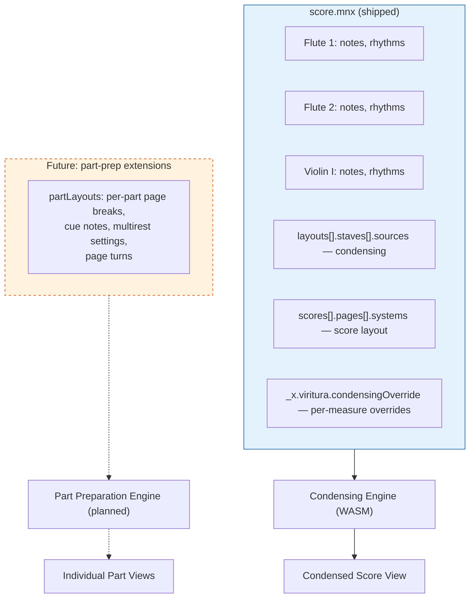

The aspirational `partLayouts` field would look roughly like:

```jsonc
// Aspirational — not in the schema today.
// When implemented, this would live on the score / layout object as an _x.viritura extension.
{
  "partLayouts": {
    "fl1": {
      "staffSize": 7.0,
      "firstPage": { "mode": "cover-page", "autoSelected": true },
      "pageTurns": {
        "autoOptimize": true,
        "minRestSeconds": 1.5,
        "allowCueFill": true,
        "allowBlankPages": true,
        "maxPaperWastePercent": 15,
      },
      "multirest": { "enabled": true, "breakAtRehearsalMarks": true },
      "cueNotes": [
        /* see §4.3 */
      ],
    },
  },
}
```

---

## 6. Performance Considerations

Condensing is computationally expensive — Dorico's condensing can take several seconds on large scores. Our approach:

| Aspect                     | Strategy                                                                                   |
| -------------------------- | ------------------------------------------------------------------------------------------ |
| **Condensing calculation** | Runs in WASM layout worker, not main thread                                                |
| **Incremental condensing** | When one measure changes, only re-condense that measure + adjacent (for label transitions) |
| **Caching**                | Condensing state per measure is cached; only invalidated when part data changes            |
| **Parallel condensing**    | Each condensing group evaluated independently (Flutes group doesn't affect Horns group)    |
| **Part layout**            | Each part's layout computed independently (parallelizable across workers)                  |
| **Page turn optimization** | Runs as a post-pass after layout, only for the active part view                            |

**Benchmark targets:**

| Operation                                        | Target                      |
| ------------------------------------------------ | --------------------------- |
| Condense 1 measure (incremental)                 | < 5ms                       |
| Condense full movement (300 measures, 12 groups) | < 500ms                     |
| Generate all parts for Beethoven 9th             | < 3s (parallel, background) |
| Page turn optimization (1 part)                  | < 200ms                     |

---

## 7. User Workflow

### 7.1 Score-First Workflow (Traditional Composer)

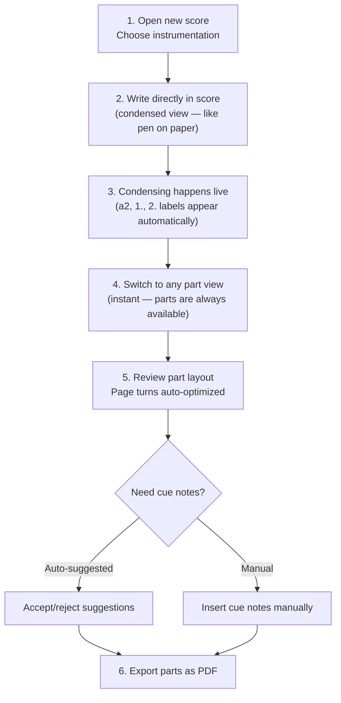

### 7.2 Parts-First Workflow (Film/TV Arranger)

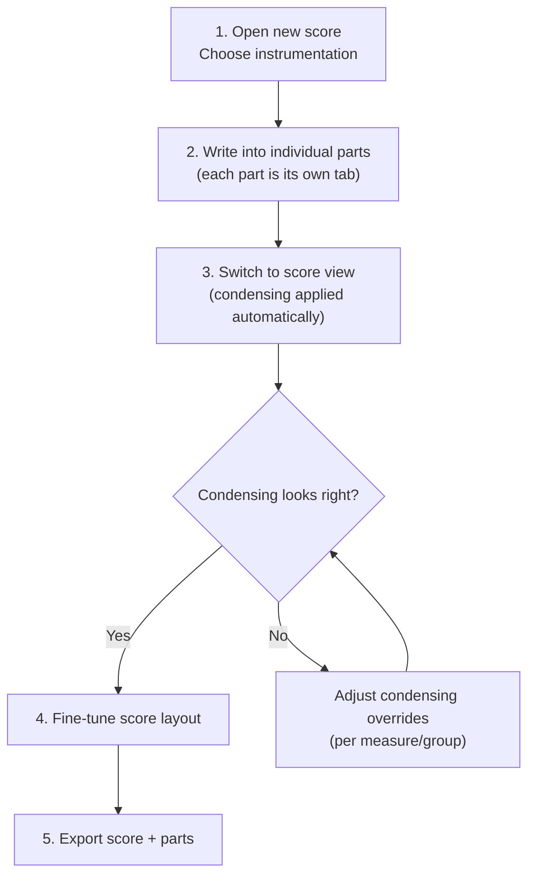

### 7.3 Hybrid Workflow (Our Differentiator)

No other software supports this fluidly:

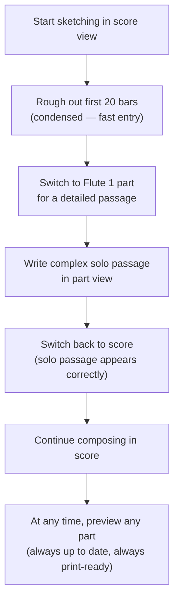

---

## 8. Edge Cases & Difficult Scenarios

### 8.1 Divisi Strings

Strings often divide into more than 2 parts. Condensing rules must handle:

- "div." — split into 2+ sub-staves temporarily
- "unis." — return to single staff
- Desk-by-desk divisi (advanced orchestral writing)

Our model supports N-way condensing groups with dynamic staff count.

### 8.2 Transposing Instruments

Score shows concert pitch; parts show transposed pitch. This is handled at the view layer:

- Data is always stored in concert pitch (in MNX)
- Score view: display at concert pitch (or optionally transposed)
- Part view: display at transposed pitch using the instrument's transposition data
- No data duplication — just a render-time transformation

### 8.3 Cross-Staff Notation

When a piano player's left hand crosses into the right hand staff (or vice versa), the visual rendering differs between score and part (in score, both staves are always visible; in part layouts, this is normal). Our cross-staff references use element IDs, not staff positions, so they work in any view.

### 8.4 Percussion Condensing

Multiple percussion instruments often share a staff in the score (e.g., Triangle + Cymbals + Bass Drum on one percussion staff). This is a specialized form of condensing with instrument-specific noteheads and staff positions. Handled via percussion condensing groups with a defined notehead map.

---

## 9. Design Decision Summary

| Decision                                          | Rationale                                                                                                             |
| ------------------------------------------------- | --------------------------------------------------------------------------------------------------------------------- |
| Store per-instrument, compute condensed score     | Avoids the "which is canonical?" problem; edits always have a clear home                                              |
| Condensed score is fully editable                 | Decomposition engine maps edits back to individual parts — our key differentiator                                     |
| Real-time duration (seconds) for page turns       | Exact tempo is known — no need for approximate beat-count thresholds; 1.5s universal threshold                        |
| Recto/verso booklet conventions                   | Professional standard; only even→odd page boundaries need physical turns                                              |
| Cover page / blank page options                   | Algorithm auto-selects between music-first, cover page, or cover+blank based on total page count and turn feasibility |
| "Page intentionally left blank" support           | Shifts page boundaries to align turns with rests; controlled by paper waste budget                                    |
| Cue notes as page-filling strategy                | Traditional engraver technique — fill a short page with cues so the turn shifts to a rest                             |
| Three cue modes (auto-suggest, manual, page-fill) | Covers navigation, user control, and layout optimization                                                              |
| Paper waste optimization                          | Algorithm tracks total blank/short pages and respects a configurable waste percentage cap                             |
| Auto page turn optimization                       | Solves a real pain point for working musicians — no other software does this                                          |
| Condensing runs in WASM worker                    | Must not block editing; large scores condense in background                                                           |
| Condensing state in `.viritura` sidecar           | Overrides are app-specific, not part of the MNX portable data                                                         |
| Both score-first and parts-first workflows        | No bias toward either — the user chooses                                                                              |
| Per-part independent layout                       | Part page/system breaks don't affect score or other parts                                                             |
