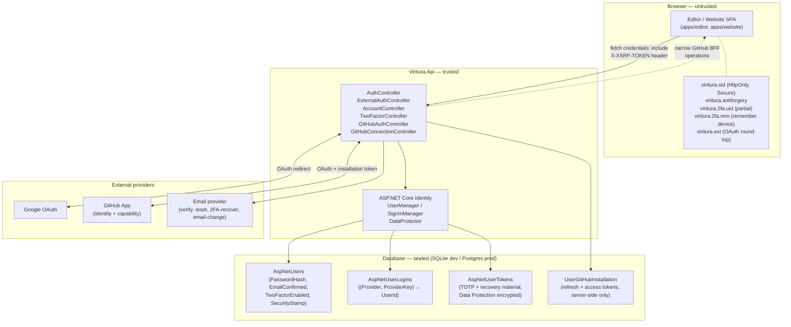
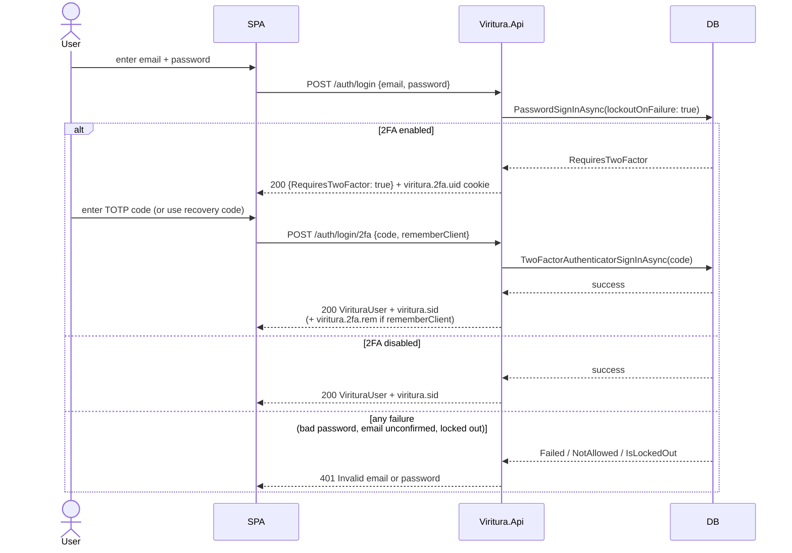
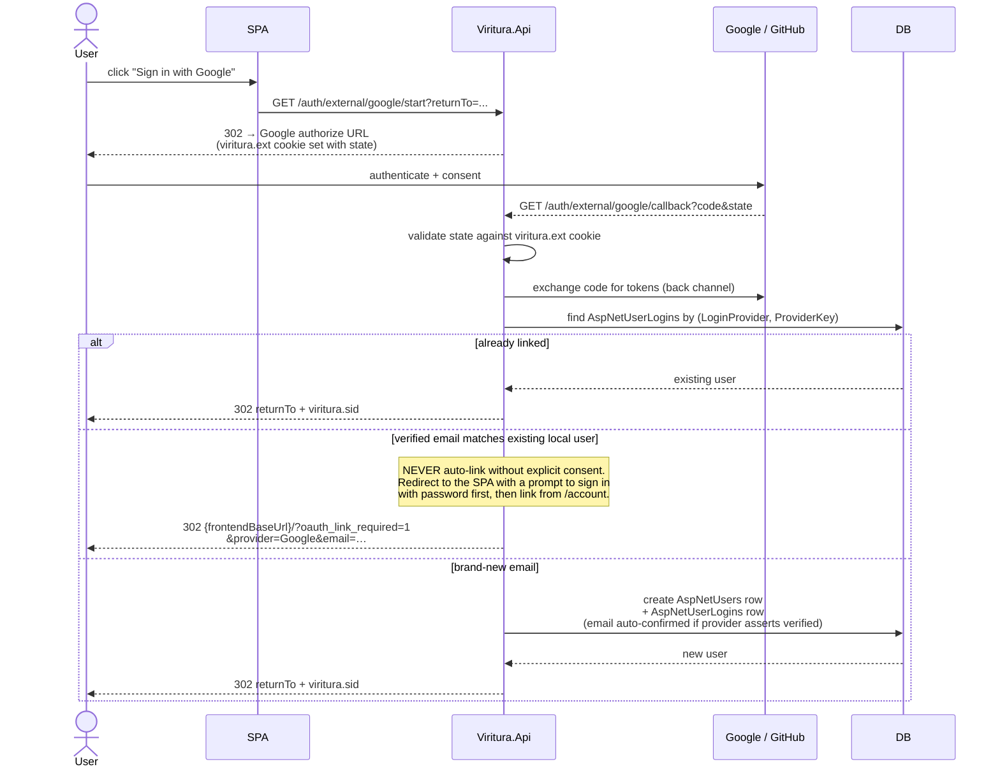
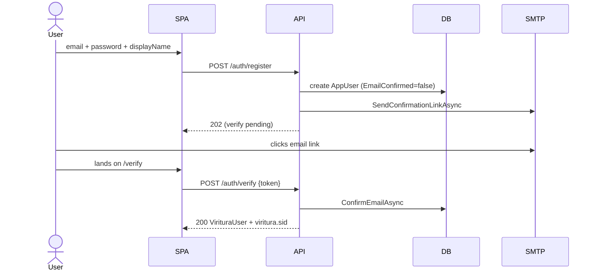
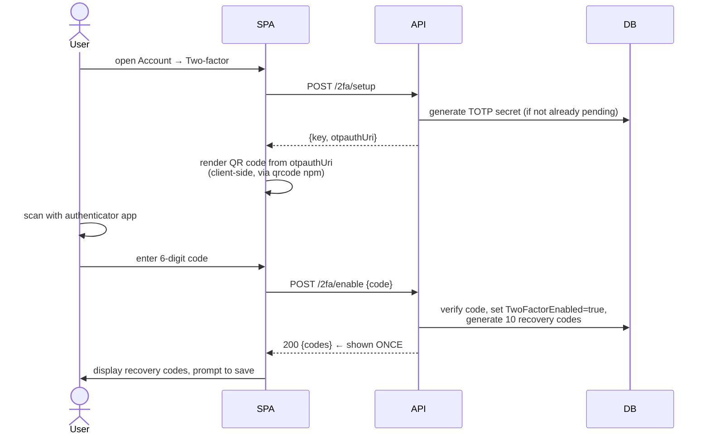

# Authentication

Viritura's authentication system gates user accounts, two-factor authentication, OAuth links (Google, GitHub), and GitHub-as-a-capability (acting on a user's repos). It is built on **ASP.NET Core Identity** (cookie auth, EF Core store) and lives in [`server/Viritura.Api/`](../../server/Viritura.Api/) and [`server/Viritura.Infrastructure/`](../../server/Viritura.Infrastructure/). The frontend exposes it through [`apps/editor/src/auth/`](../../apps/editor/src/auth/) and [`apps/editor/src/github/`](../../apps/editor/src/github/).

This document explains **what exists, why it's shaped this way, and where the security boundaries are**. For HTTP-level details see the [reference section](#http-surface) at the end.

> Live collaboration is intentionally **not** in this document. The P2P live-collab model uses unguessable room IDs as the capability and is anonymous by design — see [`spec/collaboration-system.md`](collaboration-system.md). If we ever ship a server-backed authoritative collaboration mode (see roadmap), that will introduce a new auth surface and warrant its own section.

---

## Trust and security boundaries



### What crosses each boundary

| Direction             | What crosses                                                                                                                                                                                                                                      | What does **not** cross                                                                          |
| --------------------- | ------------------------------------------------------------------------------------------------------------------------------------------------------------------------------------------------------------------------------------------------- | ------------------------------------------------------------------------------------------------ |
| Browser → API         | Email, password, TOTP code, recovery code, antiforgery token, session cookie                                                                                                                                                                      | —                                                                                                |
| API → Browser         | `viritura.sid` cookie (opaque, encrypted by DataProtector); `VirituraUser` JSON (id, email, displayName, avatar, linked providers, hasPassword, twoFactorEnabled)                                                                                 | Password hashes, TOTP secrets, recovery codes, GitHub access and refresh tokens, security stamps |
| API → DB              | PBKDF2-hashed passwords (via Identity's `PasswordHasher`), Data Protection encrypted authenticator/recovery material, and Data Protection encrypted GitHub OAuth access + refresh tokens (see [GitHub section](#github-app-identity--capability)) | —                                                                                                |
| API ↔ Google / GitHub | Standard OAuth 2.0 (auth code via `viritura.ext` round-trip cookie, then back-channel token exchange)                                                                                                                                             | —                                                                                                |
| API → SMTP            | Email body containing a single-use DataProtector token in a confirmation link                                                                                                                                                                     | —                                                                                                |

### Cookie scoping rationale

| Cookie                 | Scope choice                                     | Why                                                                                                                                                                                                                                                                                                                                                                                    |
| ---------------------- | ------------------------------------------------ | -------------------------------------------------------------------------------------------------------------------------------------------------------------------------------------------------------------------------------------------------------------------------------------------------------------------------------------------------------------------------------------- |
| `viritura.sid`         | HttpOnly, **Secure in production**, SameSite=Lax | The editor and API are cross-origin but same-site in both local worktree routing (`editor.<slug>.localhost` ↔ `api.<slug>.localhost`) and production (`app.viritura.com` ↔ `api.viritura.com`), so `Lax` permits credentialed requests without weakening cross-site protections. Development mirrors the request's HTTP/HTTPS scheme; production always requires Secure.               |
| `viritura.antiforgery` | HttpOnly **header-paired**                       | Mitigates CSRF: every state-changing request must echo the cookie value in the `X-XSRF-TOKEN` header. An attacker on `evil.com` cannot read the cookie value, so cannot forge the header.                                                                                                                                                                                              |
| `viritura.2fa.uid`     | 10-min lifetime                                  | Partial-auth cookie issued after a successful password check when 2FA is enabled. Short lifetime caps the window where a stolen partial cookie could be used to attempt TOTP brute force; on top of that, the cookie value itself is the partition key for the `TwoFactorAttempt` rate limiter (see [rate limiting](#rate-limiting)) so one attacker cannot burn another user's quota. |
| `viritura.2fa.rem`     | 30-day lifetime                                  | "Trust this browser" — lets the user skip TOTP on a known device for 30 days. Tied to user + browser; cleared on `logout-everywhere`.                                                                                                                                                                                                                                                  |
| `viritura.ext`         | 10-min lifetime, SameSite=None always            | Stores OAuth challenge state across the provider redirect. Must be `SameSite=None` because the redirect from Google / GitHub is a top-level cross-site navigation.                                                                                                                                                                                                                     |

### Antiforgery model

All state-changing endpoints (`POST`, `PUT`, `DELETE`) under `/auth/*`, `/account/*`, `/2fa/*`, and `/github/*` require a valid `X-XSRF-TOKEN` header matching the `viritura.antiforgery` cookie. The frontend fetches the pair from `GET /auth/csrf` once on app boot and includes the header on every mutating request.

OAuth callback GETs (`/auth/external/google/callback`, `/github/auth/callback`) are exempt because they're top-level browser navigations triggered by the provider, but they require a matching `state` parameter signed with DataProtector to prevent CSRF on the OAuth flow itself.

---

## Account shapes

A `AspNetUsers` row can be in one of these shapes:

| Shape          | `PasswordHash` | `AspNetUserLogins` rows | Notes                                                           |
| -------------- | -------------- | ----------------------- | --------------------------------------------------------------- |
| **Local only** | set            | none                    | Email + password sign-in only.                                  |
| **OAuth only** | null           | ≥1                      | Sign-in via Google or GitHub only.                              |
| **Hybrid**     | set            | ≥1                      | Either path works. Recommended for users who want a backup.     |
| **Orphan**     | null           | none                    | **Invariant: must never exist.** Enforced on every unlink path. |

The orphan invariant is enforced by a single rule applied to `POST /account/unlink`, `POST /account/password/remove`, and `POST /github/auth/unlink`:

```
afterRemovalCredentialCount =
    (hasPassword ? 1 : 0)
  + AspNetUserLogins.Count(forUser)
  - (removingThisOne ? 1 : 0)
>= 1
```

If removing the credential would leave zero, the API responds **409 Conflict** with a message telling the user to add another credential first.

---

## Sign-in flows

### Password sign-in (with 2FA branch)



`PasswordSignInAsync` with `lockoutOnFailure: true` automatically locks an account after 5 failed attempts for 15 minutes. The login endpoint additionally enforces **per-email** rate limiting on top of the global per-IP `Auth` policy to prevent slow credential-stuffing across many IPs.

**Why one generic 401 for all failure modes:** distinguishing "wrong password" from "unconfirmed email" from "account locked" gives an attacker a free user-existence and account-state oracle. The previous shape returned `403` for unconfirmed and `423` for locked-out, which let an attacker enumerate which addresses had ever registered and which were currently under attack by _someone else_ (a locked-out response means somebody is already brute-forcing this account). All three branches now return the same status, body, and timing so the response is informationless to anyone who doesn't already control the mailbox.

### External OAuth (Google or GitHub)



**The "never auto-link by email" rule is the security crux.** A naive implementation that says "the OAuth provider says this email is verified, so sign the user into the matching local account" enables a classic takeover: an attacker controlling `victim@example.com` at the IdP — or controlling an IdP that lies about email verification — gains full access to a Viritura account they never registered for. We explicitly send the user to a sign-in + manual link flow instead.

### GitHub as identity (same flow, plus capability)

GitHub uses the same algorithm as Google but lives on its own controller because the existing GitHub App handles both **identity** (sign-in) and **capability** (`git push`, repo creation) using a single OAuth handshake. See [GitHub App section](#github-app-identity--capability) for the dual-purpose rationale.

### Register



Registration **always returns `202 Accepted`** with the same payload regardless of whether the email is new or already in use, closing the registration-time enumeration oracle. If the email belongs to an existing account (local, OAuth, or hybrid), the server silently sends a password-reset link to that mailbox instead of creating a duplicate row. A user who controls the inbox can complete the reset; an attacker learns nothing from the status, body, or public copy. Email work is queued through a bounded production dispatcher so SMTP latency does not create a synchronous timing oracle.

### 2FA enrollment



The TOTP secret never leaves the server in raw form after `/2fa/setup` — only the `otpauth://` URI containing the base32-encoded shared secret. Recovery codes are returned **once** at enable time (and again on `/2fa/recovery/regenerate`). ASP.NET Identity token values, including authenticator keys and recovery-code material, are encrypted at rest with a dedicated Data Protection purpose; a startup migrator rewrites legacy plaintext rows through that converter.

Generating a setup secret requires a fresh `ManageTwoFactor` recent-auth grant. Once 2FA is enabled, `/2fa/setup` refuses to return the active secret. All secret- and recovery-code-bearing responses are marked `Cache-Control: no-store`.

### Recent authentication

Sensitive credential mutations use short-lived, one-time grants stored in a protected Secure, HttpOnly, `__Host-viritura-recent-auth` cookie. Every grant binds the user ID, requested action, security stamp, nonce, and expiry. It cannot authorize a different action and is consumed when used. Password accounts prove their current password and, when enabled, current TOTP. OAuth-only accounts reauthenticate through an already-linked Google or GitHub identity; a provider flow cannot be repurposed to link a new identity.

Recent authentication protects OAuth-only password creation, email changes, account deletion, login unlinking, new provider linking, and TOTP enrollment. It supplements rather than replaces antiforgery protection. GitHub operations use narrow backend-for-frontend endpoints rather than exporting a reusable provider capability.

---

## Two-factor authentication

- **Algorithm:** TOTP per RFC 6238 (SHA-1, 30-second period, 6 digits, ±1 window for clock skew). This is the ASP.NET Core Identity default.
- **Brute-force ceiling:** The TOTP and recovery-code endpoints are rate-limited to 10 attempts per partial-auth cookie per 10 minutes (see [rate limiting](#rate-limiting)), on top of Identity's standard lockout after 5 failed code submissions. This bounds an attacker holding a stolen partial cookie to ~10 guesses against a 1-in-1,000,000 TOTP space before being locked out.
- **Recovery codes:** 10 single-use codes generated at enable time and on regenerate; Identity's recovery representation is encrypted at rest in `AspNetUserTokens`. Old codes remain valid until a new batch is generated.
- **Email-based recovery** (lost device + lost recovery codes): `POST /auth/login/2fa-recover` sends a single-use DataProtector token to the account's verified email. Clicking the link lands on `POST /auth/2fa/disable-by-recovery-token` which wipes 2FA and signs the user in.
- **Disable while signed in:** `POST /2fa/disable` requires the current TOTP code as a re-auth gate, preventing a hijacked session from silently turning off 2FA.
- **Regenerate recovery codes:** `POST /2fa/recovery/regenerate` is also gated on a current TOTP code. Without the gate, a hijacked session could silently rotate the recovery code batch out from under the rightful owner — locking them out of the email-based recovery path while handing the attacker a fresh set of bypass codes.
- **Remember-this-browser:** Optional 30-day `viritura.2fa.rem` cookie set on successful TOTP. Cleared by `logout-everywhere` (which also rotates `SecurityStamp`, invalidating every other session).

---

## Account management

| Action                            | Endpoint                                                               | Gate                                                                                                                                                                                                                                                                                                                                                                                                  |
| --------------------------------- | ---------------------------------------------------------------------- | ----------------------------------------------------------------------------------------------------------------------------------------------------------------------------------------------------------------------------------------------------------------------------------------------------------------------------------------------------------------------------------------------------- |
| Change password                   | `POST /account/password`                                               | Requires current password                                                                                                                                                                                                                                                                                                                                                                             |
| Set password (OAuth-only account) | `POST /account/password/set`                                           | Action-bound recent authentication                                                                                                                                                                                                                                                                                                                                                                    |
| Remove password                   | `POST /account/password/remove`                                        | Requires current password + orphan check                                                                                                                                                                                                                                                                                                                                                              |
| Unlink OAuth provider             | `POST /account/unlink` (Google) or `POST /github/auth/unlink`          | Orphan check; OAuth-only accounts also require action-bound recent authentication                                                                                                                                                                                                                                                                                                                     |
| Change email                      | `POST /account/email` → email link → `POST /auth/confirm-email-change` | Requires confirmation of new email; **also notifies the current (old) email address** on every request so a hijacked session cannot silently move the user to an attacker-controlled mailbox. The notification fires on both the link-issued path and the duplicate-target path (where no link is sent) to deny an attacker the ability to suppress the alert by probing for already-taken addresses. |
| Update display name / avatar      | `POST /account/profile`                                                | Signed-in                                                                                                                                                                                                                                                                                                                                                                                             |
| Delete account                    | `POST /account/delete`                                                 | Password, or action-bound provider recent authentication for OAuth-only accounts; cascades to account-owned data                                                                                                                                                                                                                                                                                      |
| Sign out this device              | `POST /auth/logout`                                                    | Signed-in                                                                                                                                                                                                                                                                                                                                                                                             |
| Sign out everywhere               | `POST /auth/logout-everywhere`                                         | Signed-in; rotates `SecurityStamp`                                                                                                                                                                                                                                                                                                                                                                    |

### Out-of-band security notifications

Every credential-surface change fires a fire-and-forget email to the account's confirmed address (gated on `EmailConfirmed`) so a user whose session has been hijacked sees the change land in their inbox even when the attacker is the one operating the UI. The notification is dispatched **after** the change succeeds — we'd rather a flaky SMTP path drop the alert than block a legitimate user from updating their own credentials. Each message includes a "if this wasn't you, change password and sign out everywhere" line that points at the recovery surface.

| Trigger                                                                          | Notification                                            |
| -------------------------------------------------------------------------------- | ------------------------------------------------------- |
| `POST /account/password` (change)                                                | Password-changed alert                                  |
| `POST /account/password/set`                                                     | Password-set alert                                      |
| `POST /account/password/remove`                                                  | Password-removed alert                                  |
| `POST /account/unlink` / `POST /github/auth/unlink` (any login actually removed) | External-login-removed alert (carries provider name)    |
| OAuth link added (either via signed-in OAuth start or post-callback link path)   | External-login-added alert (carries provider name)      |
| `POST /2fa/enable`                                                               | Two-factor-enabled alert                                |
| `POST /2fa/disable`                                                              | Two-factor-disabled alert                               |
| `POST /2fa/recovery/regenerate`                                                  | Recovery-codes-regenerated alert                        |
| `POST /account/email` (both link-issued and duplicate-target branches)           | Email-change-attempted alert to the **current** address |

The notification surface lives in [`IVirituraEmailSender`](../../server/Viritura.Infrastructure/Email/IVirituraEmailSender.cs). Shared copy lives in `VirituraEmailSenderBase`; Development uses `ConsoleEmailSender`, while production uses the Resend HTTPS transport.

---

## GitHub App: identity + capability

Viritura ships a single **GitHub App** (not a plain OAuth App) in [`server/Viritura.GitHub/`](../../server/Viritura.GitHub/). It does double duty:

1. **Identity** — same OAuth callback as Google, finds-or-creates an `AppUser` keyed on `(LoginProvider="GitHub", ProviderKey=githubUserId)` and signs the user in.
2. **Capability** — the user-to-server access token from the same OAuth handshake is stored server-side in `UserGitHubInstallation` and used by [`GitHubGitProxyController`](../../server/Viritura.Api/Controllers/GitHubGitProxyController.cs) to proxy `git push`/`pull` and by repo-management endpoints to create + list repos.

**Why one App for both:**

- GitHub Apps issue **user-to-server tokens** that are constrained by the App's declared permissions and the user's installation selection. A typical OAuth App token with `repo` scope grants access to **every** repo the user can read; a GitHub App token is limited to the repos the user explicitly selected at install time. This is materially safer.
- Tokens are short-lived (~8h) with a refresh token. Neither token leaves the server: the frontend calls narrow Viritura endpoints such as `POST /github/repositories`, while the server refreshes and uses the stored token internally.
- Adding a second handler (`AspNet.Security.OAuth.GitHub` from the community library) would create two parallel handlers for the same provider with overlapping callback URLs and confused token ownership. We avoid that by using the existing custom flow as the GitHub sign-in path.

**Browser compromise blast radius:**

- No reusable GitHub bearer token is available to browser JavaScript or storage.
- A compromised Viritura session can invoke only the narrow operations exposed by Viritura's authenticated backend-for-frontend and constrained Git smart HTTP proxy.
- GitHub still limits operations to the repositories selected at installation and the App's declared permission ceiling.
- Revocation at `github.com/settings/applications` invalidates the server-held grant.

**Token storage:** OAuth access + refresh tokens are stored in `UserGitHubInstallation` encrypted at rest via `GitHubTokenProtector` (a thin wrapper around `IDataProtectionProvider` with the purpose `"Viritura.GitHub.OAuthTokens.v1"`). Encrypted columns use the on-disk format `v1:` + base64 ciphertext; rows written before encryption was introduced continue to round-trip as plaintext and are transparently re-encrypted on the next write. Decryption happens inside `GitHubInstallationStore`, which reads with `AsNoTracking()` so the decrypted entity never re-enters the EF change tracker. This means a DB-only breach (stolen backup, read-only SQL injection, snapshot leak) does **not** hand the attacker live GitHub tokens — they would additionally need the DataProtection key ring (see [key management](#sessions-and-cookies-reference)).

---

## Sessions and cookies (reference)

| Cookie                 | Scheme constant                               | HttpOnly | Secure | SameSite                | Lifetime    | Purpose                            |
| ---------------------- | --------------------------------------------- | -------- | ------ | ----------------------- | ----------- | ---------------------------------- |
| `viritura.sid`         | `IdentityConstants.ApplicationScheme`         | ✅       | ✅     | Lax (prod) / None (dev) | 14d sliding | Main auth session                  |
| `viritura.2fa.uid`     | `IdentityConstants.TwoFactorUserIdScheme`     | ✅       | ✅     | Lax (prod) / None (dev) | 10m         | Partial cookie after password step |
| `viritura.2fa.rem`     | `IdentityConstants.TwoFactorRememberMeScheme` | ✅       | ✅     | Lax (prod) / None (dev) | 30d         | Skip TOTP on trusted device        |
| `viritura.ext`         | `IdentityConstants.ExternalScheme`            | ✅       | ✅     | None                    | 10m         | OAuth round-trip state             |
| `viritura.antiforgery` | Antiforgery                                   | ✅       | ✅     | Lax (prod) / None (dev) | Session     | Paired with `X-XSRF-TOKEN` header  |

Identity options in [`Program.cs`](../../server/Viritura.Api/Program.cs):

- `RequireUniqueEmail = true`
- `Password.RequiredLength = 12`
- `Lockout.MaxFailedAccessAttempts = 5`, `DefaultLockoutTimeSpan = 15 min`
- `SignIn.RequireConfirmedEmail = true` in prod (configurable in dev)

### Key management

All cookie payloads (`viritura.sid`, the partial-2FA cookies, the antiforgery cookie), OAuth `state` parameters, and at-rest GitHub OAuth tokens are protected by ASP.NET Core's DataProtection API. The key ring is configured in [`Viritura.Infrastructure`](../../server/Viritura.Infrastructure/) and persisted to the filesystem path named by the `DataProtection:KeysDirectory` config key. In **production** the application **fails fast at startup** if the key is not set — running on the in-memory default would silently invalidate every session and every encrypted token on each restart. In Development the in-memory default is permitted as a convenience. The application name is pinned to `"Viritura"` so multiple API instances share the same key ring.

---

## Rate limiting

Configured in [`Program.cs`](../../server/Viritura.Api/Program.cs) via `Microsoft.AspNetCore.RateLimiting`, partitioned per client IP:

| Policy                   | Limit                | Partition                                                                                   | Applied to                                          |
| ------------------------ | -------------------- | ------------------------------------------------------------------------------------------- | --------------------------------------------------- |
| `Auth`                   | 30 req/min           | Client IP                                                                                   | All `/auth/*`, `/account/*`, `/2fa/*`               |
| `TwoFactorAttempt`       | 10 attempts / 10 min | SHA-256 hash of `viritura.2fa.uid` cookie value (falls back to client IP if cookie missing) | `POST /auth/login/2fa`, `POST /auth/login/recovery` |
| `GitHubAuth`             | 30 req/min           | Client IP                                                                                   | `/github/auth/*`                                    |
| `GitHubSession`          | 120 req/min          | Client IP                                                                                   | `GET /github/session`                               |
| `GitHubToken`            | 60 req/min           | Client IP                                                                                   | `POST /github/connection/token`                     |
| `GitHubGitProxy`         | 60 req/min           | Client IP                                                                                   | git wire protocol proxy                             |
| `LiveSnapshotPut`        | 20 req/min           | Client IP                                                                                   | `PUT /live/room/{id}/snapshot`                      |
| `LiveSnapshotGet`        | 600 req/min          | Client IP                                                                                   | `GET /live/room/{id}/snapshot`                      |
| `LiveSignalingHandshake` | 30 req/min           | Client IP                                                                                   | `/live/signal` WebSocket upgrade                    |
| Global default           | 600 req/min          | Client IP                                                                                   | Everything else                                     |

`POST /auth/login` additionally enforces a **per-email** limiter on top of the per-IP `Auth` policy, blocking slow credential-stuffing campaigns that rotate IPs against a single account. The per-email partition table lives in a `MemoryCache` with sliding eviction so a distributed enumeration that burns a fresh address per attempt can't grow the partition table without bound.

`SendPasswordResetEmailAsync` (invoked by both `POST /auth/forgot-password` and the duplicate-email branch of `POST /auth/register`) enforces a **per-email** cap of 3 password-reset emails per hour. Without it the SMTP path is an email bomber: the responses are intentionally identical for known and unknown emails, so there's no signal in front of the sender to throttle them — the throttle has to live on the send itself.

`POST` requests to the GitHub git proxy (`/github/git/*`) additionally require a valid `X-XSRF-TOKEN` header on top of the existing Origin/Referer enforcement. The proxy carries the user's GitHub installation token, so a forged cross-origin POST would be doubly damaging; antiforgery is defence-in-depth alongside the origin check. `GET` (advertise refs) is read-only and skips the check.

The `TwoFactorAttempt` policy partitions by the partial-auth cookie rather than by IP or user ID so the limit is **per victim session**, not per attacker. One attacker brute-forcing one victim cannot incidentally lock out a different victim, and an attacker who somehow knows a victim's user ID cannot pre-burn the quota before the victim ever attempts a code. Both the TOTP path (`/auth/login/2fa`) and the recovery-code path (`/auth/login/recovery`) are covered — recovery codes have far more entropy individually but are a small finite set per user, so they need the same brute-force ceiling. Returns `429 Too Many Requests` on the 11th attempt within the 10-minute window.

---

## Security headers

Applied by [`SecurityHeadersPolicy`](../../server/Viritura.Api/SecurityHeadersPolicy.cs) (uses `NetEscapades.AspNetCore.SecurityHeaders`). Since the API serves only JSON, the policy is restrictive by default:

- `Content-Security-Policy: default-src 'none'; frame-ancestors 'none'; base-uri 'none'; form-action 'none'`
- `X-Frame-Options: DENY`
- `X-Content-Type-Options: nosniff`
- `Referrer-Policy: strict-origin-when-cross-origin`
- `Cross-Origin-Opener-Policy: same-origin`
- `Cross-Origin-Resource-Policy: same-site`
- `Strict-Transport-Security: max-age=31536000; includeSubDomains` (prod only)
- `Server` header removed

---

## CORS

Policy `VirituraFrontend` allows credentialed requests (`AllowCredentials()`) from a fixed origin list:

- **Always:** `https://app.viritura.com`, `https://viritura.com`
- **Dev only:** `http(s)://localhost:5173` (editor), `http(s)://localhost:4173` (preview), `http(s)://localhost:5180` (website)
- **Configurable extra prod origins:** `Viritura:GitHub:AllowedFrontendOrigins` config key

Localhost origins are stripped in production.

---

## Email

Two abstractions:

- `IEmailSender<AppUser>` (Identity built-in) — used for email confirmation and password reset
- `IVirituraEmailSender` (custom) — used for 2FA email-recovery and email-change confirmation

Development defaults to `ConsoleEmailSender`, which logs messages to `ILogger` at `Information` level. Production selects `ResendEmailSender` with `Email:Provider=Resend`. Provider credentials and the verified sender are deployment secrets; see the production-auth runbook.

---

## Data model

Schema lives in [`server/Viritura.Infrastructure/`](../../server/Viritura.Infrastructure/).

### `AppUser` (extends `IdentityUser<string>`)

```csharp
public sealed class AppUser : IdentityUser
{
    public string?         DisplayName  { get; set; } // ≤ 64 chars
    public string?         AvatarUrl    { get; set; } // from OAuth provider
    public DateTimeOffset  CreatedAtUtc { get; set; }
}
```

Plus the Identity-managed columns: `Email`, `NormalizedEmail`, `EmailConfirmed`, `PasswordHash` (nullable for OAuth-only accounts), `TwoFactorEnabled`, `SecurityStamp`, `LockoutEnd`, `AccessFailedCount`.

### Identity tables (managed)

- `AspNetUsers`
- `AspNetUserLogins` — `(LoginProvider, ProviderKey) → UserId`
- `AspNetUserTokens` — Data Protection encrypted TOTP secret + recovery-code material
- `AspNetUserClaims`, `AspNetUserRoles` — present but unused today

### `UserGitHubInstallation`

```csharp
public sealed class UserGitHubInstallation
{
    public long              Id                        { get; set; } // PK
    public string            UserId                    { get; set; } // FK → AspNetUsers, CASCADE
    public string            LoginProvider             { get; set; } // "GitHub"
    public string            ProviderKey               { get; set; } // GitHub user ID
    public string            Login                     { get; set; } // e.g. "octocat"
    public long              GitHubUserId              { get; set; }
    public string?           AvatarUrl                 { get; set; }
    public string            AccessToken               { get; set; }
    public string?           RefreshToken              { get; set; }
    public DateTimeOffset?   AccessTokenExpiresAtUtc   { get; set; }
    public DateTimeOffset?   RefreshTokenExpiresAtUtc  { get; set; }
    public string            TokenType                 { get; set; } // "bearer"
    public string?           Scope                     { get; set; }
    public DateTimeOffset    CreatedAtUtc              { get; set; }
    public DateTimeOffset    UpdatedAtUtc              { get; set; }
}
```

Unique index on `(LoginProvider, ProviderKey)`. Cascade-deletes with the parent `AspNetUsers` row.

---

## HTTP surface

### `/auth/*` — identity (`Auth` rate limit)

| Method | Path                                  | Auth               | Purpose                                                                                                                                                                                                                   |
| ------ | ------------------------------------- | ------------------ | ------------------------------------------------------------------------------------------------------------------------------------------------------------------------------------------------------------------------- |
| GET    | `/auth/csrf`                          | Anonymous          | Issue antiforgery cookie + return matching header token                                                                                                                                                                   |
| GET    | `/auth/me`                            | Anonymous          | Current user JSON or `{authenticated: false}`                                                                                                                                                                             |
| POST   | `/auth/register`                      | Anonymous          | Create local account; always returns `202 Accepted` with an account-shape-independent payload. If the email is already in use, silently queues a password-reset link to that mailbox instead of creating a duplicate row. |
| POST   | `/auth/verify`                        | Anonymous          | Confirm email from emailed token                                                                                                                                                                                          |
| POST   | `/auth/resend-verification`           | Anonymous          | Re-send verification (always 204 to hide enumeration)                                                                                                                                                                     |
| POST   | `/auth/forgot-password`               | Anonymous          | Send reset link (always 204)                                                                                                                                                                                              |
| POST   | `/auth/reset-password`                | Anonymous          | Consume reset token, set new password, sign in                                                                                                                                                                            |
| POST   | `/auth/login`                         | Anonymous          | Password sign-in step 1/2                                                                                                                                                                                                 |
| POST   | `/auth/login/2fa`                     | Partial 2FA cookie | TOTP step 2/2                                                                                                                                                                                                             |
| POST   | `/auth/login/recovery`                | Partial 2FA cookie | Recovery code step 2/2                                                                                                                                                                                                    |
| POST   | `/auth/login/2fa-recover`             | Anonymous          | Email a 2FA-disable link                                                                                                                                                                                                  |
| POST   | `/auth/2fa/disable-by-recovery-token` | Anonymous          | Consume the emailed token, disable 2FA, sign in                                                                                                                                                                           |
| POST   | `/auth/confirm-email-change`          | Anonymous          | Finalise email change                                                                                                                                                                                                     |
| POST   | `/auth/logout`                        | Authenticated      | Sign out this device                                                                                                                                                                                                      |
| POST   | `/auth/logout-everywhere`             | Authenticated      | Rotate `SecurityStamp`                                                                                                                                                                                                    |

### `/auth/external/*` — Google OAuth (`Auth` rate limit)

| Method | Path                             | Auth      | Purpose                                |
| ------ | -------------------------------- | --------- | -------------------------------------- |
| GET    | `/auth/external/google/start`    | Anonymous | Issue challenge + redirect             |
| GET    | `/auth/external/google/callback` | Anonymous | Find-or-create user, sign in, redirect |

### `/account/*` — account management (`Auth` rate limit, `[Authorize]`)

| Method | Path                       | Purpose                              |
| ------ | -------------------------- | ------------------------------------ |
| POST   | `/account/unlink`          | Unlink OAuth provider (orphan check) |
| POST   | `/account/password`        | Change password                      |
| POST   | `/account/password/set`    | Set password on OAuth-only account   |
| POST   | `/account/password/remove` | Remove password (orphan check)       |
| POST   | `/account/email`           | Initiate email change                |
| POST   | `/account/profile`         | Update display name / avatar         |
| POST   | `/account/delete`          | Hard-delete account + cascade        |

### `/2fa/*` — two-factor management (`Auth` rate limit, `[Authorize]`)

| Method | Path                       | Purpose                                              |
| ------ | -------------------------- | ---------------------------------------------------- |
| GET    | `/2fa/status`              | `{enabled, remaining}`                               |
| POST   | `/2fa/setup`               | Issue TOTP secret + `otpauth://` URI                 |
| POST   | `/2fa/enable`              | Verify code, enable, return recovery codes (once)    |
| POST   | `/2fa/disable`             | Disable (requires current TOTP code)                 |
| POST   | `/2fa/recovery/regenerate` | New recovery code batch (requires current TOTP code) |

### `/github/*` — GitHub identity + capability

| Method | Path                       | Auth          | Rate limit      | Purpose                                                                   |
| ------ | -------------------------- | ------------- | --------------- | ------------------------------------------------------------------------- |
| GET    | `/github/auth/start`       | Anonymous     | `GitHubAuth`    | OAuth challenge                                                           |
| GET    | `/github/auth/callback`    | Anonymous     | `GitHubAuth`    | OAuth callback, find-or-create, sign in                                   |
| POST   | `/github/auth/unlink`      | Authenticated | `GitHubAuth`    | Revoke grant, delete local row, orphan check                              |
| GET    | `/github/session`          | Optional      | `GitHubSession` | Current GitHub link state (returns `{connected: false}` if not signed in) |
| POST   | `/github/connection/token` | Authenticated | `GitHubToken`   | Mint a fresh user-to-server access token                                  |
| GET    | `/github/app`              | Anonymous     | —               | App metadata (slug, install URL, client ID)                               |

---

## Frontend API

The editor exposes two parallel hooks from [`apps/editor/src/auth/`](../../apps/editor/src/auth/) and [`apps/editor/src/github/`](../../apps/editor/src/github/):

### `useVirituraAccount()` — "am I signed in?"

```typescript
{
  status: "loading" | "ready" | "error";
  user: VirituraUser | null; // id, email, displayName, avatarUrl,
  // linkedProviders, hasPassword, twoFactorEnabled
  refresh: () => Promise<void>;
  signIn: (payload) => Promise<LoginResult>; // { user, requiresTwoFactor }
  signInTwoFactor: (payload) => Promise<VirituraUser>;
  signInRecovery: (payload) => Promise<VirituraUser>;
  register: (payload) => Promise<VirituraUser>;
  signOut: () => Promise<void>;
  signOutEverywhere: () => Promise<void>;
}
```

Backed by `/auth/me` for state and the matching `/auth/*` endpoints for mutations. Drives `SignInDialog` and `AccountButton`.

### `useGitHubAccount()` — "can I push to GitHub?"

```typescript
{
  status:            "loading" | "ready" | "error"
  app:               GitHubAppResponse | null       // { slug, clientId, installUrl }
  session:           GitHubSessionResponse | null   // { connected, viewer, installation, accessTokenExpiresAtUtc }
  signIn:            (source?: GitHubLoginSource) => void
  unlink:            (options?) => Promise<void>
  createRepository:  (request) => Promise<CreatedGitHubRepository>
}
```

Backed by `/github/session` (which itself reads `UserGitHubInstallation` keyed by the current Viritura session).

The two hooks are deliberately separate: a user can be signed in to Viritura without a GitHub link, or have an existing GitHub link expire and need to re-link without re-authing to Viritura.

---

## Known gaps and future work

- **Email delivery operations.** Resend delivery is implemented, but bounce/complaint suppression and webhook automation remain operational follow-up work.
- **Re-auth gate on sensitive actions.** Today the gates are "current password" or "current TOTP code" where appropriate. A stronger model would require fresh re-auth (e.g., within the last 5 min) for `account/delete` and `logout-everywhere`.
- **Sign-in audit log.** Successful and failed sign-ins are logged via `ILogger` but not persisted to a structured audit table. A `UserSecurityEvent` table indexed by user would give us a self-service "recent activity" surface and forensics on suspicious behaviour.
