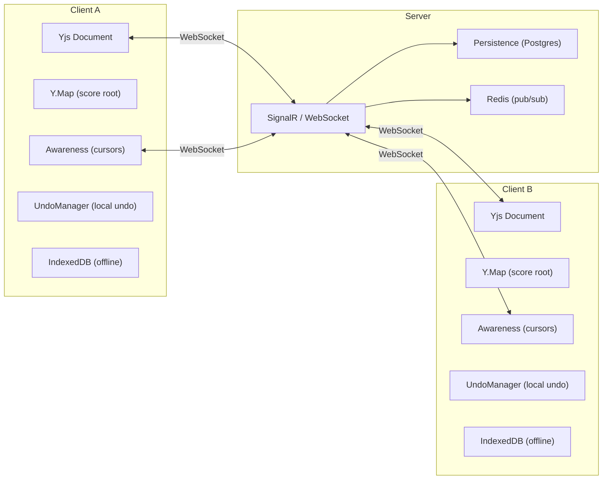
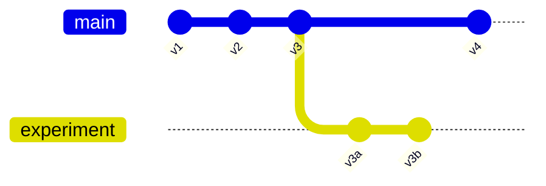
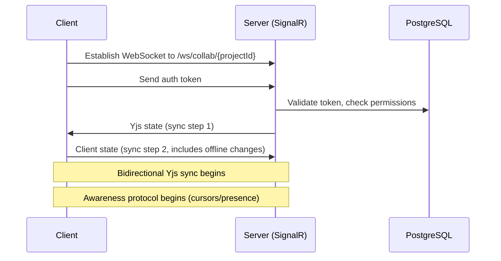

# Collaboration System Design

Live sessions are anonymous capability rooms. The 16-character room ID carries approximately 80 bits of entropy and is shared as `#live=<roomId>` so it does not enter HTTP request targets, referrer headers, or access logs. Legacy `?live=` links remain readable during migration and are rewritten without the query parameter. Anyone holding the link can join.

The signaling relay validates the Viritura topic namespace and bounds total connections, connections per source address, subscribers per topic, message size, publish payload size, and topic lifetime. The snapshot sidecar validates Yjs updates and applies upload concurrency, per-source byte quotas, room-count, total-memory, idle-expiry, and absolute-expiry limits. Capacity pressure rejects the incoming snapshot rather than evicting an unrelated room.

> **Implementation status (May 2026):** the per-element `Y.Map` / `Y.Array` shape this document specifies is **shipped**, but the implementation is a _schema-blind_ structural projection in [`packages/crdt/src/yProjection/`](../../packages/crdt/src/yProjection/), not the hand-written `Y.Map` construction shown in the code samples below. The illustrative snippets (`scoreRoot.set("metadata", new Y.Map([...]))` etc.) document the **shape** the projection produces from MNX JSON; they are not literal call sites in the codebase. See [data-model-pipeline.md: Y.Doc / CRDT](data-model-pipeline.md#ydoc--crdt) for the actual API surface and [crdt-collaboration.md](../plans/crdt-collaboration.md) for remaining product work. The WebRTC transport, IndexedDB persistence, HTTP snapshots, and awareness protocol described below are also shipped; managed cloud transport and persistence remain queued.

## Overview

The collaboration system enables multiple users to edit the same score simultaneously with real-time synchronization, offline support, and conflict-free merging. It is built on **Yjs** (a CRDT framework) and designed to be the foundation of the entire editing experience — not a bolt-on feature.

---

## Architecture



---

## CRDT-to-Model Mapping

### Principles

1. **Maps for keyed entities** — Use `Y.Map` for objects with named properties (Score, Part, Measure, Note)
2. **Arrays for ordered collections** — Use `Y.Array` for lists where order matters (measures, voice elements, notes in a chord)
3. **Nested maps for voice content** — Voice content is keyed by `partId:staffIdx:voiceIdx` to avoid array index conflicts
4. **Top-level spanners** — Spanners (slurs, hairpins) are stored at the document root, not inside measures, to avoid conflicts when editing endpoints
5. **Sub-documents for scalability** — Large scores split into sub-documents (one per section or per part) to avoid loading the entire score

### Document Structure

```typescript
// Root Yjs document structure
const ydoc = new Y.Doc();

// Top-level shared types
const scoreRoot = ydoc.getMap("score"); // Y.Map — score metadata & style
const parts = ydoc.getArray("parts"); // Y.Array<Y.Map> — parts list
const measures = ydoc.getArray("measures"); // Y.Array<Y.Map> — measures list
const spanners = ydoc.getArray("spanners"); // Y.Array<Y.Map> — spanners
const textItems = ydoc.getArray("textItems"); // Y.Array<Y.Map> — text attachments
const layoutOverrides = ydoc.getMap("layout"); // Y.Map — layout overrides
```

### Mapping Details

#### Score Root (`Y.Map`)

```typescript
scoreRoot.set("version", "1.0.0");
scoreRoot.set(
  "metadata",
  new Y.Map([
    ["id", "uuid-v7"],
    ["title", "My Score"],
    ["composer", "Jane Doe"],
    ["createdAt", "2026-02-26T10:00:00Z"],
    ["modifiedAt", "2026-02-26T15:30:00Z"],
  ]),
);
scoreRoot.set(
  "style",
  new Y.Map([
    ["musicFont", "Bravura"],
    ["spatium", 1.764],
    // ...
  ]),
);
```

#### Parts (`Y.Array<Y.Map>`)

```typescript
const part = new Y.Map();
part.set("id", "p1");
part.set("name", "Violin I");
part.set("abbreviation", "Vln. I");
part.set(
  "instrument",
  new Y.Map([
    ["id", "violin"],
    ["family", "strings"],
    ["clefs", new Y.Array(["treble"])],
    // ...
  ]),
);
parts.push([part]);
```

#### Measures (`Y.Array<Y.Map>`)

```typescript
const measure = new Y.Map();
measure.set("id", "m1");
measure.set("number", 1);
measure.set("barlineEnd", "normal");

// Time signature (only when changed)
measure.set(
  "timeSignature",
  new Y.Map([
    ["numerator", 4],
    ["denominator", 4],
    ["displayType", "common"],
  ]),
);

// Voice content — keyed map avoids concurrent insertion conflicts
const voices = new Y.Map();
const voice = new Y.Map();
const elements = new Y.Array();

const chord = new Y.Map();
chord.set("id", "e1");
chord.set("type", "chord");
chord.set("duration", new Y.Map([["base", "quarter"]]));
chord.set("dots", 0);
chord.set(
  "notes",
  new Y.Array([
    /* note Y.Maps */
  ]),
);

elements.push([chord]);
voice.set("elements", elements);
voices.set("p1:0:0", voice); // partId:staffIdx:voiceIdx
measure.set("voices", voices);

measures.push([measure]);
```

---

## Conflict Resolution Scenarios

### Scenario 1: Two Users Edit Different Measures

**No conflict.** Yjs arrays handle independent edits at different indices automatically.

### Scenario 2: Two Users Edit the Same Measure, Different Voices

**No conflict.** Voices are keyed by `partId:staffIdx:voiceIdx` in a `Y.Map`. Different keys = independent edits.

### Scenario 3: Two Users Edit the Same Voice in the Same Measure

**Potential conflict — handled by Yjs Y.Array semantics.**

- If both insert notes at different positions: Yjs preserves both insertions in their intended order
- If both delete the same note: Yjs converges (double-delete is idempotent)
- If one deletes and another modifies the same note: Delete wins (Yjs behavior — the deleted item's modifications are lost)

**Mitigation:** The awareness protocol shows real-time cursor positions, so users can see that someone else is editing a specific location and avoid simultaneous edits of the same element.

### Scenario 4: Two Users Move a Barline / Change Time Signature

**Structural conflict.** Changing the time signature at a measure affects all voices in that measure.

**Resolution:** Last-writer-wins for the `timeSignature` property (Y.Map semantics). The UI shows a notification: "User X changed the time signature of measure N."

### Scenario 5: Offline Editing and Reconnection

**Handled natively by Yjs.**

1. User goes offline → edits accumulate in the local Yjs document
2. Changes persist to IndexedDB via y-indexeddb
3. User reconnects → Yjs syncs all accumulated changes
4. CRDT merge is automatic and conflict-free
5. If structural conflicts occurred (e.g., same measure heavily edited by both), the visual result may surprise the user → show diff view

---

## Awareness Protocol

The Yjs awareness protocol syncs ephemeral state between connected users — cursor positions, selections, and presence information.

### Awareness State Shape

```typescript
interface AwarenessState {
  /** User identity */
  user: {
    id: string;
    name: string;
    color: string; // assigned color for cursor/selection highlighting
    avatarUrl?: string;
  };

  /** Current cursor position in the score */
  cursor?: {
    measureId: string;
    partId: string;
    staffIndex: number;
    voiceIndex: number;
    position: Fraction;
    /** Which element the cursor is on */
    elementId?: string;
  };

  /** Current selection range */
  selection?: {
    type: "element" | "range";
    elementIds?: string[];
    startMeasureId?: string;
    endMeasureId?: string;
    startPosition?: Fraction;
    endPosition?: Fraction;
  };

  /** What mode the user is in */
  mode: "normal" | "note-input" | "edit-text" | "playback";

  /** Note input state (if in note-input mode) */
  noteInput?: {
    duration: DurationType;
    dots: number;
    accidental?: AccidentalType;
    voice: number;
  };

  /** Is the user currently viewing the score? */
  active: boolean;

  /** Last activity timestamp */
  lastActive: number;
}
```

### Cursor Rendering

Each remote user's cursor is rendered as:

- A colored vertical line at their current position
- A colored highlight over their selection
- A small name tag above the cursor showing the user's name
- User avatars in the collaborator panel

Colors are auto-assigned from a perceptually-distinct palette:

```typescript
const COLLABORATOR_COLORS = [
  "#FF6B6B",
  "#4ECDC4",
  "#45B7D1",
  "#96CEB4",
  "#FFEAA7",
  "#DDA0DD",
  "#98D8C8",
  "#F7DC6F",
  "#BB8FCE",
  "#85C1E9",
  "#F8C471",
  "#82E0AA",
];
```

---

## Undo/Redo

### Per-User Undo Stack

Yjs provides `Y.UndoManager` which tracks mutations by origin (= per client). Each user has their own undo stack:

```typescript
const undoManager = new Y.UndoManager([measures, spanners, textItems, parts], {
  // Track changes by this user
  trackedOrigins: new Set([ydoc.clientID]),
  // Capture stacks that can reasonably be undone together
  captureTimeout: 500, // group changes within 500ms
});

// Undo only this user's changes, not other collaborators'
undoManager.undo();
undoManager.redo();
```

**Key behavior:**

- User A's undo only undoes User A's changes
- User B's changes are unaffected by User A pressing Ctrl+Z
- The undo stack preserves CRDT consistency

---

## Version History

### Snapshots

The server periodically creates snapshots of the Yjs document state:

```typescript
interface ScoreVersion {
  id: string; // UUID v7
  projectId: string;
  /** Yjs document state as binary (encodeStateAsUpdate) */
  yjsState: Uint8Array;
  /** Human-readable label */
  label?: string; // e.g., "v2.1 — Added coda section"
  /** Who created this version */
  userId: string;
  createdAt: string;
  /** Parent version for branching */
  parentId?: string;
}
```

### Auto-Snapshots

- Auto-snapshot every 5 minutes while the document has active editors
- Auto-snapshot on significant structural changes (new part added, time sig changed)
- Auto-snapshot when the last user disconnects

### Named Versions (Tags)

Users can explicitly create named versions:

- "Final draft"
- "Before orchestration"
- "Submitted version"

### Branching

Users can create branches from any version:



Branches can be compared and merged. Merging uses Yjs state vectors — the CRDT guarantees convergence.

### Diff View

A visual diff between two versions shows:

- Added notes/measures (green highlight)
- Deleted notes/measures (red highlight with strikethrough)
- Modified properties (yellow highlight)

Implementation: Decode both Yjs states, reconstruct score models, run element-by-element comparison.

---

## Permissions Model

```typescript
interface ProjectPermissions {
  projectId: string;

  /** The project owner — full control */
  ownerId: string;

  /** Per-user roles */
  collaborators: Collaborator[];

  /** Default access for anyone with the link */
  linkAccess: "none" | "view" | "comment" | "edit";
}

interface Collaborator {
  userId: string;
  role: CollaboratorRole;
  addedAt: string;
  addedBy: string;
}

type CollaboratorRole = "editor" | "commenter" | "viewer";
```

**Role permissions:**

| Action               | Owner | Editor | Commenter | Viewer |
| -------------------- | ----- | ------ | --------- | ------ |
| Edit score           | ✓     | ✓      | ✗         | ✗      |
| Add comments         | ✓     | ✓      | ✓         | ✗      |
| View score           | ✓     | ✓      | ✓         | ✓      |
| Play back            | ✓     | ✓      | ✓         | ✓      |
| Export               | ✓     | ✓      | ✓         | ✗      |
| Create versions      | ✓     | ✓      | ✗         | ✗      |
| Manage collaborators | ✓     | ✗      | ✗         | ✗      |
| Delete project       | ✓     | ✗      | ✗         | ✗      |
| Transfer ownership   | ✓     | ✗      | ✗         | ✗      |

---

## Comments and Annotations

### Inline Comments

Attached to specific score positions (like Google Docs comments):

```typescript
interface ScoreComment {
  id: string;
  /** Where in the score this comment attaches */
  anchor: CommentAnchor;
  /** Comment thread */
  thread: CommentMessage[];
  resolved: boolean;
  createdAt: string;
}

interface CommentAnchor {
  measureId: string;
  position?: Fraction;
  partId?: string;
  elementId?: string;
  /** For range comments */
  endMeasureId?: string;
  endPosition?: Fraction;
}

interface CommentMessage {
  id: string;
  userId: string;
  text: string;
  createdAt: string;
  editedAt?: string;
}
```

Comments are stored in a separate Yjs sub-document to avoid bloating the score document.

---

## Scaling Strategy

### Sub-Documents

For large scores (orchestral works, operas), load only the needed portions. Partitioning is by **movement** (the natural musical boundary — no spanners cross movements, each starts on a new page):

```mermaid
graph TB
    Root[\"Root Y.Doc<br/>~3 KB, always loaded\"] --> Metadata[\"metadata<br/>Title, composer, parts, movements\"]
    Root --> PartsConfig[\"parts-config<br/>Instruments, transpositions, staves\"]
    Root --> Mvt1[\"movement-1 (Y.SubDoc) ~1-3 MB\"]
    Root --> Mvt2[\"movement-2 (Y.SubDoc) ~1-3 MB\"]
    Root --> Mvt3[\"movement-3 (Y.SubDoc) ~1-3 MB\"]
    Root --> Mvt4[\"movement-4 (Y.SubDoc) ~1-3 MB\"]
    Root --> Overrides[\"viritura-overrides (Y.SubDoc) ~100 KB\"]
    Root --> Comments[\"comments (Y.SubDoc) variable\"]

    Mvt1 --> GM1[\"global-measures (Y.Array)\"]
    Mvt1 --> PM1[\"part-measures (Y.Map by partId)\"]
    Mvt1 --> SP1[\"spanners (Y.Array)\"]
    Mvt1 --> TI1[\"text-items (Y.Array)\"]

    style Metadata fill:#C8E6C9,stroke:#388E3C
    style PartsConfig fill:#C8E6C9,stroke:#388E3C
    style Mvt1 fill:#BBDEFB,stroke:#1976D2
    style Mvt2 fill:#BBDEFB,stroke:#1976D2
    style Mvt3 fill:#BBDEFB,stroke:#1976D2
    style Mvt4 fill:#BBDEFB,stroke:#1976D2
    style Overrides fill:#FFF9C4,stroke:#FBC02D
    style Comments fill:#FFF9C4,stroke:#FBC02D
```

**Load strategy:**

1. Root metadata + parts config always loaded (~3 KB)
2. The movement the user navigates to is loaded on open (~1-3 MB)
3. Adjacent movements are prefetched in background
4. Comments and overrides are loaded on demand

Sub-documents are loaded on demand as the user scrolls or navigates. When a user edits measure 75, only the corresponding movement's sub-document needs to be synced.

**Bandwidth optimization:** Updates are only broadcast to users who have the relevant sub-document loaded. If User A edits Movement 1 while User B is viewing Movement 3, User B doesn't receive the update until they navigate to Movement 1.

See [`../plans/performance-architecture.md`](../plans/performance-architecture.md) for the full memory model, budgets, and scaling analysis.

### Connection Management

- Users connect to a specific project room via WebSocket
- The server tracks which sub-documents each user has loaded
- Updates are only broadcast to users who have the relevant sub-document loaded
- Idle users (no activity for 30 minutes) are downgraded to awareness-only (receive cursor updates but not document changes) to save bandwidth

### Rate Limiting

- Maximum 50 users per document simultaneously
- Maximum 1000 operations per user per minute
- Maximum document size: 50MB (Yjs state)
- Debounced awareness updates: 100ms minimum interval

---

## Offline Workflow

1. **Going offline:**
   - Yjs document state is persisted to IndexedDB (via y-indexeddb)
   - User can continue editing offline
   - All changes are tracked locally

2. **While offline:**
   - Full editing capability (no playback restrictions)
   - Undo/redo works normally
   - No awareness of other users (obviously)
   - UI shows "Offline — changes will sync when reconnected"

3. **Reconnecting:**
   - Yjs syncs accumulated changes with the server
   - CRDT merge is automatic
   - If many changes occurred on both sides, show a summary notification
   - Re-establish awareness protocol

4. **Conflict indicator:**
   - After sync, if the same measure was edited by multiple users offline, highlight those measures with a subtle indicator
   - User can review the merged result and adjust if needed

---

## WebSocket Protocol

### Connection Flow



### Message Types

```typescript
// Yjs sync messages (binary protocol, handled by y-websocket)
type YjsMessage =
  | { type: 0; data: Uint8Array }  // sync step 1
  | { type: 1; data: Uint8Array }  // sync step 2
  | { type: 2; data: Uint8Array }  // update

// Awareness messages
  | { type: 3; data: Uint8Array }  // awareness update

// Custom messages (JSON, application-specific)
  | { type: 100; payload: { action: 'comment'; ... } }
  | { type: 101; payload: { action: 'version'; ... } }
  | { type: 102; payload: { action: 'export-request'; ... } }
```

### Reconnection Strategy

- Exponential backoff: 100ms, 200ms, 400ms, 800ms, ..., max 30s
- On reconnect, Yjs re-syncs automatically (state vector comparison)
- Service Worker can maintain WebSocket in background tab (with user permission)
