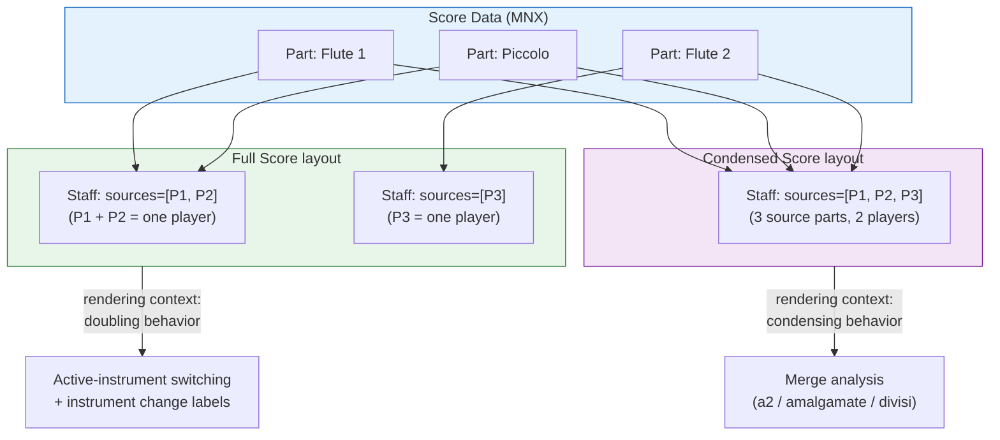
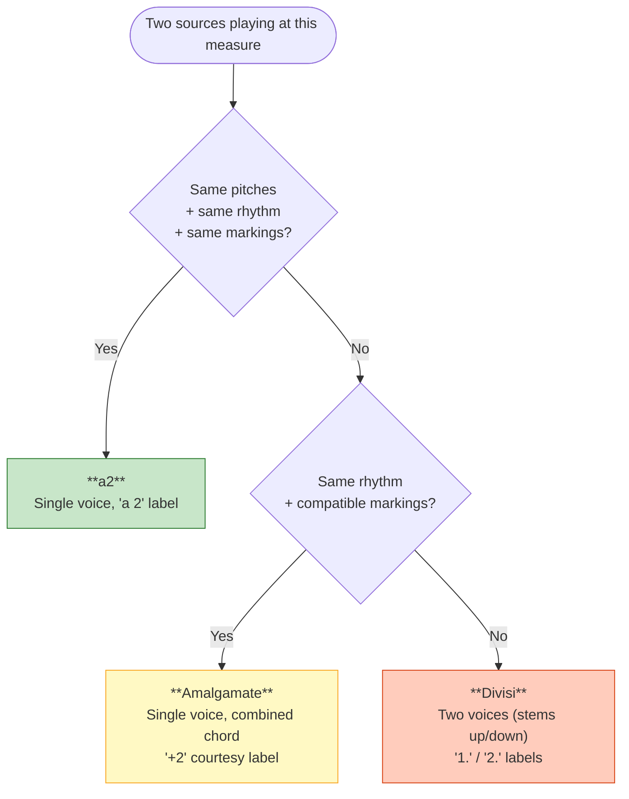
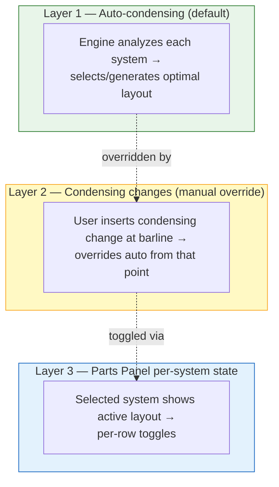
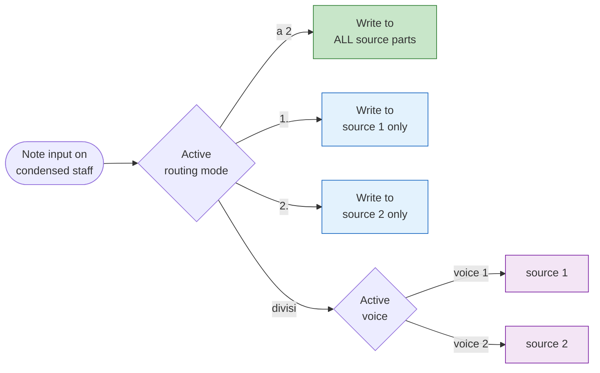

# Condensing & Instrument Doubling

> **Reference / spec.** Describes the shipped architecture and records the remaining polish work.

Both **instrument doubling** (one player covering Flute/Piccolo) and **score condensing** (Fl 1 + Fl 2 sharing a staff in the conductor's score) use the same underlying mechanism: a staff that lists multiple parts in its `sources[]` array. The behavior — doubling vs. merging — is determined by _which score is being rendered_, not by any flag on the data.



The MNX representation is just:

```json
{ "type": "staff", "sources": [{ "part": "P1" }, { "part": "P2" }] }
```

No `_x.viritura` vendor extension involved — this is native MNX.

## 1. Doubling

A doubling player (one human, multiple instruments) is modeled as **two separate parts** that share a staff in the **full-score layout**. That shared staff is what defines them as one player; no explicit player-identity field is stored.

### Player identity is inferred from the full-score layout

```json
{
  "id": "full-score",
  "content": [
    { "type": "staff", "sources": [{ "part": "P1" }, { "part": "P2" }] },
    { "type": "staff", "sources": [{ "part": "P3" }] }
  ]
}
```

P1 (Flute) + P2 (Piccolo) = 1 player. P3 (Flute 2) = 1 player. When a _condensed_ score references all three, the engine consults the full-score layout to compute: **3 source parts, 2 players** → merge analysis runs between 2 voices.

This means condensing merge analysis operates on **player count**, not raw source count. The active instrument for a doubling player at any given measure is determined by which part has music.

### UI

- Staves with `sources.length > 1` render as collapsible items in the Parts Panel.
- Collapsed: combined name ("Flute 1 / Piccolo") with source count.
- Expanded: indented sub-items per source.
- Context menu: "Add Doubling" / "Remove Doubling".

## 2. The condensed score is a score definition, not a toggle

A condensed score appears alongside the full score and individual parts as a peer:

```json
"scores": [
  { "name": "Full Score",      "layout": "full-score" },
  { "name": "Condensed Score", "layout": "condensed-score" },
  { "name": "Flute",           "layout": "L-P2" }
]
```

The condensed score's layout uses multi-source staves:

```json
{
  "id": "condensed-score",
  "content": [
    {
      "type": "group",
      "symbol": "bracket",
      "content": [
        { "type": "staff", "sources": [{ "part": "P2" }, { "part": "P3" }] },
        { "type": "staff", "sources": [{ "part": "P4" }, { "part": "P5" }] }
      ]
    }
  ]
}
```

### Why a score definition, not a toggle

| Concern            | Toggle approach (rejected)        | Score definition approach                                |
| ------------------ | --------------------------------- | -------------------------------------------------------- |
| Persistence        | Recomputed each time              | Saved in the MNX file                                    |
| Per-system layouts | Needs separate state              | Uses `pages[].systems[].layout` natively                 |
| Multiple views     | One condensed view only           | Multiple condensed scores (conductor, rehearsal, pocket) |
| Custom groupings   | Fixed instrument pairing          | Any combination of parts on staves                       |
| UI                 | Special mode toggle               | Just another score tab                                   |
| Data model         | Separate condensing state to sync | Everything in the MNX model                              |

### Merge decisions happen at render time

There is no synthesized condensed-parts data. The Rust layout engine computes merge mode (a2 / amalgamate / divisi) from the source parts' music as it renders.



| Music relationship             | Merge mode     | Rendering                          |
| ------------------------------ | -------------- | ---------------------------------- |
| Identical content              | **a2**         | Single voice, "a 2" text           |
| Same rhythm, different pitches | **Amalgamate** | Single voice, combined chords      |
| Different rhythms              | **Divisi**     | Two voices (stems up / stems down) |

Merge analysis considers the **full musical content** at each evaluation point — pitches, rhythms, dynamics, articulations, slurs, hairpins, text expressions, ornaments, and other markings. Conflicting markings force divisi even when pitches/rhythms would amalgamate. See [§8](#8-merge-analysis-non-note-content) for the full rules.

## 3. Per-system condensing

The condensed score can reference **different layouts per system**, allowing different condensing groupings across the piece.

```json
{
  "name": "Condensed Score",
  "pages": [
    {
      "systems": [
        { "measure": "m1", "layout": "cond-fl12-ob12" },
        { "measure": "m17", "layout": "cond-fl1-fl23" },
        { "measure": "m33", "layout": "full-score" }
      ]
    }
  ]
}
```

Layout definitions are reusable templates. Identical groupings reuse the same layout ID — the engine deduplicates.

### Three layers of control



**Layer 1 — auto.** For each system, the engine examines each instrument group, checks whether they can share a staff (same rhythm? same notes? independent?), and selects or generates a layout definition.

**Layer 2 — manual override.** Right-click a barline → "Insert Condensing Change". Opens the condensing popover ([§5](#5-the-condensing-popover-routing--changes)).

**Layer 3 — Parts Panel.** When a system is selected on the canvas, the Parts Panel shows the active layout for that system with toggle affordances.

### Many-to-many flexibility

Condensing is _not_ a fixed pairing. Any combination of source instruments can map to any number of condensed staves, and this mapping can change at every condensing change point. Three things vary independently at each change:

1. **Which sources share a staff** — any grouping, not just pairs.
2. **How many condensed staves** — can increase or decrease.
3. **Staff ordering** — sources can appear in any order.

```
m1:   Staff 1 [Fl 1, Fl 2]   Staff 2 [Fl 3/Picc]        ← 2 staves
m17:  Staff 1 [Picc]   Staff 2 [Fl 1]   Staff 3 [Fl 2]  ← 3 staves, all separate
m33:  Staff 1 [Fl 1, Fl 2, Fl 3]                        ← 1 staff, all together
m49:  Staff 1 [Fl 1]   Staff 2 [Fl 2, Fl 3/Picc]        ← 2 staves, new grouping
```

**Improvement over Dorico:** Dorico only allows condensing changes at system breaks. Viritura supports condensing changes **mid-system** — merge mode, voice allocation, and instrument labeling can change at any barline within a system. Changing the _number of staves_ mid-system is a stretch goal blocked on ossia-staff rendering infrastructure.

## 4. Expandable source staves

When viewing a condensed score, each condensed staff can be expanded to reveal its individual source staves directly on the canvas.

```
┌─────────────────────────────────────────────┐
│  Fl. 1, 2   ║ ♩ ♩ ♩ ♩   (condensed)        │  ← always visible
│  ▼ expand   ╟──────────────────────────────  │
│    Fl. 1    ║ ♩ ♩ ♩ ♩                       │  ← shown on expand
│    Fl. 2    ║ ♩ ♩ ♩ ♩                       │
└─────────────────────────────────────────────┘
```

- Expansion is **per condensed staff** (Fl 1+2 expanded while Ob 1+2 stays collapsed).
- Expansion state is **transient** — not saved in MNX; treated like zoom level.
- Source staves render as **full independent staves** (own clefs, key sigs, time sigs, all notation) so the condensed and expanded views always match.
- Edits propagate both ways live (edits target source parts; condensed staff re-renders from sources).

| Edit target              | What happens                                                      |
| ------------------------ | ----------------------------------------------------------------- |
| Condensed staff (a2)     | Edit broadcasts to both source parts → source staves update       |
| Condensed staff (divisi) | Edit goes to the specific source part → that source staff updates |
| Expanded source staff    | Edit goes to that source part → condensed staff re-renders        |

## 5. The condensing popover — routing & changes

A single popover handles both **condensing labels** (routing input) and **condensing changes** (layout overrides). Entry points:

| Use case                    | Entry point                | Popover section used    |
| --------------------------- | -------------------------- | ----------------------- |
| Set routing while composing | `Alt+C` on condensed staff | Top (label selection)   |
| Insert condensing change    | Right-click barline        | Bottom (staff grouping) |
| Override auto-condensing    | `Alt+C` at barline         | Both                    |
| Edit existing label         | Click label on score       | Top                     |

```
┌──────────────────────────┐
│  ● a 2     (all unison)  │  ← routes input to all sources
│  ○ 1.      (solo)        │  ← routes to source 1 only
│  ○ 2.      (solo)        │  ← routes to source 2 only
│  ○ +2      (courtesy)    │  ← amalgamation hint
│  ○ divisi                │  ← voice-based routing
│  ──────────────────────  │
│  ☐ Staff grouping...     │  ← opens condensing change dialog
└──────────────────────────┘
```

### Routing modes during note input



The routing mode persists until the user changes it or reaches a new condensing label. Labels themselves are not stored — they are re-inferred from the resulting music on re-render. The routing shortcut is a composition convenience that produces the right notes-in-the-right-source-parts.

### Smart default routing

When no explicit mode is set:

1. **Voice 1** → `sources[0]`, **Voice 2** → `sources[1]`.
2. If the current passage is a2, new notes go to all sources. If divisi, notes go to the active voice's source.
3. The status bar shows the active routing.

### Auto mode switching

Breaking a unison by changing a pitch automatically triggers re-render as divisi — no user action needed. The merge analyzer runs every render.

## 6. Editing in condensed view

Because condensing is layout-only, every rendered element retains **provenance** — which source part it came from.

| Mode           | Click target               | Edit behavior                                        |
| -------------- | -------------------------- | ---------------------------------------------------- |
| **Divisi**     | Voice 1 / Voice 2          | Unambiguous — each voice maps to one source          |
| **Amalgamate** | Specific notehead in chord | Engine tracks which note = which source              |
| **a2**         | Single rendered note       | Broadcasts to all sources (correct: a2 = same thing) |

The provenance plumbing lives in `apps/editor/src/score/condensingRouter.ts`.

## 7. The Parts Panel is the single source of truth

There is no separate Score Setup Dialog. All score setup, instrumentation, grouping, and score management happen inline in the Parts Panel with live canvas feedback.

```
┌─────────────────────────────────┐
│ Scores                          │  ← score list
│   Full Score              ◀     │
│   Condensed Score               │
│   Flute                         │
│   [+ Add Score]                 │
├─────────────────────────────────┤
│ ┃ ┃  Flute 1                    │  ← staff tree with brackets
│ ┃ ┃  Flute 2                    │
│ ┃    Oboe                       │
│      Clarinet (B♭)              │
├─────────────────────────────────┤
│ [+ Add Instrument]              │
├─────────────────────────────────┤
│ Concert ⇋ Written   ▤/▣         │
└─────────────────────────────────┘
```

### Score list

- **Click** a row → switch to that score view (active row highlighted with ◀).
- **[+ Add Score]** → "Full Score", "Condensed Score", "Custom Score", "Part: {instrument}".
- **Right-click** → Rename, Duplicate, Delete, Set Pitch Mode (concert/written).
- **Drag** to reorder.

### Adding a condensed score — auto-generation rules

| Instrument group                        | Condensed staff                |
| --------------------------------------- | ------------------------------ |
| 2 of same instrument (Fl 1, Fl 2)       | One staff, two sources         |
| 3 of same instrument (Fl 1, Fl 2, Fl 3) | Default: Fl 1+2, Fl 3 separate |
| 4 of same instrument (Hn 1–4)           | Hn 1+2, Hn 3+4                 |
| Solo instrument (Picc, Timp)            | Own staff unchanged            |
| Multi-staff instrument (Piano)          | Own staves unchanged           |

After creation, users customize via condensing changes.

### Score-context-aware panel

| Active score    | Panel shows                                    |
| --------------- | ---------------------------------------------- |
| Full Score      | All staves, one per instrument                 |
| Condensed Score | Multi-source staves with condensing indicators |
| Part (Flute)    | Just that part's staves                        |

Switching score tabs updates the panel tree, grouping bars, and available context menu actions.

## 8. Merge analysis: non-note content

Merge analysis evaluates the **full musical content**, not just pitch and rhythm. The engine considers all attached markings when deciding merge mode.

| Category             | Examples                          | Identical                 | Conflicting                       |
| -------------------- | --------------------------------- | ------------------------- | --------------------------------- |
| **Dynamics**         | f, pp, sfz, fp                    | Same marking → shared     | Different dynamics → divisi       |
| **Hairpins**         | cresc., dim., < >                 | Same span + direction     | Different direction/span → divisi |
| **Articulations**    | staccato, accent, tenuto, marcato | Same set on note → shared | Different articulations → divisi  |
| **Slurs**            | Slur start/end                    | Same start+end points     | Different slur spans → divisi     |
| **Text expressions** | "dolce", "espress."               | Same text → shared        | Different text → divisi           |
| **Ornaments**        | trill, turn, mordent              | Same ornament → shared    | Different ornaments → divisi      |
| **Tremolos**         | single/double/buzzroll            | Same type → shared        | Different types → divisi          |
| **Technique**        | pizz., arco, con sord.            | Same technique → shared   | Different techniques → divisi     |

### Decision rules

1. **All identical** (same notes, same markings) → **a2** — render once, shared markings.
2. **Same rhythm + compatible markings** → **Amalgamate** — combined chord, shared markings.
3. **Same rhythm + conflicting markings** → **Divisi** — pitches could amalgamate, but markings force separation.
4. **Different rhythms** → **Divisi** regardless of markings.

### Key principle

Two sources playing identical notes with the same rhythm but **different dynamics** (Fl 1 at _ff_, Fl 2 at _pp_) render as divisi — not a2 — because the dynamics need separate placement. The same applies to conflicting articulations, slurs, or any other per-voice marking.

System-level markings (tempo, rehearsal marks, time/key signatures) are not part of merge analysis — they belong to the system, not to individual voices.

### Amalgamation with shared markings

When sources amalgamate (same rhythm, different pitches, same markings), the marking renders **once** on the combined chord — not duplicated.

- Fl 1: C5 staccato, _ff_
- Fl 2: E5 staccato, _ff_
- Result: C5+E5 chord, single staccato, single _ff_.

## 9. Other engraving rules

### Voice capacity

- Up to **4 independent voices** on a condensed staff (matches the multi-voice input system). Handles two instruments × two internal voices each.
- **Unlimited amalgamation** — a4, a6, or larger chords stack naturally. Hollywood scores routinely use a6 for string sections.
- For normal orchestral instruments, multi-voice + condensing is unusual. If an instrument uses internal multi-voice writing, it typically shouldn't be condensed.

### Player labels and rest handling

| Scenario                                | Rendering                          | Label                            |
| --------------------------------------- | ---------------------------------- | -------------------------------- |
| Only player 1 playing                   | Normal stems (no direction forced) | `1.`                             |
| Player 2 joins in unison                | Single voice                       | `a 2`                            |
| Player 2 joins in harmony (same rhythm) | Single voice, combined chord       | `+2` (courtesy)                  |
| Players diverge (different rhythms)     | Divisi (stems up/down)             | `1.` / `2.` on respective voices |

**Rest hiding rule.** Greedily prefer hiding rests by showing a player label (`1.`) instead. At the next beam break, if the other voice can't amalgamate, start showing explicit rests with divisi voices.

### Transposition constraints

Instruments of different transpositions **cannot share a staff** — they produce different key signatures in written pitch mode.

- B♭ Cl 1 + B♭ Cl 2 → can condense.
- Ob 1 + English Horn → cannot share a staff (Ob in C, EH in F).
- Ob 1 + Ob 2 → can condense.

They _can_ share a condensing **group**, however. When an EH player doubles on Oboe 3, they can condense with Ob 1+2 while they're on Oboe; they get their own staff while on English Horn.

The engine enforces this constraint automatically — auto-condensing never pairs incompatible transpositions, and the condensing-change dialog grays out invalid pairings.

### Clef handling

If source parts use different clefs, the condensed staff **splits by default** (each voice keeps its own clef, which in practice means divisi rendering since one staff can only have one active clef).

Scores can **override the clef** for a condensed staff — e.g., Bassoon 1+2 share tenor clef in the condensed score while Bassoon 2's individual part keeps bass clef. The clef override lives on the condensed staff's layout definition and does not affect source parts.

### Grand staff condensing

Grand-staff instruments (piano, harp, organ) condense as a unit — both staves of a piano are one source. Piano 1 + Piano 2 condensed produces a grand staff with up to 4 voices (2 per piano × 2 staves). Rare but occurs in large orchestral scores (Mahler, Strauss).

### Instrument add/remove cascade

Adding an instrument in the full score automatically places it in all condensed score definitions, using the §7 auto-generation rules. Removing a source instrument cleans up all references across all score definitions.

## 10. Key data types

```typescript
// @viritura/core
interface LayoutStaff {
  type: "staff";
  sources: LayoutSource[];
}

interface LayoutSource {
  part: string;
  staff?: number;
  stem?: string;
  voice?: string;
}

interface SystemDefinition {
  layout?: string; // layout at system start
  measure: string; // start measure
  layoutChanges?: LayoutChange[]; // mid-system switches
}

interface ScoreDefinition {
  name?: string;
  layout?: string; // default layout
  pages?: PageDefinition[]; // per-page/system overrides
}
```

## 11. Remaining work

### Beam-break-granularity merge analysis

Merge mode is currently evaluated once per measure. Re-evaluate at automatic
beam-break boundaries so an identical opening beat group can render `a 2` before
diverging into amalgamated or divisi voices later in the same measure. This
requires segment-level merge analysis, mid-measure transition markers, and
voice allocation that can change mode within a measure.

Before implementing this, replace the provisional whole-measure override shape
described below so manual and automatic transitions use the same positional
model.

### Position-bearing condensing changes

Manual overrides currently live on
`parts[].measures[]._x.viritura.condensingOverride`, even though the decision
belongs to a multi-source layout staff rather than one source part. Replace it
with `global.measures[]._x.viritura.condensingChanges[]`, where each entry has a
rhythmic `position`, stable layout-staff reference, and mode.

The migration requires stable optional IDs on `LayoutStaff`, schema and TS/Rust
model changes, dual-read/new-write parser behavior, engine consumption, editor
popover mutation updates, fixture migration, and corresponding updates to
[viritura-extensions.md](viritura-extensions.md). Group-wide UI actions should
emit one entry per staff rather than complicating the wire format with a second
scope.

### Mid-system staff-count changes

Merge mode and voice allocation can change at a mid-system barline, but adding
or removing staves still forces a system break. Supporting variable staff count
within a system depends on ossia-style infrastructure: staff lines that begin
or end at barlines, variable local system height, and mid-system bracket
adjustment. Do not begin this work before that infrastructure exists.

## References

- Engine condensing analysis: `engine/viritura-engine/src/layout/condensing/`
- Per-system layout resolution: `engine/viritura-engine/src/layout/mnx_layout/explicit.rs`
- Click-to-source routing & note-input routing: `apps/editor/src/score/condensingRouter.ts`
- Condensing popover: `apps/editor/src/components/CondensingPopover.tsx`
- Staff grouping dialog: search workspace for `StaffGroupingDialog`
- Layout types: `packages/core/src/model/layout.ts`
- Parts Panel: `apps/editor/src/components/PartListPanel.tsx`
- MNX spec (external): `../mnx-spec/`
