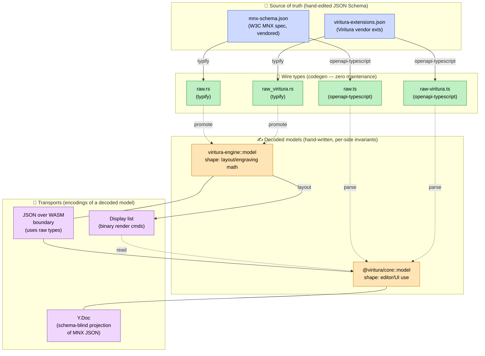
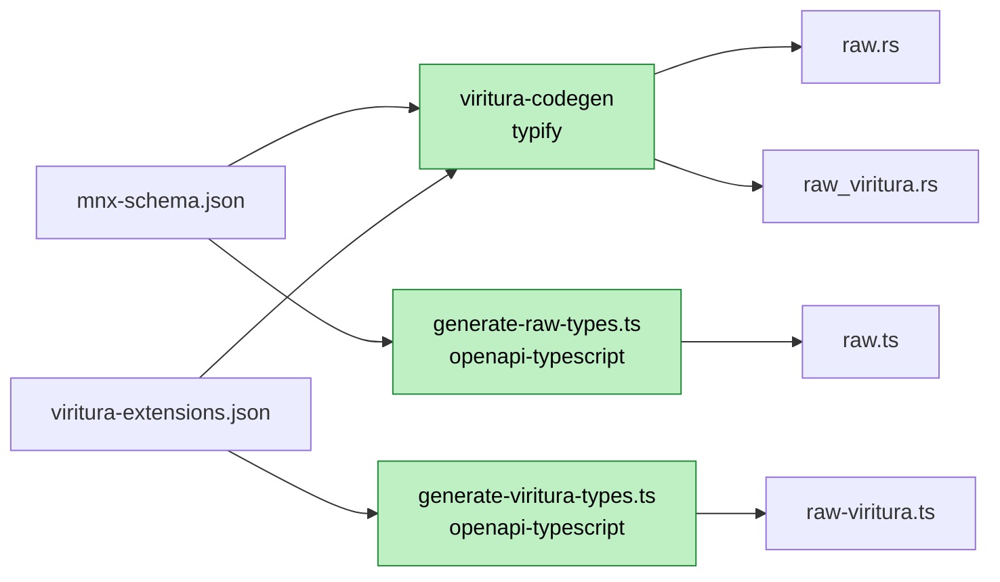
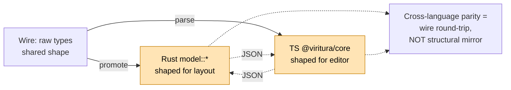
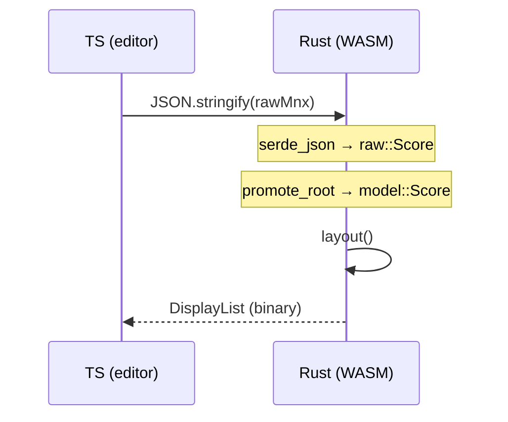
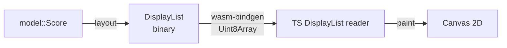
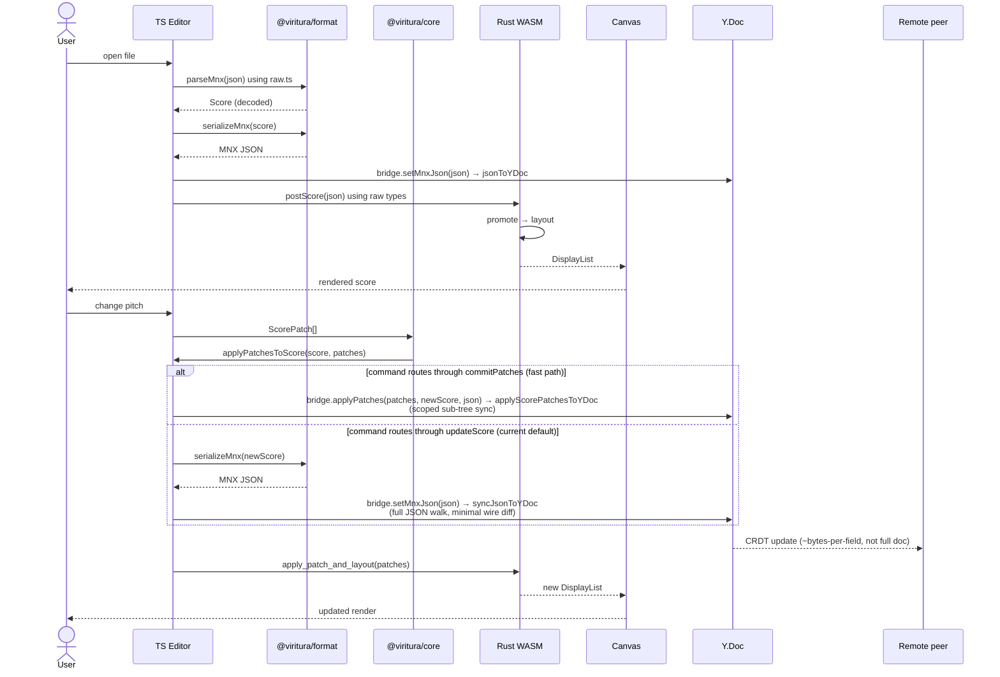

# Data Model Pipeline

> Canonical reference for the score data model. Describes every
> representation a `Score` takes between the on-disk MNX schema and the
> screen, on both the Rust and TypeScript sides, and which of those
> representations are codegen'd vs hand-maintained.

## TL;DR

The real maintenance load is **two decoded models that both round-trip
the wire**, sitting between a vendored W3C schema + our vendor-extension
schema (the only places wire-shape changes happen) and a binary render
protocol (the only place layout output is hand-described). Everything
else is either generated from the schemas or is a _transport_ — an
encoding of a tier above, not another shape of `Score`.

| Tier                                   | Rust                                                                                                                       | TypeScript                                                                                                                                 | Cost                                                      |
| -------------------------------------- | -------------------------------------------------------------------------------------------------------------------------- | ------------------------------------------------------------------------------------------------------------------------------------------ | --------------------------------------------------------- |
| MNX schema (W3C)                       | [`mnx-schema.json`](../../packages/format/schemas/mnx-schema.json)                                                         | (same)                                                                                                                                     | vendored — `git pull` from upstream, not hand-authored    |
| Vendor-extension schema (ours)         | [`viritura-extensions.json`](../../packages/format/schemas/viritura-extensions.json)                                       | (same)                                                                                                                                     | **hand** — only place wire-shape changes originate        |
| Wire types                             | [`raw.rs`](../../engine/viritura-engine/src/raw.rs), [`raw_viritura.rs`](../../engine/viritura-engine/src/raw_viritura.rs) | [`raw.ts`](../../packages/core/src/raw/raw.ts), [`raw-viritura.ts`](../../packages/core/src/raw/raw-viritura.ts) (in `@viritura/core/raw`) | codegen — schema is the only edit site                    |
| Decoded models                         | [`viritura-engine/src/model/`](../../engine/viritura-engine/src/model/) (shape: layout/engraving math)                     | [`@viritura/core/src/model/`](../../packages/core/src/model/) (shape: editor/UI; ~30 types now _derived_ from raw via type-level helpers)  | **hand** — but the TS side has been thinned by derivation |
| WASM transport (encoding, not a model) | `serde_json` over wire types                                                                                               | `JSON.parse` over wire types                                                                                                               | free                                                      |
| CRDT transport (encoding, not a model) | —                                                                                                                          | [`@viritura/crdt/src/yProjection/`](../../packages/crdt/src/yProjection/) — schema-blind walker over MNX JSON                              | free — never sees `Score`                                 |
| Render protocol                        | [`render::DisplayList`](../../engine/viritura-engine/src/render/) (binary, drawing commands)                               | typed reader in [`@viritura/renderer`](../../packages/renderer/)                                                                           | **hand** — but it's render output, not a `Score`          |

So: **4 hand-maintained surfaces that matter** — the vendor-extension
schema, the two decoded models, and the binary render protocol. The
cross-language contract for the decoded models is _"both sides
round-trip the wire format,"_ not _"both sides are structurally
isomorphic"_ — enforced by 168 round-trip + 166 schema-validation tests
in `@viritura/format`.

> **TS hand-maintenance is shrinking.** After the May 2026 derivation
> pass, ~30 of the decoded TS interfaces are now produced by TS
> utility-type combinators over raw types (`Narrow`, `Hoist`,
> `WithVendor`, `HoistVendor` in [`packages/core/src/model/_derive.ts`](../../packages/core/src/model/_derive.ts)).
> Adding a wire field that the decoded shape passes through now requires
> _zero_ TS edits — the regenerated `raw.ts` flows through the
> combinators automatically. See [TS derivation primitives](#ts-derivation-primitives--what-shrunk) below.
> The Rust side intentionally does **not** mirror this — see
> [Rust analog: why not derive `model::*` from `raw::*`?](#rust-analog-why-not-derive-model-from-raw) for the reasoning.

---

## Layer map



**Reading order**: green = generated (no maintenance burden), orange = hand-maintained, blue = source of truth, purple = derived transports.

---

## Tier 1 — Source of truth (JSON Schema)

Two schemas, two ownership stories:

- **[`mnx-schema.json`](../../packages/format/schemas/mnx-schema.json)** — vendored from the W3C MNX working group. We don't edit it; `pnpm mnx:schema:sync` updates it from the sibling MNX repository and records the upstream commit, blob, schema ID, and canonical checksum in [`mnx-schema-source.json`](../../packages/format/schemas/mnx-schema-source.json). `pnpm mnx:schema:check` runs in the lint gate and rejects any unpinned schema edit.
- **[`viritura-extensions.json`](../../packages/format/schemas/viritura-extensions.json)** — owned by us. Every field that lives under `_x.viritura` in an MNX document has a `$def` here. See [viritura-extensions.md](viritura-extensions.md) for the field-level reference.

These two schemas are the **only** place wire-shape changes happen. Every consumer downstream is generated or hand-narrowed from them.

Both strict parsers validate every supported `_x.viritura` location against its location-specific `$def`. Unknown extension properties and vendor blocks attached to unsupported MNX objects are errors, rather than data that is silently dropped during promotion.

---

## Tier 2 — Wire types (codegen)

Same schemas, four generated artifacts, two generators:



**Rust:** [`engine/viritura-codegen`](../../engine/viritura-codegen/) wraps both schemas, runs them through [`typify`](https://crates.io/crates/typify), and writes `viritura-engine/src/raw.rs` + `viritura-engine/src/raw_viritura.rs`. Regenerate with `cargo run -p viritura-codegen`.

**TypeScript:** [`generate-raw-types.ts`](../../packages/format/scripts/generate-raw-types.ts) + [`generate-viritura-types.ts`](../../packages/format/scripts/generate-viritura-types.ts) rewrite `$defs` refs into OpenAPI 3.1 `components.schemas` and run [`openapi-typescript`](https://www.npmjs.com/package/openapi-typescript). Output now lands in **`@viritura/core/raw`** (not `@viritura/format`) so the decoded model can derive from raw without inducing a `core → format` cycle. The package exposes raw types via subpath exports — `@viritura/core/raw` for MNX, `@viritura/core/raw-viritura` for vendor extensions, and `@viritura/core/raw/mnx-schema.json` for the validator. Regenerate with `pnpm --filter @viritura/format gen:raw && pnpm --filter @viritura/format gen:raw-viritura`. CI uses the `:check` variants to fail on drift.

**Key property**: changing a schema is the _only_ way to change a wire type. Schema drift surfaces as a compile error at every consumer site.

---

## Tier 3 — Decoded models (hand-written)

Codegen stops at the wire shape because the wire shape — as MNX actually defines it — leaves several invariants unexpressed that the runtime needs. Some of these the MNX schema _could_ tighten (and we'd pick the tighter types up for free if it did); others are genuinely outside what JSON Schema can express:

| Invariant                                                       | Wire (MNX as defined)                                                                            | Decoded (TS / Rust)                                                                                                              | Why the gap                                                                                                                                                                                                                                                                                                                  |
| --------------------------------------------------------------- | ------------------------------------------------------------------------------------------------ | -------------------------------------------------------------------------------------------------------------------------------- | ---------------------------------------------------------------------------------------------------------------------------------------------------------------------------------------------------------------------------------------------------------------------------------------------------------------------------- |
| `fraction` is exactly two integers                              | `{type: array, items: integer-unsigned}` (any length)                                            | `[number, number]` tuple                                                                                                         | **MNX laxity, not a JSON Schema limitation.** JSON Schema can express this (`prefixItems` + `minItems: 2, maxItems: 2`); MNX doesn't. If MNX tightened it, codegen would emit the tuple directly.                                                                                                                            |
| `barline.type` reflects MNX `barline-type` verbatim             | 11-variant `enum`; repeats live in _sibling_ `measure.repeatStart` / `measure.repeatEnd` objects | TS: `type BarlineType = raw.BarlineType` (aliased ✅) <br> Rust: `pub use raw::BarlineType` (aliased ✅)                         | **No gap.** Decoded model preserves the wire shape exactly. Layout collapses the end-of-measure barline with adjacent repeat markers into a layout-private `layout::render_barlines::BarlineKind` (14 variants) at render time — that combination is a rendering concern, not a model concern.                               |
| `note-value-base` is one of 17 kinds with a `.beats()` mapping  | 17-variant `enum`                                                                                | TS: `type NoteValueBase = raw.NoteValueBase` (aliased ✅) <br> Rust: hand-written enum with `impl NoteValueBase { fn beats(); }` | **No type-shape gap; behavior gap on Rust only.** TS aliases the codegen enum directly. Rust hand-writes it because Rust forbids inherent `impl` blocks on type aliases of foreign types — aliasing would force `beats()` into a free function. Same justification as `Orientation`; tracked alongside the 9 aliased leaves. |
| Event `id` is unique within a score                             | `string` (no cross-document uniqueness)                                                          | branded `EventId` (potential)                                                                                                    | **Genuine JSON Schema gap.** `uniqueItems` works inside one array, not across nested arrays in a document. Has to be enforced at decode time.                                                                                                                                                                                |
| `Note` carries `pitch.midi` computed from step + octave + alter | n/a                                                                                              | added field                                                                                                                      | **Genuine wire-format gap.** Computed/derived fields are runtime data, not wire data; no schema language expresses them.                                                                                                                                                                                                     |
| `_x.viritura.foo` is hoisted next to sibling wire fields        | `key: { fifths, mode, _x: { viritura: { atonal } } }`                                            | `key: { fifths, mode, atonal, _x: { viritura: { atonal } } }`                                                                    | **Vendor ergonomics, not a schema problem.** Both shapes are expressible; we hoist for readability and round-trip the original `_x` via tests.                                                                                                                                                                               |

So the decoded tier has to be hand-maintained — but the reasons split cleanly: **MNX laxity** (`fraction`), **genuine wire-format gaps** (repeat collapsing, computed fields, cross-document uniqueness, vendor hoisting), and **Rust-specific behavior carriers** (`NoteValueBase.beats()`, `Orientation.force_stem_up()` — see [Rust analog](#rust-analog-why-not-derive-model-from-raw)). The TS side aliases more aggressively because TS lets you attach helpers to type aliases without restriction. **But it doesn't have to be cross-language consistent.** The Rust and TS decoded models are _sibling consumers_ of the wire format, not mirror images:



The cross-language contract is **"both sides can round-trip the wire format"**, not "the Rust struct and TS interface are isomorphic." `@viritura/format`'s 168 round-trip tests + 166 schema-validation tests enforce that contract.

### Rust decoded model

[`engine/viritura-engine/src/model/`](../../engine/viritura-engine/src/model/) — closed structs shaped for the layout/engraving math. The only path from JSON to `model::Score` is through the **promote walker** (see below): `parse_mnx` and `parse_mnx_strict` both go `serde_json::from_str → raw::Root → promote_root → model::Score`. Leaf model types still derive `Deserialize` (used internally by the promote walker for sub-trees and by tests), but `Score` itself is only constructible via `promote_root`, so the wire/decoded seam stays load-bearing and explicit.

#### Promote walker — module inventory

[`engine/viritura-engine/src/promote/`](../../engine/viritura-engine/src/promote/) is the Rust mirror of TypeScript's `promoteUnknown` / `RawScore → Score` walker. One module per concern; functions are `pub(crate)` (only `parse::parse_mnx*` and tests call them):

| Module                                                                                                                                                                                                                                                                                                                                                                                                                                                                                                                                                                                                | Promotes                                                                                                                                                                           |
| ----------------------------------------------------------------------------------------------------------------------------------------------------------------------------------------------------------------------------------------------------------------------------------------------------------------------------------------------------------------------------------------------------------------------------------------------------------------------------------------------------------------------------------------------------------------------------------------------------- | ---------------------------------------------------------------------------------------------------------------------------------------------------------------------------------- |
| [`root.rs`](../../engine/viritura-engine/src/promote/root.rs)                                                                                                                                                                                                                                                                                                                                                                                                                                                                                                                                         | `promote_root` — entry point. Dispatches typify's broken anyOf-union content lists by peeking at discriminant fields.                                                              |
| [`score.rs`](../../engine/viritura-engine/src/promote/score.rs), [`part.rs`](../../engine/viritura-engine/src/promote/part.rs)                                                                                                                                                                                                                                                                                                                                                                                                                                                                        | Score-level wrapper + part assembly. Hoists `_x.viritura.metadata`.                                                                                                                |
| [`measure.rs`](../../engine/viritura-engine/src/promote/measure.rs)                                                                                                                                                                                                                                                                                                                                                                                                                                                                                                                                   | Global + part measures. Promotes standard dynamic groups and hoists `_x.viritura.{rehearsalMark, coda, jump, pedals, chordSymbols, expressions, condensingOverride}`.              |
| [`event.rs`](../../engine/viritura-engine/src/promote/event.rs), [`note.rs`](../../engine/viritura-engine/src/promote/note.rs), [`slur.rs`](../../engine/viritura-engine/src/promote/slur.rs)                                                                                                                                                                                                                                                                                                                                                                                                         | Events, sequences, pitched notes, kit-note merge into `notes[]`, slur `_x.viritura.shape` hoist.                                                                                   |
| [`articulation.rs`](../../engine/viritura-engine/src/promote/articulation.rs)                                                                                                                                                                                                                                                                                                                                                                                                                                                                                                                         | Markings + fermata + orient. Hoists `_x.viritura.{staccatissimoWedge, trill, ornaments, arpeggio, caesura, fingerings}`.                                                           |
| [`direction.rs`](../../engine/viritura-engine/src/promote/direction.rs)                                                                                                                                                                                                                                                                                                                                                                                                                                                                                                                               | MNX-core directions: segno/fine/jump/tempo/dynamic/ottava/orientation. Tempo hoists `_x.viritura.{text, showMetronomeMark, showText}`.                                             |
| [`vendor_directions.rs`](../../engine/viritura-engine/src/promote/vendor_directions.rs)                                                                                                                                                                                                                                                                                                                                                                                                                                                                                                               | Viritura-only direction types (pedals, chord symbols, glissandos, expressions, …) built on top of typed `raw_viritura::*`.                                                         |
| [`vendor_ext.rs`](../../engine/viritura-engine/src/promote/vendor_ext.rs)                                                                                                                                                                                                                                                                                                                                                                                                                                                                                                                             | `read_viritura_ext` helper — the single canonical way to fish a typed `_x.viritura.*` map out of a `raw::VendorExtensions`.                                                        |
| [`layout.rs`](../../engine/viritura-engine/src/promote/layout.rs)                                                                                                                                                                                                                                                                                                                                                                                                                                                                                                                                     | Layouts (all `_x.viritura`-backed; no raw counterpart) and `_expansion` / `_condensedNumbers` underscore fields.                                                                   |
| [`pitch.rs`](../../engine/viritura-engine/src/promote/pitch.rs), [`duration.rs`](../../engine/viritura-engine/src/promote/duration.rs), [`barline.rs`](../../engine/viritura-engine/src/promote/barline.rs), [`beam.rs`](../../engine/viritura-engine/src/promote/beam.rs), [`repeat.rs`](../../engine/viritura-engine/src/promote/repeat.rs), [`time.rs`](../../engine/viritura-engine/src/promote/time.rs), [`key.rs`](../../engine/viritura-engine/src/promote/key.rs), [`clef.rs`](../../engine/viritura-engine/src/promote/clef.rs), [`kit.rs`](../../engine/viritura-engine/src/promote/kit.rs) | Leaf promotes. `key` hoists `_x.viritura.atonal`; `kit` hoists `_x.viritura.notehead`.                                                                                             |
| [`promote.rs`](../../engine/viritura-engine/src/promote.rs)                                                                                                                                                                                                                                                                                                                                                                                                                                                                                                                                           | `PromoteError` (currently just `UnsupportedNoteValueBase`) and public JSON-entry helpers (`promote_global_measure_json`, `promote_part_measure_json`) used by the WASM patch flow. |
| [`fixture_sweep.rs`](../../engine/viritura-engine/src/promote/fixture_sweep.rs) (test-only)                                                                                                                                                                                                                                                                                                                                                                                                                                                                                                           | Sweeps every MNX fixture through `promote_root` and asserts no `PromoteError`.                                                                                                     |

Structural conventions (kept consistent so drift surfaces as a localised compile error):

- **typify newtype unwrap.** Public-field newtypes (`Octave(pub i64)`, `Color(pub String)`, …) use `.0`. Private-field newtypes that `impl Deref<Target = str>` (`Id`, `SimpleColor`, `KitKey`) use `String::from(x)` / `x.to_string()`. Deref-only newtypes (`OttavaAmount`, `TimeSignatureUnit`) use `**x` to reach the inner integer.
- **Vendor-extension access.** Always via `read_viritura_ext`, never by indexing `raw::VendorExtensions` directly (its key type doesn't implement `Borrow<str>`).
- **Fallible vs infallible.** Pure structural promotes return their decoded type directly. Anything that can hit an engine gap returns `Result<T, PromoteError>` and bubbles via `?`.
- **Engine-vs-spec drift, captured once at the seam:** `raw::NoteValueBase::Longa → model::NoteValueBase::Long`; `DuplexMaxima` / `512th`–`4096th` → `PromoteError::UnsupportedNoteValueBase`; `TAB` clef is engine-only and never appears in `raw`; jump types `DsAlCoda` / `DcAlCoda` only come through `_x.viritura.jump`.
- **Internal-only model fields** (`source_part_index`, `source_note_index`, `forced_stem_up`, `source_seq_index`) are initialised to `None` in promote.

### TypeScript decoded model

[`packages/core/src/model/`](../../packages/core/src/model/) — shapes for the editor. Constructed by [`packages/format/src/mnx/parse*.ts`](../../packages/format/src/mnx/) from `raw.ts` + `raw-viritura.ts`. After the vendor-extensions codegen landed, all `_x.viritura` access is narrowed to a generated extensions type at the entry — no more `Record<string, unknown>` casts at the boundary.

#### TS derivation primitives — what shrunk

Many decoded TS shapes match raw exactly, or differ only in one of a handful of recurring ways. Those types are no longer hand-written; they're produced by combinators in [`_derive.ts`](../../packages/core/src/model/_derive.ts):

| Helper              | Shape                                                | Use when                                                                                                                                                         |
| ------------------- | ---------------------------------------------------- | ---------------------------------------------------------------------------------------------------------------------------------------------------------------- |
| `type Foo = RawFoo` | identity                                             | decoded == wire (leaf value types, primitives, `Sound`, `PerformOptions`, `Tie`, `NoteValueBase`, …)                                                             |
| `Narrow<T, M>`      | `Omit<T, keyof M> & M`                               | one field tightens (`fraction: [number, number]`, `targetType` enum narrowed, ties replaced with decoded `Tie[]`)                                                |
| `Hoist<T, V>`       | `T & V`                                              | one or two computed/synthesized fields added on top of the wire shape                                                                                            |
| `WithVendor<T, V>`  | retype `_x.viritura` to `V`                          | wire shape passes through, vendor dict needs to be statically typed                                                                                              |
| `HoistVendor<T, V>` | retype `_x.viritura` **and** expose `V` at top level | the common Viritura pattern (`key.atonal`, `kitComponent.notehead`) — decoded model reads at top level, wire writes under `_x.viritura.*`, both sides type-check |

The combinators are purely compile-time (TS utility types); zero runtime cost. The intent — "this type is a narrowed wire shape" vs "this type is hand-rolled" — stays legible because we always use a named combinator, never bare `Omit<T, K> & {…}`.

Things that stay hand-written because they don't fit any of the above:

- Shapes that add a computed non-wire field (`Note.pitch.midi`)
- Shapes assembled from several wire types (`Score` itself)
- Shapes whose decoded representation is a different data structure entirely (sparse `Voice.events` vs the wire's positional sequence)

**The remaining hand-written surface is the cost center the codegen can't reach** — invariants the JSON Schema can't express plus structural reshuffling.

---

## Tier 4 — Transports

A transport is an _encoding_ of a decoded model for a specific medium. None of the three add a fourth decoded shape; each picks a slice of one of the existing models and reshapes it for the medium.

### WASM JSON



The WASM boundary uses **raw types on both sides**, not the decoded models. Because both ends codegen from the same schema, there is no separate maintenance surface here — it's a free win.

### Y.Doc / CRDT

The CRDT projection lives on the TS side, in [`packages/crdt/src/yProjection/`](../../packages/crdt/src/yProjection/). It has two layers:

**Schema-blind core** — walks MNX JSON, not the decoded `Score`. Four pure functions:

- **`jsonToYDoc(json, doc, rootKey)`** — cold-start projection: writes a JSON value into a fresh `Y.Map`/`Y.Array` tree on `doc`.
- **`readJsonFromYDoc(doc, rootKey)`** — inverse projection: reads the Y tree back to a plain JSON value.
- **`syncJsonToYDoc(nextJson, doc, rootKey)`** — the canonical steady-state path: structurally diffs `nextJson` against the existing tree and issues minimal `Y.Map.set` / `Y.Array.insert` / `Y.Array.delete` ops in a single transaction. A one-field edit on a 1.9 MB orchestral score produces a ~29-byte Y update (~0.004% of the full state) — but the _local_ walk is O(score size) per edit.
- **`syncYMap` / `syncYArray`** — the same diff, exposed as sub-tree primitives so the schema-aware layer below can scope a sync to just the affected event / measure.

**Schema-aware fast adapter** — [`applyScorePatchesToYDoc(patches, newScore, doc, rootKey)`](../../packages/crdt/src/yProjection/applyScorePatchesToYDoc.ts). Translates a `ScorePatch[]` directly into Yjs ops on the existing score tree, bypassing the full JSON re-walk:

- Locates the affected sub-tree in the Y.Doc via the patch's locator (`PartId` → `Y.Map`, measure index → `Y.Map`, voice → sequence `Y.Map`, event id → event `Y.Map`).
- Serializes the corresponding fresh sub-tree from `newScore` via the exported serializer helpers in `@viritura/format` (`serializeEvent`, `serializeArpeggio`, `serializeDynamic`, `serializeNonArpeggio`, `serializeSequenceContent`).
- Runs `syncYMap` / `syncYArray` scoped to that sub-tree.
- Throws `PatchTargetNotInYDoc` if the target sub-tree is missing (e.g. a concurrent remote delete); the bridge catches it and falls back to a full `setMnxJson` so the room state heals on the next edit.

Cost is O(patch size + affected sub-tree size), not O(score size). Drift surface is bounded by the 9 variants of `ScorePatch`; a parity test ([`applyScorePatchesToYDoc.test.ts`](../../packages/crdt/src/__tests__/applyScorePatchesToYDoc.test.ts)) asserts byte-identical Y.Doc state vs the schema-blind path for every variant.

The bridge ([`MnxYjsBridge`](../../packages/crdt/src/MnxYjsBridge.ts)) exposes both surfaces:

- `setMnxJson(json, opts)` — schema-blind path; parses + calls `syncJsonToYDoc`. Used for cold paths (initial load, paste-replace, import, recovery).
- `applyPatches(patches, newScore, serializedMnx, opts)` — fast path; calls `applyScorePatchesToYDoc` inside a `LOCAL_WRITE_ORIGIN` transaction, falling back to `setMnxJson(serializedMnx, opts)` on `PatchTargetNotInYDoc`.
- `getMnxJson()` — calls `readJsonFromYDoc` + stringifies.

There is no separate `Score` projection — the editor still owns the decoded `Score` shape, and the CRDT layer only touches it via `applyScorePatchesToYDoc` (to read fresh wire sub-trees through the format serializer). The schema-blind layer remains the canonical fallback.

```mermaid
flowchart LR
  Score["@viritura/core::Score"]
  Json["MNX JSON"]
  Patches["ScorePatch[]"]
  YDoc["Y.Doc<br/>(Y.Map / Y.Array tree)"]

  Score -->|serializeMnx| Json
  Json -->|jsonToYDoc / syncJsonToYDoc<br/>(cold paths, fallback)| YDoc
  Patches -->|applyScorePatchesToYDoc<br/>(fast edit path)| YDoc
  YDoc -->|readJsonFromYDoc| Json
  Json -->|parseMnx| Score

  classDef hand fill:#ffe4b5,stroke:#c47c00,color:#000
  classDef free fill:#bef0c4,stroke:#218838,color:#000
  classDef bounded fill:#fff3a8,stroke:#a07000,color:#000
  class Score hand
  class YDoc,Json free
  class Patches bounded
```

**This tier is now schema-free at its core.** The Y projection core (`jsonToYDoc` / `syncJsonToYDoc`) cannot drift from the decoded `Score` because it never sees it. The schema-aware fast adapter (`applyScorePatchesToYDoc`) intentionally touches the decoded `Score` to read fresh wire sub-trees through the format serializer, but its drift surface is bounded by the `ScorePatch` union (9 variants) and held to byte-identical parity with the schema-blind path by [`applyScorePatchesToYDoc.test.ts`](../../packages/crdt/src/__tests__/applyScorePatchesToYDoc.test.ts) — see [Drift surfaces](#drift-surfaces) below.

### Display list (binary)

Layout output flows from Rust to TS as a **binary display list** (drawing commands + glyphs + bounds), not as a structural model dump. The encoder lives in [`engine/viritura-engine/src/render/binary.rs`](../../engine/viritura-engine/src/render/binary.rs) and the decoder in [`packages/renderer/src/binaryDisplayList.ts`](../../packages/renderer/src/binaryDisplayList.ts). The renderer reads it; nothing on the TS side reconstructs a decoded model from it.



---

## End-to-end flow

A round trip from "user opens an `.mnx` file" to "user makes an edit" to "peer sees the edit":



Every arrow is one of the four tiers above. No tier was bypassed; no representation was reinvented.

---

## What codegen did and didn't buy us

The vendor-extensions codegen ([commit `38a4bdf0`](https://github.com/PeterYangIO/Harmonia/commit/38a4bdf0)) brought TS to parity with Rust. A subsequent pass (May 2026) moved raw types from `@viritura/format` into `@viritura/core/raw` and replaced ~30 hand-written TS decoded interfaces with derived types via the combinators above. Result:

| Tier              | Before                                | After                                                                                                                                     |
| ----------------- | ------------------------------------- | ----------------------------------------------------------------------------------------------------------------------------------------- |
| Wire shape (Rust) | codegen (`raw.rs`, `raw_viritura.rs`) | (no change)                                                                                                                               |
| Wire shape (TS)   | codegen + manual vendor in `format`   | codegen of both schemas, lives in `@viritura/core/raw`                                                                                    |
| Decoded (Rust)    | hand (`model::*`)                     | hand (`model::*`) + 17 leaf enums aliased to `raw::*` / `raw_viritura::*` — see [Rust analog](#rust-analog-why-not-derive-model-from-raw) |
| Decoded (TS)      | hand (`@viritura/core::model`)        | hand + ~30 derived types via `Narrow` / `Hoist` / `(Hoist)WithVendor`                                                                     |

**Codegen replaced ~30 vendor `as VendorObj` casts in the parser with typed accesses**, AND made the viritura schema the single source of truth for both languages. Adding a vendor field is now: edit JSON Schema → `cargo run -p viritura-codegen` + `pnpm gen:raw-viritura` → compile errors at every site that needs to handle the new field.

**Codegen did not — and should not — generate the decoded tier wholesale.** The decoded models carry invariants the wire shape can't express (tuples, enum unions, normalized durations, computed `pitch.midi`). The TS combinators are the right shape of intermediate step: they let us declaratively express _what kind_ of narrowing each decoded type performs, without re-introducing a hand-written "tighten the generated types" layer.

### Rust analog: why not derive `model::*` from `raw::*`?

Natural question after the TS combinators landed: can Rust do the same? Short answer: **mostly no, and the Rust architecture already has a stronger invariant than TS achieves with derivation.** Long answer below.

What the TS combinators exploit is **TypeScript's structural typing** — `Omit<T, K> & M` produces a _new_ type at the type level with zero runtime cost, and any value that satisfies the resulting shape is automatically assignable. Rust is nominal: `Narrow<raw::Foo, {field: NewType}>` cannot produce a new struct that's both `raw::Foo`-shaped _and_ has a different field type. You'd have to declare a new struct either way, and at that point you've written it by hand.

For each Rust tier where you might want derivation, the calculus:

1. **Trivial aliases (decoded == wire)** — _landed (May 2026)_:

   ```rust
   pub use crate::raw::BeamHookDirection;          // was: pub enum ... {}
   pub use crate::raw::StemDirection;
   pub use crate::raw::FermataSymbol;
   pub use crate::raw::FermataDuration;
   pub use crate::raw::UpDown;
   pub use crate::raw::UpDownAuto;
   pub use crate::raw::GraceType;
   pub use crate::raw::TupletDisplaySetting;
   pub use crate::raw::AccidentalEnclosureSymbol;
   pub use crate::raw::ClefSign;
   pub use crate::raw_viritura::CaesuraStyle;
   pub use crate::raw_viritura::ChordQuality;
   pub use crate::raw_viritura::ExpressionPlacement;
   pub use crate::raw_viritura::PedalLineStyle;
   pub use crate::raw_viritura::PedalType;
   pub use crate::raw_viritura::RehearsalMarkStyle;
   ```

   16 leaf enums across `event.rs`, `beam.rs`, `clef.rs`, `direction.rs`,
   and `chord_symbol.rs` were structurally identical to their raw
   counterparts — same variants, same serde renames — with no
   hand-written `impl` blocks. Aliasing gives the model types a strict
   superset of derives (raw types also implement `Copy`, `Eq`, `Hash`,
   `Ord`, `Display`, `FromStr`) and collapsed several identity
   match-arm walls in `promote/vendor_directions.rs` and
   `promote/articulation.rs` to direct field assignment. Two further
   IDENTICAL candidates were intentionally skipped: `IdPair` (raw uses
   an `Id` newtype, not `String`, so call sites would need updating)
   and `Orientation` (carries a `force_stem_up` method that Rust
   doesn't let you attach to a type from another module). The
   `ClefSign` alias additionally dropped a `TAB` variant that the spec
   doesn't define and that no code path used.

   The aliases inherit raw's `Deserialize` impl, which technically
   violates the chunk-11 "`model::*` cannot deserialize" invariant for
   these 17 types. The invariant exists to prevent silent JSON → model
   construction at unexpected sites; for pure leaf enums with no
   transformation, that risk is negligible (deserializing one wire enum
   variant to its already-identical model variant is a no-op), and they
   were already deserialized as fields of larger `Deserialize`-bearing
   types like `Beam` and `Markings` even before the alias.

2. **Narrow (one field tightens)** — no help available:
   The whole point is that the decoded enum is a _different type_ (`NoteValueBase`) than the wire string. Rust has to declare `enum NoteValueBase { … }` and a `From<raw::NoteValueBase> for NoteValueBase` (or the `promote_note_value_base` function we already have). A macro could remove the boilerplate (`derive_promote!(NoteValueBase, raw::NoteValueBase, { Maxima, Longa, Breve, ... })`), but the structural transformation has to live somewhere. Verdict: skip unless we accumulate 20+ near-identical promotes.

3. **Hoist (compute extra fields)** — no help possible:
   Adding `pitch.midi` requires _running code_ during construction (deriving midi from step + octave + alter). Type-level composition can't express that. Same story as TS — `Hoist` only adds the _type declaration_ of the extra field; the value still has to be computed by `parsePitch`.

4. **WithVendor / HoistVendor (typed `_x` extensions)** — possible but pointless:
   typify already emits the `_x` field as `HashMap<String, serde_json::Map>` (loose), and the promote functions already pluck `_x.viritura.foo` into typed fields. A macro could lift the pluck pattern (`promote_vendor!(field: "atonal" -> bool)`), but the gain is small — the pattern only repeats ~6 times and each instance is one line of `raw.x.as_ref().and_then(|x| x.viritura.atonal)`.

5. **The bigger structural point** — Rust _already_ has the property TS is chasing:
   - The only construction path for `model::Score` is `promote_root` (see [Promote walker — module inventory](#promote-walker--module-inventory) above). Adding a decoded field that nobody promotes is a _compile error_ at the promote site; adding a wire field that nobody promotes is silent — but that's the same on both sides and is caught by the round-trip fixture tests.
   - The promote walker is **exhaustively pattern-matched** on `raw::*` enums. Adding a wire enum variant via codegen surfaces as a non-exhaustive-match error at every site. TS doesn't have this — narrow unions are caught by `tsc`'s exhaustiveness only in `switch` blocks the author remembered to write that way.

   The TS combinators are a clever workaround for _not_ having those compile-time invariants. Rust doesn't need the workaround.

**Concrete recommendation.** The trivial-alias pass has landed (see #1 above). Everything else, leave alone: the promote walker is the right Rust idiom for the work the TS combinators do, and the exhaustive-match + no-`Deserialize` invariants give Rust stronger drift detection than TS gets from derivation.

### By the numbers (May 2026 audit)

Mechanical comparison of every `pub struct` / `pub enum` declared in
`engine/viritura-engine/src/model/*.rs` against the codegen `raw.rs` /
`raw_viritura.rs`. 131 types total across 16 model files:

| Bucket        | Count | Relationship to `raw::X`                                                      | Trimmable via alias?                                                                             |
| ------------- | ----: | ----------------------------------------------------------------------------- | ------------------------------------------------------------------------------------------------ |
| **IDENTICAL** |    20 | Same fields/variants, same serde shape                                        | 18 done (incl. `BarlineType`, `ClefSign`, 7 vendor leaves); 2 deferred (`IdPair`, `Orientation`) |
| **WIDER**     |     2 | Model adds variants the wire doesn't have                                     | No — domain extension                                                                            |
| **NARROWER**  |    39 | Model strips wire-only fields (`id`, `_c`, `_x`)                              | No — intentional decoded shape                                                                   |
| **DIFFERENT** |    13 | Model adds computed/decoded fields (`Note.source_part_index`, hoisted vendor) | No — real transformation                                                                         |
| **NO_RAW**    |    65 | No codegen counterpart at all                                                 | No — pure hand-written                                                                           |

The **NO_RAW** bucket is the most surprising and the most informative
number: **half of `model/*.rs` describes shapes the wire doesn't have as
standalone types at all.** Concrete examples:

- `direction.rs` — standard `DynamicGroup` promotion plus decoded `Pedal`, `Caesura`, `TextExpression`, `RehearsalMark`, `Coda`, `Trill`, `Tremolo`, `Glissando`, and `Fingering` types.
- `layout.rs` — all 9 types (layouts live entirely in `_x.viritura`, so no raw counterpart).
- `chord_symbol.rs`, `key.rs::KeySignature`, `time.rs::TimeSignature`, `kit.rs::PerformOptions`, lyrics, ornaments — all vendor-decoded.
- `measure.rs::ResolvedMeasure`, `MnxArpeggio`, `GlobalMeasureExtensions` — derived/decoded shapes the wire doesn't name.

### Line-count history

| Snapshot                                                       | Total lines in `engine/.../model/*.rs` |
| -------------------------------------------------------------- | -------------------------------------: |
| Before the raw/promote walker (commit `766d70b4^`, April 2026) |                                  3,697 |
| After the full promote-walker rollout (May 2026)               |                                  3,367 |
| After the trivial-alias pass (this work)                       |                                  3,284 |
| Cumulative trim from the migration                             |                            −413 (−11%) |

Most of the post-walker shrinkage was hand-written `Deserialize` impls
for tricky cases (`SequenceContent`'s untagged dispatch,
`EventMarkings`'s vendor unpacking, `Note`'s pitch placeholder) that
became unnecessary once raw owned the JSON wall. The alias pass
followed on by removing leaf enums that survived the migration only as
shape-identical copies. **The remaining 3,284 lines are what's left
after codegen absorbed everything it could** — invariants the JSON
Schema can't express, structural reshuffling at the promote boundary,
and the 65 decoded shapes the wire format doesn't have as standalone
types.

### What the 11,772 lines of raw codegen actually buys

Framing the audit as "only 9 of 131 hand-written types were trimmable"
inverts the value proposition. Raw isn't a substitute for the model; it
is the _input_ to it, and does three jobs that would otherwise be hand
work:

1. **The JSON-decoding wall.** `raw::*` is the only thing in the engine
   with `Deserialize` impls. Every MNX file enters through
   `serde_json::from_str::<raw::Score>` → `promote_root`. Without raw,
   every one of 131 model types would need a hand-written `Deserialize`
   with serde renames (`16th`, `_x`, `type` → `type_`), untagged-enum
   dispatch for `SequenceContent` (note vs event vs grace vs tuplet vs
   space), and optional-field plumbing. The 11,772 lines of `raw.rs`
   are mostly that boilerplate.
2. **Exhaustive-match anchor.** Every promote function dispatches on a
   `raw::*` enum with a non-default `match`. When MNX adds a variant
   tomorrow, typify regenerates the enum and every promote site fails
   to compile. Strings parsed by hand would silently land in a default
   arm.
3. **Source of truth for wire quirks.** All the `#[serde(rename = "16th")]`,
   discriminated unions, and casing rules come from the schema by way
   of the typify derives.

The raw codegen's value is **making the 3,284-line hand-maintained
model affordable**, not replacing it.

---

## Drift surfaces

Three places where the type system stops protecting us:

### 1. Decoded model ↔ wire shape (Rust)

**Protected by**: the `promote_*` walker. After chunks 11–12, every field of `model::*` must be reachable from `promote_root`. Adding a wire field that nobody promotes is silent; adding a decoded field that nobody promotes is a compile error (since `Deserialize` was removed).

**Test**: `promote_succeeds_for_all_fixtures` (all 71 MNX fixtures).

### 2. Decoded model ↔ wire shape (TS)

**Protected by**: parse function signatures plus the derivation combinators. Each `parse*` function takes a generated `Raw*` type and returns a `@viritura/core` type; for the ~30 derived decoded types, the type itself is a TS expression over the raw type, so a schema change flows through automatically and only the hand-written parse logic (and any narrower invariants) needs review.

**Test**: 168 round-trip tests + 166 schema-validation tests in `@viritura/format`.

### 3. Y.Doc projection ↔ TS decoded model

**Not a drift surface anymore.** Previously this was the wobbliest tier: a hand-written `mnxToYDoc` / `yDocToMnx` / `applyPatchesToYDoc` triple that mirrored the closed `Score` interface field-by-field, with the classic structural-vs-nominal mismatch (destructuring-rest silently dropped new fields into an LWW blob, three live build errors at one point).

The schema-blind structural projection in [`packages/crdt/src/yProjection/`](../../packages/crdt/src/yProjection/) deleted the surface entirely. The projection sees only MNX JSON, never the `Score` interface, so adding a field to the decoded model is invisible to the CRDT layer — the field flows through the parse ↔ serialize boundary that `@viritura/format` already protects, and then the structural walker round-trips it as a plain JSON leaf.

**Tests:** 85 round-trip tests over the full 83-file MNX corpus (`yProjection.roundTrip.test.ts`), 6 structural-sync tests covering cold-start parity / idempotence / container-identity preservation / minimal delta / peer convergence / corpus fuzz (`yProjection.sync.test.ts`), 8 bridge tests on top.

Quality-of-life work that is _not_ a drift surface — LCS-aware array diff, patch-to-Y direct path, `Y.UndoManager` wiring — lives in [Yjs — what's queued](#yjs--whats-queued-non-blocking) below.

---

## Yjs — what's queued (non-blocking)

Real-time collaboration works today. The structural projection round-trips
the full MNX corpus, ships minimal deltas, and merges concurrent edits to
distinct fields cleanly. The items below are quality-of-life improvements,
not blockers — none of them affect correctness or convergence.

1. **LCS / move-aware array diff.** Current array sync is position-by-position:
   a front-insert into a 100-element array cascades as 100 replacements
   plus one append. Correct, but ships more bytes than necessary. The
   recent UUID-v7 id unification (`generateId()` on every id-bearing
   element — see [`packages/core/src/id.ts`](../../packages/core/src/id.ts))
   makes this dramatically easier: the comparator collapses from "deep
   structural equality" (O(subtree)) to "string equality" (O(1)) on the
   element's stable id. A hash-set LCS over the id sequence catches
   front / middle inserts, deletes, and reorders with the wire delta
   proportional to the actual edit. Arrays of primitives or id-less
   objects keep the position-by-position fallback.

2. **Patch-to-Y direct path.** Editor flow today is `edit → mutate Score
→ serializeMnx(score) → JSON.parse → syncJsonToYDoc walker`. The wire
   delta is tiny but the local walk is O(score size) per keystroke. For
   typical scores it's invisible; for a Beethoven-5-class orchestral
   score, measurable. Two architectural escapes: translate `ScorePatch[]`
   directly to Y ops at the structural seam, or flip ownership so Y is
   the canonical store and `Score` is derived. Not measured to be a real
   bottleneck yet.

3. **No `Y.UndoManager` integration.** Local undo is handled in-editor
   outside Y. Multiplayer-aware undo (only undo _your_ changes) needs
   `Y.UndoManager` scoped by the `LOCAL_WRITE_ORIGIN` token already on
   every local transaction.

4. **No protocol / schema version field in `_meta`.** Only `hostClientId`
   lives there. Adding a `protocolVersion` field now (default `1`) costs
   nothing and gives future migrations a hook.

5. **Same-field concurrent merge is `Y.Map` LWW.** Two peers simultaneously
   editing the same note's pitch resolves to one winner. Standard `Y.Map`
   semantics; richer merge (e.g. preserve both an octave bump and an
   accidental add on the same note) would require finer-grained patches
   rather than re-syncing JSON — i.e. solving (2) first.

---

## Regeneration commands

```bash
# Rust wire types (both schemas)
cd engine && cargo run -p viritura-codegen

# TS wire types
pnpm --filter @viritura/format gen:raw
pnpm --filter @viritura/format gen:raw-viritura

# CI parity (fail on drift)
pnpm --filter @viritura/format gen:raw:check
pnpm --filter @viritura/format gen:raw-viritura:check
```

## Related docs

- [viritura-extensions.md](viritura-extensions.md) — vendor-extension field reference
- [mnx-coverage.md](mnx-coverage.md) — MNX spec coverage matrix
- [file-format.md](file-format.md) — on-disk `.mnx` + `.viritura` strategy
- [collaboration-system.md](collaboration-system.md) — CRDT / Y.Doc design
- [performance-architecture.md](../plans/performance-architecture.md) — display-list and render pipeline
