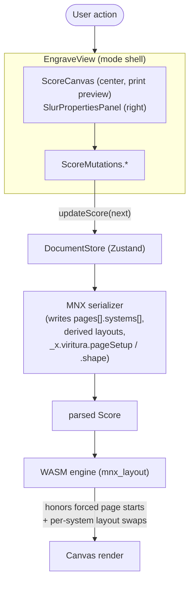

# Engrave Mode v1

Engrave Mode lets users author publication-quality decisions on top of the
music data captured in Write Mode. It is a distinct top-level mode (Activity
Bar) that operates on **per-`ScoreDefinition` view state** without ever
touching `parts[]`.

## Scope (v1 — shipped)

| Capability                                                     | UI                                                                                  | MNX persistence                                            |
| -------------------------------------------------------------- | ----------------------------------------------------------------------------------- | ---------------------------------------------------------- |
| Forced **system break** at a measure                           | Ctrl/Cmd+click on a barline; selected marker deletes with `Delete`/`Backspace`      | `pages[].systems[].measure`                                |
| Forced **page break** at a measure                             | Shift+click on a barline; selected marker deletes with `Delete`/`Backspace`         | new entry in `pages[]`                                     |
| **Hide / show staff** for a system                             | Ghost-rail eye icons in the canvas gutter → popover with per-staff toggles          | derived `LayoutDefinition` referenced from `system.layout` |
| **Per-score page setup** (size, margins, rastral)              | Select a score in the header, then edit it directly in Engrave left panel → Layouts | `_x.viritura.pageSetup` on the `ScoreDefinition`           |
| **Slur shape overrides** (per-handle bezier offsets in spatia) | Click slur → right panel shows `[p0, p1, p2, p3]` deltas + Reset; drag handles      | `event.slurs[]._x.viritura.shape`                          |
| **Reset breaks**                                               | Toolbar "Reset to auto layout"                                                      | clears `pages[]`                                           |
| **Restore hidden staves**                                      | Toolbar "Show all hidden staves" (conditional)                                      | strips derived `system.layout` overrides                   |

## Architecture



`ScoreMutations` ([`apps/editor/src/score/ScoreMutations.ts`](../../apps/editor/src/score/ScoreMutations.ts)) re-exports the per-feature modules so call-sites import from one place. Logic is split by feature:

| Feature           | Module                                                                                   | Key entry points                                                                                              |
| ----------------- | ---------------------------------------------------------------------------------------- | ------------------------------------------------------------------------------------------------------------- |
| Pagination breaks | `ScoreMutations.ts`                                                                      | `insertBreakInScore`, `clearBreakInScore`, `clearAllBreaksInScore`                                            |
| Staff visibility  | [`staffVisibilityMutations.ts`](../../apps/editor/src/score/staffVisibilityMutations.ts) | `setStaffVisibilityInScore`                                                                                   |
| Slur shape        | [`slurShapeMutations.ts`](../../apps/editor/src/score/slurShapeMutations.ts)             | `setSlurShapeInScore` (additive), `replaceSlurShapeInScore`, `getSlurShapeFromScore`, `clearSlurShapeInScore` |

### Pagination snapshot

`pages[].systems[]` is **all-or-nothing per score view**. The first time a
user authors _any_ break, the serializer enumerates every system boundary so
the engine sees a complete forced pagination. Helpers in
[`packages/core/src/model/pagination.ts`](../../packages/core/src/model/pagination.ts)
round-trip between that MNX shape and a flat `PaginationSnapshot` for UI
manipulation:

```ts
interface PaginationEntry { measure: string; layout?: string; pageBreak: boolean }
interface PaginationSnapshot { entries: PaginationEntry[] }

emptySnapshot(): PaginationSnapshot
extractSnapshot(score: ScoreDefinition): PaginationSnapshot
snapshotToPages(snap): PageDefinition[] | undefined
insertBreak(snap, measureId, "system" | "page", layout?): PaginationSnapshot
clearBreak(snap, measureId): PaginationSnapshot
sortSnapshot(snap, order: string[]): PaginationSnapshot
applySnapshot(score, snap): ScoreDefinition
```

### Derived layouts (hide-staff)

Hiding a staff on a system swaps that system's `layout` reference to a
generated `LayoutDefinition`. Each derived layout is minted with a fresh
UUID v7 id (no human-meaningful naming scheme) and flagged with
`_x.viritura.derived: true` so the GC can distinguish it from
user-authored layouts ([`packages/core/src/model/derivedLayouts.ts`](../../packages/core/src/model/derivedLayouts.ts)).

Dedup is **structural**, not id-based. A `canonicalLayoutKey` walks the
layout's content tree (sorted keys, `undefined` elided, instance `id`
and the `derived` bookkeeping flag excluded) and produces a stable
string. Any existing layout whose canonical key matches a candidate is
reused — whether it was user-authored or previously derived from a
different base. Two systems hiding the same parts collapse to one
layout; so do two layouts that converge on the same shape from
different bases (the case ossia / divisi / auto-hide will exercise).

| Helper                      | Behavior                                                                                                                                                                                             |
| --------------------------- | ---------------------------------------------------------------------------------------------------------------------------------------------------------------------------------------------------- |
| `deriveHiddenLayout`        | Prunes the requested parts out of a base layout's content tree; reports which ids were actually present.                                                                                             |
| `ensureDerivedLayout`       | Reuses an existing structurally-equal layout if one is present; otherwise mints a UUID v7, flags it `_x.viritura.derived: true`, and appends.                                                        |
| `pruneUnusedDerivedLayouts` | GCs unreferenced layouts whose `_x.viritura.derived` is `true`. User-authored layouts are never GC'd — MNX treats `layouts[]` as a library and authors may keep spare layouts around for future use. |

Two systems hiding the same set of parts deduplicate to one derived layout.
Showing all parts again removes the system override and triggers GC.

### Engine contract

`compute_page_breaks_with_forced(system_heights, config, title_height_px, forced_page_starts)` in
[`engine/viritura-engine/src/layout/page.rs`](../../engine/viritura-engine/src/layout/page.rs)
honors the explicit pagination boundaries while still falling back to auto-flow
for unforced gaps. Per-system layout swaps go through the `system_layout_changes`
map in [`engine/viritura-engine/src/layout/mnx_layout/explicit.rs`](../../engine/viritura-engine/src/layout/mnx_layout/explicit.rs);
a system's effective `layout` may carry a different (smaller) staff count than
the score's base layout.

## Canvas interaction model

Engrave-mode interactions ride on `ScoreCanvas` event hooks rather than the
global `KeyboardRegistry`:

- `onEngraveBarlineClick(hit, mods)` — modifier disambiguates system vs page break.
- `onEngraveMarkerClick` + `useMarkerSelection` wire `Delete`/`Backspace` to clear the selected marker.
- `onEngraveStaffEyeClick(partId, systemMeasureId)` — fires from the ghost-rail eye glyphs and opens a per-staff toggle popover.
- `onEngraveSlurSelectionChange` + `onEngraveSlurShapeEdit(slurId, delta)` — selection drives the right-side `SlurPropertiesPanel`; handle drags are additive (`setSlurShapeInScore`), numeric panel edits replace (`replaceSlurShapeInScore`).

No global engrave-mode keybindings are registered today.

## Out of scope for v1 (deferred)

- **Canvas break-glyph overlays** in the gutter and ghost rows for hidden staves. Requires a dedicated ScoreCanvas overlay layer.
- **Engrave keyboard shortcuts** (`Ctrl+Enter` for system break, etc.). Requires its own `KeyboardRegistry` binding set.
- **Note spacing nudges, beam slope overrides, custom text frames, cross-staff stem tweaks** — broader engrave controls land in v2.
- **Bulk "copy breaks to other scores"** across part-extracted views.
- **Mid-system layout change with staff-count reduction** — the engine swaps staves 1:1; reducing staff count mid-system needs a system break instead.

## Validation

- Rust: `cargo test -p viritura-engine --lib test_per_system_layout_reduces_staff_count` ([`test_layouts.rs`](../../engine/viritura-engine/src/layout/tests/test_layouts.rs))
- TS:
  - `pnpm --filter @viritura/core test` — `pagination.test.ts`, `derivedLayouts.test.ts`
  - `pnpm --filter @viritura/editor test EngraveMutations EngraveRoundTrip`
- Storybook (`pnpm dev:storybook`, port 6007):
  - **App › Engrave Mode › Forced Breaks** (`SystemBreaksEveryTwoMeasures`, `PageBreakAtMidpoint`)
  - **App › Engrave Mode › Staff Visibility** (`HideOneStaffOnSystem`, `ProgressiveReveal`)
