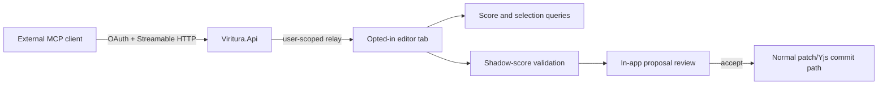

# MCP Integration

> **Status:** External MCP clients are the supported model-assisted interaction surface. The browser-hosted relay, OAuth flow, session routing, score queries, and mandatory in-app proposal review are shipped. The experimental first-party chat panel and provider integration have been retired.

## Shipped architecture

Viritura exposes Streamable HTTP MCP at `https://api.viritura.com/mcp`. The authoritative score remains in an opted-in editor tab:



- Each editor tab must explicitly opt in before it registers a browser-host session.
- External clients use Authorization Code with S256 PKCE. One-hour reference tokens are audience-bound and scoped to `score:read`, `selection:read`, and `score:propose`.
- `editor.list_sessions` returns only the signed-in user's connected sessions. A `sessionId` is required when more than one session is available.
- The API relays calls to the authoritative tab and does not store score content.
- Capacity is bounded per user, per session, and globally. Sessions reconnect automatically but remain ephemeral and tab-scoped.
- There is no direct-write scope or tool. Every mutation is first validated against a shadow score and shown for explicit approval in Viritura.

The server catalogue is defined in [server/Viritura.Api/Mcp/McpToolCatalog.cs](../../server/Viritura.Api/Mcp/McpToolCatalog.cs). Browser-side execution lives in [apps/editor/src/mcpSession/toolDispatch.ts](../../apps/editor/src/mcpSession/toolDispatch.ts), with proposal review in [apps/editor/src/mcpSession/McpProposalReview.tsx](../../apps/editor/src/mcpSession/McpProposalReview.tsx).

## Shipped tool surface

### Discovery and reads

| Tool                        | Purpose                                                                 |
| --------------------------- | ----------------------------------------------------------------------- |
| `editor.list_sessions`      | Discover the user's opted-in editor tabs.                               |
| `score.overview`            | Return score metadata, part names, and measure count.                   |
| `score.get_mnx`             | Return the complete current MNX document.                               |
| `score.get_measures`        | Return a bounded 1-32 measure slice, optionally filtered by part.       |
| `editor.get_selection`      | Return the active editor selection.                                     |
| `editor.get_selected_music` | Resolve the active selection to selection metadata and MNX music.       |
| `score.analyze_chords`      | Identify exact triads and seventh chords and summarize pitch classes.   |
| `score.get_timeline`        | Return measure timing, tempo regions, and duration for a bounded range. |
| `score.validate`            | Dry-run patches or a complete MNX document without opening a review.    |
| `score.get_video_sync`      | Return persisted score-to-picture synchronization settings.             |
| `score.get_instruments`     | Return instrument identities, ranges, clefs, and out-of-range notes.    |

### Reviewable proposals

| Tool                                    | Purpose                                                                              |
| --------------------------------------- | ------------------------------------------------------------------------------------ |
| `preview.propose_patches`               | Validate up to 256 typed score patches and open the patch diff.                      |
| `preview.propose_mnx`                   | Validate and review a complete replacement MNX document.                             |
| `preview.propose_chord_notes`           | Add pitches to existing events through generated typed patches.                      |
| `preview.reset_stem_directions`         | Remove explicit stem directions and review the resulting document.                   |
| `preview.split_orchestral_staves`       | Split supported combined orchestral parts and create a condensed score.              |
| `preview.normalize_tritsch_instruments` | Normalize the known Tritsch score's identities, voices, stems, and playback sources. |
| `preview.get_status`                    | Observe whether a proposal is pending, accepted, rejected, or stale.                 |

Accepted patch proposals enter the editor's normal `commitPatches()` path and therefore retain validation, undo grouping, and Yjs collaboration behavior. Whole-document proposals use the same mandatory review boundary before replacing the working document.

## Known limitations and follow-ups

### Current MCP revision

The relay predates the MCP `2026-07-28` revision. It continues to work with existing clients, but the following compatibility work remains:

- Replace Dynamic Client Registration with Client ID Metadata Documents.
- Implement the required `server/discover` endpoint.
- Move connect-time client identity/capability assumptions to per-request `_meta` fields.
- Treat interrupted streams as new requests; the current revision removed SSE resumability and `Last-Event-ID`.

The existing routing-only `sessionId` tool argument already matches the revision's server-minted-handle model and needs no redesign.

### Persistent headless access

The shipped relay requires an open, opted-in editor tab. After cloud project storage and project-level authorization ship, add a separate project resource such as:

```text
https://api.viritura.com/projects/{id}/mcp
```

That endpoint would support authenticated score access when no browser tab is connected. It must preserve the same validated, reviewable mutation policy or define an equally explicit approval policy for unattended workflows. Cloud storage remains a separately scheduled backend capability.

## Explicit non-goals

- **First-party chat panel and BYO provider keys.** Retired. Users interact through an external MCP client that already supplies the model and chat UI.
- **MCP sampling for an in-app model.** Sampling was deprecated in the `2026-07-28` MCP revision; provider integration or ACP would be the appropriate shape if first-party chat is reconsidered.
- **A new `@viritura/ai` package or parallel `ToolRegistry`.** The shipped server catalogue and browser dispatcher are the tool surface. A second registry would duplicate schemas and dispatch behavior.
- **Direct MCP writes.** Proposal review is a deliberate security and collaboration boundary, not a temporary limitation.
- **Local model routing and Chrome Prompt API integration.** These belonged to the retired first-party chat design.
- **ACP client integration.** Possible in the Tauri shell, but not scheduled; the external MCP workflow already covers bring-your-own-agent usage.

## Design invariants

1. Score content stays in the authoritative editor tab for live sessions.
2. Every explicit session lookup is authorized against the OAuth subject.
3. Read tools should prefer bounded or selection-scoped context over whole-document transfer.
4. Models may dry-run repeatedly, but opening a proposal is the only route to a user-visible mutation.
5. No accepted proposal bypasses the editor's normal validation, undo, and collaboration paths.
