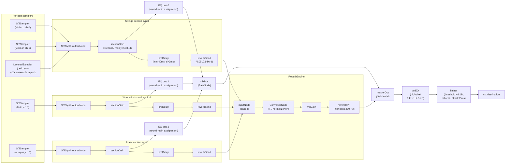
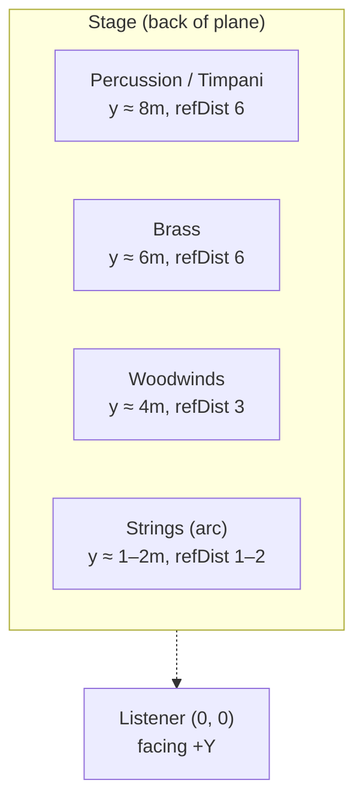
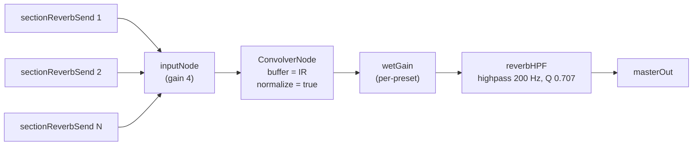
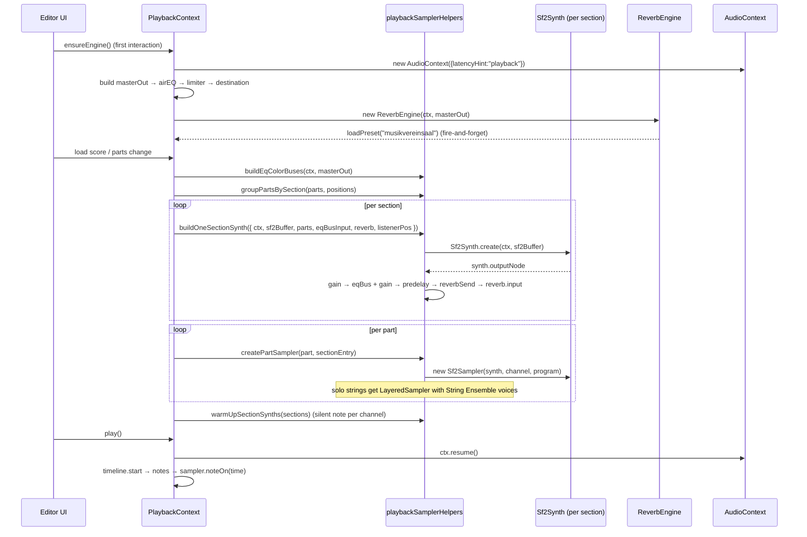

# Orchestral Audio

How Viritura turns a score into a realistic concert-hall mix in the browser. This document describes the **shipped** audio architecture across `packages/audio` and `packages/playback`.

For the user-facing transport / mixer UI see [`apps/editor`'s playback components](../../apps/editor/src/components/playback). For impulse-response files and licenses see [`packages/audio/assets/sounds/ir/`](../../packages/audio/assets/sounds/ir).

---

## Design philosophy

The engine is built like a recording engineer's mix, not a 3D-audio simulator:

- **Stereo speakers, not headphones.** Orchestral music is mixed for a stereo field in front of the listener — panned with MIDI CC10, blended with a single hall reverb. We deliberately do **not** use HRTF / binaural panning, which makes instruments sound "inside the listener's head" and is wrong for this use case.
- **The hall is half the sound.** Convolution reverb using real concert-hall impulse responses provides the spatial signature; everything else (per-section gain, pre-delay, EQ decorrelation) just feeds that hall sensibly.
- **Per-section pooling, not per-part synths.** Every part in the same orchestra section (e.g. all violins) shares one `Sf2Synth` instance on different MIDI channels. This keeps the per-AudioContext `AudioWorklet` count under control and shares the ~125 MB SoundFont buffer.
- **One shipped SoundFont, swappable tomorrow.** Playback ships [`Shan-SGM-Pro-15.sf2`](../../packages/audio/assets/sounds/Shan-SGM-Pro-15.sf2) (Shan SGM-Pro v15, a GM/GS SoundFont, ~119 MB) staged at application build time under `/sounds/` and fetched at app boot by [`PlaybackContext`](../../packages/playback/src/PlaybackContext.tsx). The sampler interface (`ISampler`) lets us swap the SoundFont layer for higher-quality sample libraries (SFZ banks, Muse Sounds-style streamers) without touching the routing.

---

## Package layout

| Package                                        | Role                                                                                                                                                                                        |
| ---------------------------------------------- | ------------------------------------------------------------------------------------------------------------------------------------------------------------------------------------------- |
| [`packages/audio`](../../packages/audio)       | Engine primitives. AudioContext-agnostic building blocks: `Sf2Synth`, `Sf2Sampler`, `LayeredSampler`, `SpatialNode`, `ReverbEngine`, `Metronome`, `Scheduler`, `PlaybackEngine`, GM tables. |
| [`packages/playback`](../../packages/playback) | React orchestration. `PlaybackContext` builds and owns the full graph; `playbackSamplerHelpers.ts` constructs section synths + EQ buses + per-part samplers.                                |
| [`apps/editor`](../../apps/editor)             | Transport / mixer / spatial canvas UI consuming `usePlayback()`.                                                                                                                            |

---

## Signal graph

The full graph built at the start of a playback session, for a score with 3 sections (strings / woodwinds / brass) routed through three of the four shared EQ decorrelation buses:

Built once per `PlaybackContext` mount: [`packages/playback/src/PlaybackContext.tsx`](../../packages/playback/src/PlaybackContext.tsx) (`ensureEngine`, ~line 160). Per-section construction lives in [`packages/playback/src/playbackSamplerHelpers.ts`](../../packages/playback/src/playbackSamplerHelpers.ts) (`buildOneSectionSynth`, `buildSectionSynths`, `buildEqColorBuses`).

---

## Spatial layout

The "concert hall" is a flat XY plane in meters with the listener at the origin facing forward (`+Y`, toward the stage). Per-part positions come from the spatial canvas; defaults follow a standard orchestral arrangement.

| Concept                                                                                                              | Mechanism                                                                                                                                                                                                                                                                                          |
| -------------------------------------------------------------------------------------------------------------------- | -------------------------------------------------------------------------------------------------------------------------------------------------------------------------------------------------------------------------------------------------------------------------------------------------- |
| **Per-instrument projection** ([`SpatialNode.ts:FAMILY_PROJECTION`](../../packages/audio/src/SpatialNode.ts))        | `refDistance` table — brass/perc/organ project further (6–8 m) than strings (1–2 m), reflecting their natural acoustic output. Drives both gain attenuation and reverb send.                                                                                                                       |
| **Section centroid**                                                                                                 | `buildOneSectionSynth` averages the X/Y of all parts in a section and uses the max `refDistance` of those parts. The section's `gainNode` and `predelay` are tuned to that centroid.                                                                                                               |
| **Distance attenuation**                                                                                             | `sectionGain = d ≤ refDist ? 1 : refDist / d` (inverse-distance, hand-rolled — we don't use `PannerNode` for audio, only for visualization).                                                                                                                                                       |
| **Pre-delay**                                                                                                        | `predelay.delayTime = min(0.04, distance × 0.003)` — far sections get up to 40 ms of pre-delay before hitting the reverb send, simulating the speed-of-sound gap between direct sound and the first reflections.                                                                                   |
| **Reverb send level**                                                                                                | `sendLevel = clamp(0.05 + d × 0.075, 0.05, 0.9)` — close instruments stay dry, far instruments get more room sound. Computed per section.                                                                                                                                                          |
| **Stereo pan**                                                                                                       | MIDI CC10 sent into each `Sf2Sampler` channel, value derived from `(partX − listenerX) / PAN_RANGE`. Updated live when the user drags either the part or the listener on the spatial canvas.                                                                                                       |
| **String ensemble layering** ([`buildStringEnsembleLayered`](../../packages/playback/src/playbackSamplerHelpers.ts)) | Solo string parts (violin, viola, cello) are wrapped in a `LayeredSampler` with two GM String Ensemble voices (programs 48 / 49) on extra MIDI channels of the same section synth. Each layer gets its own pan offset (triangle or vertical stack for edge instruments) to widen the stereo field. |
| **Visualization PannerNode**                                                                                         | `SpatialNode` wraps a `PannerNode` purely so the spatial canvas can read 2D positions. The panner is not in the audio path.                                                                                                                                                                        |

---

## Reverb engine

`ReverbEngine` ([`packages/audio/src/ReverbEngine.ts`](../../packages/audio/src/ReverbEngine.ts)) is a thin wrapper around `ConvolverNode` plus a 200 Hz high-pass on the wet return (standard orchestral mixing practice to prevent low-end mud buildup from the diffuse tail).

### Impulse responses

Real-room IRs from [Voxengo Free Impulse Responses](https://www.voxengo.com/free/impulseresponses/) (licensed for free use). Each preset URL is base-relative so it resolves correctly in dev (`/`) and on the deployed app (`/app/`).

| ID                | Name                      | Use case                                        |
| ----------------- | ------------------------- | ----------------------------------------------- |
| `musikvereinsaal` | **Vienna Musikverein**    | Default. Rich, warm orchestral.                 |
| `scala-milan`     | La Scala, Milan           | Bright, clear opera house.                      |
| `french-salon`    | French 18th-Century Salon | Intimate chamber music.                         |
| `masonic-lodge`   | Masonic Lodge             | Smaller ensembles.                              |
| `st-nicolaes`     | St. Nicolaes Church       | Long-tail, dark — choral and organ.             |
| `none`            | No Reverb                 | Dry signal only (e.g. for diagnostic playback). |

Decoded IRs are cached in `cachedIRBuffers` so preset switches after the first load are instant.

---

## Per-part playback lifecycle

Implementation:

- `PlaybackContext.ensureEngine` — [`PlaybackContext.tsx`](../../packages/playback/src/PlaybackContext.tsx) (~line 155)
- `buildEqColorBuses`, `buildSectionSynths`, `createPartSampler`, `warmUpSectionSynths` — [`playbackSamplerHelpers.ts`](../../packages/playback/src/playbackSamplerHelpers.ts)
- Note scheduling — `PlaybackEngine` + `Scheduler` in `packages/audio`
- Per-part mixer (volume / pan / mute / solo) — `partLevels.ts` in `packages/playback`

---

## EQ color buses

Four shared EQ buses sit between the section synths and the master output. Built by `buildEqColorBuses` ([`playbackSamplerHelpers.ts`](../../packages/playback/src/playbackSamplerHelpers.ts)) and assigned **round-robin** by `buildSectionSynths` (`eqBuses[sectionCounter % eqBuses.length]`).

### Why they exist

The pooled-synth design means every part within a section shares one `Sf2Synth` instance. Two violins playing in unison on the same SF2 program are sample-accurate copies of each other — when summed they sound like one louder violin, not two players, and the in-phase doubling produces an unnatural "mechanical" timbre (a real string section gets its lush sound from dozens of slightly mistuned, slightly out-of-phase players). The EQ color buses are the **cheap fix**: by routing different sections through filters with different magnitude/phase responses, identical-instrument doublings that happen to be split across sections (e.g. two flute parts in winds vs. a piccolo in another section, or a 2nd-violin part vs. a 1st-violin part if your score organizes them as separate sections) get just enough spectral and phase separation to stop phase-locking.

This is a deliberate trade-off versus the "correct" approach (microtuning every voice, per-voice convolution decorrelation, or per-player ensemble samples) — those are expensive and unnecessary for a notation editor's preview-quality playback.

### Assignment rule

Sections are assigned to buses in iteration order, modulo 4. The mapping is **not** based on instrument family — "brass" doesn't deterministically go to "warm." A score with only strings and woodwinds gets buses 0 and 1; a score with strings, winds, brass, and percussion gets 0, 1, 2, 3 (and a fifth section would wrap back to 0). Within a single section all parts share the same bus, so the trick does **not** help unison parts inside one section (e.g. two violin parts both grouped under `strings`); those rely on the per-part stereo pan (CC10) and the string-ensemble layering trick to differentiate.

### Bus parameters

| Bus | Curve   | Filters                                          | Intent                                          |
| --- | ------- | ------------------------------------------------ | ----------------------------------------------- |
| 0   | Neutral | passthrough                                      | Reference / no coloration.                      |
| 1   | Bright  | highshelf +1.5 dB @ 3 kHz                        | Lifts presence band; shifts high-end phase.     |
| 2   | Warm    | lowshelf +1 dB @ 300 Hz, highshelf −1 dB @ 4 kHz | Body lift + top-end roll-off; shifts both ends. |
| 3   | Nasal   | peaking +2 dB @ 1.2 kHz, Q 1.5                   | Midrange bump; the most aggressive phase shift. |

The gain numbers are deliberately small (1–2 dB). The audible coloration is a side effect — the **phase response** of the biquads is what does the decorrelation work.

---

## Master bus

Every signal — direct and reverb return — converges on `masterOut`, then:

| Stage         | Node                             | Settings                                                       | Why                                                                               |
| ------------- | -------------------------------- | -------------------------------------------------------------- | --------------------------------------------------------------------------------- |
| `masterOut`   | `GainNode`                       | gain 1.0                                                       | Sum point + headroom hook.                                                        |
| `airEQ`       | `BiquadFilterNode` (`highshelf`) | freq 8 kHz, gain +2.5 dB                                       | Compensates for the inherent darkness of GM SF2 synthesis + distance attenuation. |
| `limiter`     | `DynamicsCompressorNode`         | threshold −8 dB, ratio 12, knee 6, attack 2 ms, release 180 ms | Prevents clipping when reverb + air EQ push the sum above 0 dBFS; gentle glue.    |
| `destination` | `ctx.destination`                | —                                                              | The output device.                                                                |

---

## Pooling & performance trade-offs

| Decision                                                                              | Why                                                                                                                                                                  |
| ------------------------------------------------------------------------------------- | -------------------------------------------------------------------------------------------------------------------------------------------------------------------- |
| One `Sf2Synth` (spessasynth `WorkletSynthesizer`) per orchestra section, not per part | Each synth has its own `AudioWorklet`. Per-part synths would blow the per-context worklet budget in any large score and duplicate the 100–200 MB SF2 buffer.         |
| Section centroid + max-projection for `sectionGain` / `predelay` / `reverbSend`       | Cheap, perceptually close enough — the listener can't tell two violins 0.5 m apart have the same reverb send. Recomputed only when the listener moves significantly. |
| Per-part stereo via MIDI CC10 inside the shared synth                                 | Free in CPU and gives correct per-part pan within a section; no need for per-part `GainNode`/`StereoPannerNode` chains.                                              |
| Sampler builds preserved across note edits                                            | `samplerPartSignatureRef` keeps a signature of the part list; the expensive `Sf2Synth.create` only runs when instruments actually change, not on every note edit.    |
| `latencyHint: "playback"`                                                             | We optimize for jitter resistance / smooth output over input latency — there's no live input path here.                                                              |
| Eager warm-up                                                                         | `warmUpSectionSynths` plays a silent note on every used MIDI channel to force the SF2 voice allocator to load and initialize the preset before the user hits Play.   |

---

## What this engine doesn't do (deliberate)

- **No HRTF / binaural panning.** Wrong fit for 2D stereo orchestral playback.
- **No per-part SF2 synths.** Too expensive; section pooling + CC10 pan is the right trade-off.
- **No algorithmic Schroeder / FDN reverb.** The implementation is convolution-only against real-room IRs — they already encode early reflections, natural air absorption, and room geometry. (The original plan considered algorithmic reverb as a fallback; in practice the IR set ships with every install so the fallback isn't needed.)
- **No early-reflection tap network.** Folded into the IRs.
- **No stereo decorrelation per part.** String solo widening is handled explicitly by `LayeredSampler` adding ensemble voices; further per-part decorrelation has diminishing returns for the complexity.

---

## Open work

| Item                            | Notes                                                                                                                                                                  |
| ------------------------------- | ---------------------------------------------------------------------------------------------------------------------------------------------------------------------- |
| Higher-quality sample libraries | Swap GM SF2 for SFZ / streamed sample banks (e.g. VSCO, Sonatina) behind the existing `ISampler` interface — no graph changes needed.                                  |
| Per-articulation samples        | The current SF2 path is one program per part. Hook engraving articulations into program changes (or to keyswitched SFZ groups) for spiccato / pizzicato / con sordino. |
| Reverb UI                       | Expose preset switching in the transport/mixer UI (currently the default Musikverein preset auto-loads, with no in-app picker).                                        |
| Live IR upload                  | Let users drop their own WAV IRs into the preset list (drag-drop into the mixer).                                                                                      |
| Listener motion smoothing       | When the user drags the listener on the spatial canvas, `sectionGain` recomputes step-wise. A short ramp on `setValueAtTime` would reduce zippering on rapid drags.    |

---

## References

- [`packages/audio/src/ReverbEngine.ts`](../../packages/audio/src/ReverbEngine.ts) — convolution reverb + presets
- [`packages/audio/src/SpatialNode.ts`](../../packages/audio/src/SpatialNode.ts) — coordinate system, `FAMILY_PROJECTION`, `OrchestraSection` classification
- [`packages/audio/src/Sf2Sampler.ts`](../../packages/audio/src/Sf2Sampler.ts), [`packages/audio/src/LayeredSampler.ts`](../../packages/audio/src/LayeredSampler.ts) — sampler primitives
- [`packages/playback/src/PlaybackContext.tsx`](../../packages/playback/src/PlaybackContext.tsx) — `ensureEngine`, master bus, reverb init
- [`packages/playback/src/playbackSamplerHelpers.ts`](../../packages/playback/src/playbackSamplerHelpers.ts) — section synths, EQ color buses, per-part construction
- [`packages/playback/src/partLevels.ts`](../../packages/playback/src/partLevels.ts) — per-part volume / pan / mute / solo
- Voxengo Free Impulse Responses — https://www.voxengo.com/free/impulseresponses/
