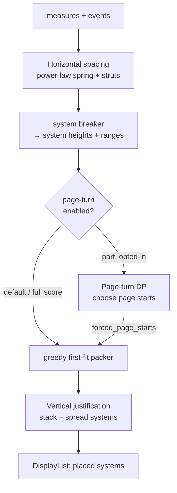
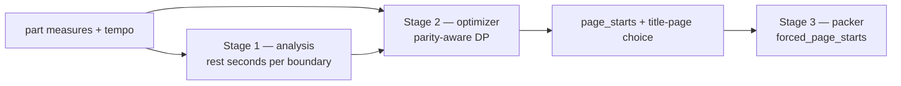

# Page Layout: Spacing & Pagination

> **Reference / spec.** Describes the shipped layout algorithms — horizontal
> note spacing, vertical system spacing & justification, the first-fit page
> packer, and the page-turn-aware pagination DP. Forward-looking / not-yet-built
> ideas are collected under [Deferred work](#deferred-work).

All layout geometry is computed in the Rust engine
([`engine/viritura-engine/src/layout/`](../../engine/viritura-engine/src/layout))
and handed to the TypeScript renderer as absolute coordinates. The browser
only paints; it never decides where anything goes. Three independent passes
turn a measure stream into placed systems on pages:

1. **Horizontal spacing** — assign every note/rest an x-position within its
   measure (a power-law duration spring + rigid collision struts), then justify
   each system to the page width.
2. **Vertical spacing** — compute each system's height, stack systems on a page,
   and justify the stack to fill the page (or leave it ragged on the last page).
3. **Pagination** — decide which systems begin each page. The default is a
   greedy first-fit packer; **parts** can opt into a page-turn-aware dynamic
   program that chooses page starts so physical turns land in rests.



Units: lengths are in **staff spaces** (`sp`) at config time and multiplied by
`config.sp` (pixels-per-staff-space) to reach device pixels. Where this document
says "7.0 sp" it means seven staff spaces.

---

## 1. Horizontal spacing

The horizontal pass lives under
[`engine/viritura-engine/src/layout/spacing`](../../engine/viritura-engine/src/layout).
It produces a `LogSpacing { mapping: Vec<(beat, cum_x_sp)>, total_width,
rigid_widths, rigid_total, base_sp }` per measure: a monotone map from beat
position to cumulative x, plus the rigid (incompressible) sub-total. Internally,
all rhythmic facts use the canonical microbeat-rounded `BeatKey`; one shared
sequence traversal builds a geometry/ink snapshot for onsets, tuplets,
tremolos, grace attachment, accidentals, flags, displacement, and annotations.
Spacing estimators consume that snapshot rather than independently walking raw
`SequenceContent`.

### 1.1 Duration spring — fixed-quarter power law

The natural width contributed by the gap between two consecutive onsets is a
**multiplicative power law** anchored at the quarter note
(`log_duration_width` in `collectors.rs`):

$$ w(\text{gap}) = \text{QUARTER_SPACE_SP} \cdot \left(\frac{\text{gap}}{\text{REFERENCE_BEATS}}\right)^{E} $$

with `QUARTER_SPACE_SP = 3.5`, `REFERENCE_BEATS = 1.0` (a quarter), and
`E = 0.585 = log2(1.5)`. A zero/negative gap contributes zero.

Why a power law with `0 < E < 1`, and why anchored at a **fixed** quarter
rather than the measure's shortest note:

- **Density monotonicity.** For a fixed measure duration `T` split into `N`
  equal gaps, total natural width is `base · (T/ref)^E · N^(1-E)`. Because
  `1 - E ∈ (0,1)`, this **increases with `N`** — a denser bar is always wider
  than a sparser bar of the same duration. The earlier _additive-log_ spring
  (`shortest + k·log2(gap/shortest)`) had a derivative that could go negative,
  which produced the visible bug of a 4-note bar measuring wider than a 7-note
  bar in the same meter.
- **Scale stability.** Anchoring at the detected shortest note inflated every
  long note/rest whenever fast notes appeared _anywhere_ in the score (e.g.
  32nds elsewhere widened all the quarters). Anchoring at a fixed quarter makes
  a half-note the same width regardless of the surrounding rhythmic vocabulary.

Resulting natural widths (sp), all bounded and sub-linear in duration:
triplet-16th `≈1.25` (floored to the min strut), 16th `1.56`, eighth `2.34`,
quarter `3.5`, half `5.25`, whole `7.9`.

### 1.2 Collision struts (rigid floors)

The spring sets the _natural_ (compressible) width; collisions are prevented by
**rigid struts** that justification can never squeeze below:

- **`min_note_spacing` (1.5 sp)** — a floor on every onset-to-onset advance.
  The power law shrinks dense gaps toward this floor, so it engages exactly
  where notes would otherwise collide.
- **Rigid accidental and grace padding** — physical accidental columns and
  grace runs are accumulated into `rigid_widths` so they survive page-fill
  compression; arpeggio and fermata preferences remain elastic. This is our stand-in
  for full glyph-shape collision: each onset advance is
  `max(duration_spring, min_note_spacing, fermata_pad, xstaff_pad)` plus any
  rigid prefix padding (`builders.rs`).
- **Rigid trailing clearance** — final-onset ink carries an incompressible tail
  to the trailing barline. The solver uses the minimum structural buffer across
  the rendered barline catalog, so raw and resolved spacing entry points remain
  identical while every actual barline clears; it never shifts one staff
  independently, so shared onset columns remain aligned.

Space creation has three explicit solver inputs:

- `MeasureWidthConstraint`: max-folded minimum natural width.
- `OnsetPaddingConstraint`: additive pre-onset width with an explicit rigid
  portion.
- `GapFloorConstraint`: max-folded post-onset minimum, explicitly elastic or
  rigid.

The separate types prevent measure-wide minima, additive ink, and gap floors
from accidentally sharing incompatible reconciliation semantics.

### 1.3 Justification to page width

When a system is justified to fill the line, leftover width is distributed by
scaling the **springs** while the **struts stay rigid** — so compression and
stretch never introduce collisions. This mirrors the squeeze-factor model in
established engravers: springs yield, minimum distances do not.

> **MMR elastic stretch is deferred.** A planned refinement gives multimeasure
> rests a much higher stretch ceiling than note bars (so a justified system
> `[4][4][20][4]` widens the long rest instead of smearing the note groups).
> Not yet implemented — see [Deferred work](#deferred-work).

### 1.4 Required regression discipline

Every spacing behavior change must include:

1. a minimal musical fixture containing only the trigger; and
2. a rule-level invariant, not only a display-list snapshot.

Use the shared `minimal_spacing_score` test helper. Choose at least one relevant
invariant such as monotonic onset positions, cross-staff alignment, rigid-floor
preservation, collision clearance, monotonic obstacle effects, merged-spacing
monotonicity, or equivalent tuplet representations. A real-score regression
may supplement the minimal fixture when it protects an interaction that the
small fixture cannot represent; Beethoven 5.1 m39 protects condensed wind
alignment and final-onset clearance at a trailing barline.

---

## 2. Vertical spacing

The vertical pass is `compute_system_y_positions`
([page.rs](../../engine/viritura-engine/src/layout/page.rs)). It places systems
top-to-bottom on each page and decides whether (and how much) to spread them.

### 2.1 System height

A system's height is its measured content bbox when available
(`system_content_heights`), else the fallback

```
height = n_staves · staff_height + (n_staves − 1) · default_inter_staff
```

with `staff_height = 4.0 sp` and `default_inter_staff = 7.0 sp` (the baseline
white space between staves within a system). Per-staff y-offsets within a
system come from `compute_staff_y_offsets_for_system`
([shared.rs](../../engine/viritura-engine/src/layout/mnx_layout/shared.rs)),
which pushes staves apart by content skylines (hanging dynamics, ledger lines,
articulations) but never closes a gap below
`default_intra_staff_clearance = 2.0 sp`.

### 2.2 Inter-system gap & skyline absorption

The default inter-system gap is `config.inter_system_spacing` (**12.0 sp**,
≈3 staff heights). When per-system protrusion extras are available, the gap is
computed by `effective_system_gap` so that a neighbour's overhang **absorbs
into** the default gap rather than adding on top of it:

```
gap = max(min_skyline_clearance, default_inter_staff − below_prev − above_cur)
```

`min_skyline_clearance = 1.0 sp` is the hard floor: an `ff` hanging below one
system and a rehearsal mark atop the next may eat into the gap but never kiss.

### 2.3 Vertical justification

**Standard engraving convention: every page is justified to fill the page
_except_ the last page of the document.** The last (or only) page justifies only
when its natural content already reaches
`LAST_PAGE_JUSTIFY_THRESHOLD = 0.65` of usable height; below that it stays
top-aligned with a ragged bottom (stretching a near-empty final page looks worse
than leaving it ragged).

When a page justifies, the leftover `usable − natural_height` is distributed
between inter-system and intra-staff gaps by weight:

```
INTER_WEIGHT = 1.5      // between systems — grow faster so systems stay distinct
INTRA_WEIGHT = 1.0      // between staves within a system
extra_per_unit = leftover / (n_inter · INTER_WEIGHT + n_intra · INTRA_WEIGHT)
```

A single-system page (no inter-system gaps) routes all leftover into intra-staff
gaps, which fixes large orchestral scores from wasting half the page.

### 2.4 Overflow squish

If natural content _exceeds_ usable height, intra-staff gaps are reduced first,
down to `min_intra_staff_squish = 3.0 sp` (with clearance shrinking
proportionally but never below `min_intra_staff_clearance = 0.5 sp`). Beyond
that, an oversized single system grows its page box (see §3.3).

---

## 3. Pagination — the greedy packer

`compute_page_breaks` / `compute_page_breaks_with_extras`
([page.rs](../../engine/viritura-engine/src/layout/page.rs)) is the default and
the single source of truth for physical page geometry. Everything else (the
page-turn DP, user breaks, MNX `score.pages[]`) feeds it `forced_page_starts`
and lets it produce the final `PageLayout` vec.

### 3.1 First-fit fill

```
for each system i:
    needed = first_on_page ? height[i] : effective_system_gap(i-1, i) + height[i]
    if force_break || (current + needed > usable_height and page not empty):
        finalize page; start new page
    place i; current += needed
```

`usable_height = page_height − margin_top − margin_bottom − title_height`
(title only on page 0). For A4 defaults (`page_height = 297 sp`, top/bottom
margins `15 sp`) that is `267 sp`, less the title block on page 1.

### 3.2 Forced starts

Any system index in `forced_page_starts` forces a break regardless of fit
(index 0 is implicit). This is how user-authored engrave-mode breaks, MNX
`score.pages[]`, and the page-turn DP's chosen starts all enter the same packer.
Forced starts only ever **add** breaks — an enabled layout therefore never has
_fewer_ pages than the greedy baseline (a property locked by
`page_turns_never_reduce_page_count`).

### 3.3 Oversized systems & title block

A single system taller than the usable height never bleeds onto the next page;
instead the page box grows to
`max(configured_height, content + margins + title)`. The first-page title block
height is measured by `title_block_height` from metadata (title, subtitle,
composer, arranger) with `TITLE_GAP_SP = 0.5` between elements.

---

## 4. Page-turn-aware pagination (parts)

A printed part is read as two-page spreads, and the player must free a hand to
turn at the **bottom-right (recto)** page of each spread. The conductor score
paginates for density; a part must paginate for **playability** — every physical
turn should land in enough rest for the player to actually turn the page.

This is an **opt-in, part-only** replacement for the greedy packer's _choice of
starts_ (the packer itself is unchanged). It is gated on
`PageTurnConfig.enabled` and lives in
[`engine/viritura-engine/src/layout/page_turn/`](../../engine/viritura-engine/src/layout/page_turn).
The pipeline is three pure stages wired by `plan_page_turns`
([page_turn.rs](../../engine/viritura-engine/src/layout/page_turn.rs)):



### 4.1 Stage 1 — turn-window analysis

For every boundary `b` (between measure `b` and `b+1`) the analysis
([analysis.rs](../../engine/viritura-engine/src/layout/page_turn/analysis.rs))
measures how many **real-time seconds of rest** the player has across it. It
reasons in seconds — not bars — so a tight _volti subito_ (V.S.) window ranks
below a luxurious multimeasure rest but far above a turn that lands on a
sounding note.

Per boundary it computes a `TurnWindow`:

- **`tail_seconds`** — rest _before_ the turn: walk backward from measure `b`,
  summing trailing rest across consecutive full-rest measures. This is the
  natural V.S. (rest, then turn).
- **`head_seconds`** — rest _after_ the turn: walk forward from measure `b+1`
  summing leading rest. Relying on this (rest sits at the top of the next page,
  typically an MMR) forces a printed **"time"** marking — the player turns
  first, then rests.
- **`turn_seconds = tail + head`**, classified into a **quality band**:

  | Band          | Condition                               | Meaning                                               |
  | ------------- | --------------------------------------- | ----------------------------------------------------- |
  | `Comfortable` | `≥ comfortable_secs` (5.0)              | relaxed turn, cost ≈ 0                                |
  | `Vs`          | `[vs_secs, comfortable_secs)` (3.0–5.0) | usable volti subito                                   |
  | `Tight`       | `(0, vs_secs)`                          | desperation turn — allowed, flagged                   |
  | `Impossible`  | `0`                                     | lands on a sounding note — never chosen unless forced |

- **`structural`** — the boundary is touched by a repeat, volta, or jump
  (`structural_boundary_flags` in
  [expansion.rs](../../engine/viritura-engine/src/layout/page_turn/expansion.rs)).
  A turn here is unsafe because the rest may not be free on every pass, so it is
  conservatively disqualified.
- **`fermata_blocked`** — a fermata/caesura at or adjacent to the boundary. These
  are turn-_avoid_ zones (exposed, expressive moments), not bonus windows.
- **`annotation`** — `None | Vs | Time`, the suggested printed mark.

Beats→seconds is a thin, tempo-aware resolver (`TempoMap` in
[tempo.rs](../../engine/viritura-engine/src/layout/page_turn/tempo.rs)): tempo is
piecewise-constant between marks; unknown tempo falls back to
`default_bpm = 90`. We deliberately did **not** port the TS `@viritura/midi`
timeline — the analysis needs only the one beats→seconds formula.

Analysis is **single-line**: a boundary is restful only when _every_ voice of
the part is silent across it. We do not model "one hand free" on a grand staff.

### 4.2 Stage 2 — the optimizer (DP)

Pagination is framed as: **partition the ordered system list into pages,
minimizing a global additive cost.** `run_dp`
([optimizer.rs](../../engine/viritura-engine/src/layout/page_turn/optimizer.rs))
is a forward dynamic program over system boundaries:

```
dp[i][parity] = min over j of ( dp[j][·] + density_cost(page j..i) + turn_cost(boundary i) )
```

This is **not greedy** — it minimizes the total cost across _all_ pages at once,
so it will accept a locally denser/looser page to avoid a worse page or turn
downstream. For an additive per-page cost this DP is **globally optimal**; there
is nothing a beam search or ILP would improve. When output looks wrong, the fix
is the cost function, not the search. Complexity is `O(S²)` over systems, bounded
tighter by the per-page height limit; parts are short, so it is trivially fast.

#### Density cost — an acceptable _band_, not a single target

`density_cost` treats fill as a band, not a point. Let `fill = content / capacity`:

- **Inside `[min_fill_fraction, 1.0]` (0.75–1.0)** the page is _good_. The only
  term is a gentle convex pull toward `target_fill_fraction` (0.9):
  `density · (fill − target)²`. This breaks ties toward fuller pages and spreads
  slack evenly, but is small enough never to override turn quality on its own.
- **Below the floor** the page is genuinely under-filled (the amateur-looking
  sparse failure). A **steep linear** shortfall penalty fires:
  `sparse · (floor − fill)` with `sparse = 6.0`. Linear, not squared, on
  purpose — a squared penalty stays nearly flat just below the floor, so a 72%
  page would read as "fine"; linear makes the penalty bite the moment fill
  crosses 75%.
- The **last page is exempt** from the floor rule — a short final page is
  expected.
- Under the **professional** preset (`allow_partial_pages = false`) a badly
  sparse page (`fill < 0.6`) additionally takes a `BIG` cliff, forbidding it
  outright.

Why a band and not "minimize Σ|fill − 100%|": (a) the target is below 100%
because vertical justification needs slack and >100% is physically impossible
(it is a _one-sided_ problem — the only failure is under-fill); (b) the in-band
term is squared so the optimizer distributes emptiness evenly instead of
tolerating one glaring half-empty page.

#### Turn cost

`turn_cost` is charged **only at physical turns** — boundaries that fall at the
bottom-right (recto) page of a spread, determined by parity. Spread-internal
(verso→recto) boundaries pay nothing, so the optimizer has slack to push "bad"
boundaries onto no-turn positions and reserve the rests for real turns. This is
why good density and good turns are usually _simultaneously_ achievable — only
half the boundaries are turn-constrained.

Base cost by band: `Comfortable 0.0`, `Vs 0.4`, `Tight 1.5` (or `4.0` below
`min_acceptable_secs`), `Impossible 8.0`; plus `+10` structural, `+6` fermata.
On top of that, a **time-marking penalty** keyed off **head excess**:

```
if viable and head > tail:
    base += time_marking · clamp(head − tail, 0, comfortable_secs) / comfortable_secs
```

This biases the optimizer to pull a rest _before_ the turn (natural V.S.) rather
than lean on the next page's opening rest (which forces a "time" mark). It is
keyed off head excess — _not_ the tail deficit — because a tail-deficit gate
silently vanishes in the exact case it targets (an MMR sitting at the top of the
next page while the outgoing page already ends comfortably). Genuine exceptions
survive: when the post-turn rest is a _leading_ rest with no trailing rest to
turn on, the alternative boundary's far larger base cost dominates the ≤1.0
penalty, so the DP correctly keeps the "time" turn.

#### Title-page parity

The single biggest lever on turn parity is **whether the part opens with a
dedicated title page** — it shifts every subsequent page's recto/verso parity by
one. The binding itself is fixed (a bound volume opens on a recto, so physical
turns fall after even-indexed pages); the title page is the legitimate lever that
flips parity, at the cost of `weights.title_page` (0.6). `optimize` runs the DP
for each candidate (`TitlePagePolicy::Auto` tries both with/without; `Always` /
`Never` pin it) and keeps the cheapest. A dedicated title page also frees the
inline title-block height on the first music page.

### 4.3 Stage 3 — packer integration

`plan_forced_starts` ([page_turn.rs](../../engine/viritura-engine/src/layout/page_turn.rs))
converts the DP's chosen `page_starts` (system indices) into the packer's
`forced_page_starts` and reports whether a title page was elected. When the call
site cannot paint a cover page (`allow_title_page = false`), the optimizer is
forbidden from reserving one — otherwise its parity (and every turn decision)
would be offset by an unrendered page. The packer then produces final geometry
exactly as in §3. After the prior skyline-gap alignment work, the optimizer's
planned `page_starts` equal the rendered pages (the packer adds no extra overflow
breaks), so the DP's plan is faithful to what renders.

### 4.4 Configuration

`PageTurnConfig`
([config.rs](../../engine/viritura-engine/src/layout/page_turn/config.rs)),
default `enabled = false`:

| Field                      | Default | Meaning                                                                               |
| -------------------------- | ------- | ------------------------------------------------------------------------------------- |
| `comfortable_secs`         | 5.0     | upper band edge — relaxed turn                                                        |
| `vs_secs`                  | 3.0     | lower edge of the V.S. band                                                           |
| `min_acceptable_secs`      | 3.0     | turn-quality floor before density stops yielding                                      |
| `target_fill_fraction`     | 0.9     | comfort anchor the in-band pull targets                                               |
| `min_fill_fraction`        | 0.75    | lower edge of the acceptable fill band                                                |
| `allow_partial_pages`      | true    | may end a page below the band to win a turn                                           |
| `allow_intentional_blanks` | true    | _(config present; blank-page insertion deferred)_                                     |
| `title_page`               | `Auto`  | `auto \| always \| never`                                                             |
| `first_page_recto`         | `None`  | override the standard recto-first binding                                             |
| `emit_vs_marks`            | true    | compute V.S./"time" annotations                                                       |
| `default_bpm`              | 90      | tempo fallback                                                                        |
| `weights`                  | —       | `density 1.0, turn 1.0, sparse 6.0, title_page 0.6, blank_page 0.8, time_marking 1.0` |

The `EngravingPreset` convenience flips several at once: **Relaxed** (target 0.9,
floor 0.75, relief valves on) vs **Professional** (target 0.95, floor 0.85,
relief valves off — no sparse or blank pages, accept a tighter V.S. before
wasting paper).

Settings round-trip through MNX as `_x.viritura.pageSetup.pageTurns`
(`{ enabled, preset, defaultBpm }`) — see
[parseLayout.ts](../../packages/format/src/mnx/parseLayout.ts) /
[serializeLayout.ts](../../packages/format/src/mnx/serializeLayout.ts).

### 4.5 Output & warnings

The layout result carries `pageTurnWarnings` (mirrored to the display list and
normalized in [wasm.ts](../../packages/renderer/src/wasm.ts)), one per flagged
physical turn with `kind ∈ { tight, impossible, structural, fermata }` and the
available `turn_seconds`. These are surfaced to the TS layer but **not yet
painted** as an overlay, and the printed **V.S.** / **"time"** marks are computed
internally but **not yet emitted** as render commands — see
[Deferred work](#deferred-work).

---

## Deferred work

Not yet implemented:

- **MMR splitting.** Cutting a long multimeasure rest at any internal bar (even
  mid-system) to land a turn exactly inside the rest. The cheapest relief valve
  the packer could have; no `mmr_split` candidate boundaries are generated today.
- **MMR elastic stretch.** A higher horizontal stretch ceiling for MMRs so
  justification widens long rests before smearing note groups (§1.3).
- **Intentional blank pages.** `allow_intentional_blanks` / `blank_page` weight
  exist in config, but the optimizer does not insert "this page intentionally
  left blank" parity pages — only the title-page lever is wired.
- **Printed V.S. / "time" marks & the warnings overlay.** Annotations and
  `pageTurnWarnings` are computed but not rendered (§4.5).
- **Materializing accepted turns to `score.pages[]`** so a chosen pagination
  locks and round-trips, plus engrave-mode lock/unlock and "find a better turn"
  affordances.
- **Full repeat/jump routing.** `expand_playback_order` honors forward repeats
  and voltas; D.C./D.S. jumps are not yet routed (their boundaries are still
  protected conservatively via `structural` flags).
- **Debounced auto-reflow** while editing in paged view (today: lazy/explicit
  recompute).

## Related

- [data-model-pipeline](data-model-pipeline.md) — how measures/events reach the
  layout engine.
- [performance-architecture](../plans/performance-architecture.md) — the layout
  pipeline's place in the render budget.
- [engrave-mode](engrave-mode.md) — user-authored breaks that feed the same
  `forced_page_starts`.
